### 3.6 — Méthode de documentation synchronisée

Chaque **cas d'utilisation phare** est documenté dans un **bloc unique** regroupant, dans cet ordre :

1. **Fiche descriptive** — préconditions, scénario nominal, postconditions, scénarios alternatifs ;
2. **Diagramme d'activité** — enchaînement métier (décisions, acteurs) ;
3. **Diagramme(s) de séquence** — échanges techniques entre interface, contrôleur, services et persistance.

Les trois artefacts portent le **même identifiant UC** (ou le même libellé sur le diagramme acteur §3.2). Les diagrammes de cas d'utilisation draw.io **ne sont pas modifiés** : ils restent la référence visuelle globale ; le détail se trouve dans les blocs ci-dessous.

**Légende séquences — participants récurrents**

| Participant | Rôle |
| --- | --- |
| **Interface Web** | Pages Next.js (`app/*`) |
| **Server Action / API** | Point d'entrée serveur, validation session et rôle |
| **PostgreSQL (Prisma)** | Persistance métier |
| **Supabase Auth** | Authentification, JWT, cookies |
| **Services `lib/*`** | Routage, RDV, mail, imports CSV |

**Tableau de traçabilité — cas phares**

| UC / cas | Acteur | Fiche | Activité | Séquence(s) | Processus global §3.10 |
| --- | --- | --- | --- | --- | --- |
| UC-01 | Élève | §3.7.1 | ACT-UC-01 | — *(proche SEQ-ELEVE-01)* | ACT-01 |
| Authentifier | Élève | §3.7.2 | ACT-AUTH-ELEVE | SEQ-ELEVE-01 | — |
| UC-03 | Visiteur | §3.7.3 | ACT-UC-03 | SEQ-ELEVE-02 | ACT-01 |
| UC-02 | Élève | §3.7.4 | ACT-UC-02 | SEQ-ELEVE-03 | ACT-01 |
| UC-04 | Élève | §3.7.5 | ACT-UC-04 | SEQ-ELEVE-05 | ACT-01 |
| UC-05 | Élève | §3.7.6 | ACT-02 | SEQ-ELEVE-06, 07, 08 | ACT-02 |
| UC-06 | Élève | §3.7.7 | ACT-UC-06 | SEQ-ELEVE-09, 10 | ACT-01 |
| Authentifier | Admin | §3.8.1 | ACT-AUTH-ADMIN | SEQ-ADMIN-01 | — |
| UC-07 | Admin | §3.8.2 | ACT-UC-07 | SEQ-ADMIN-11 | ACT-01 |
| UC-08 | Admin | §3.8.3 | ACT-03 | SEQ-ADMIN-10 | ACT-03 |
| UC-09 | Admin | §3.8.4 | ACT-UC-09 | SEQ-ADMIN-06 | ACT-01, ACT-03 |
| UC-10 | Admin | §3.8.5 | ACT-UC-10 | SEQ-ADMIN-08 | ACT-02 |
| Quota RDV | Admin | §3.8.6 | — | SEQ-ADMIN-02 | — |
| Authentifier | Agent | §3.9.1 | ACT-AUTH-AGENT | SEQ-AGENT-01 | — |
| UC-11 | Agent | §3.9.2 | ACT-UC-11a, ACT-04 | SEQ-AGENT-02, 03 | ACT-04 |

Index complet des 24 séquences : `docs/SEQUENCES_PAR_CAS_UTILISATION.md`. Régénération : `npm run diagrams:sequences-acteurs` et `npm run diagrams:activites`.

---

### 3.7 — Conception par cas — ACTEUR ÉLÈVE (et visiteur)

*Référence diagramme : Figure 3.1 §3.2.*

### 3.7.1 — UC-01 : Activer son compte élève

#### Fiche descriptive

| Élément | Description |
| --- | --- |
| **Identifiant** | UC-01 |
| **Nom** | Activer son compte élève |
| **Acteur principal** | Élève (non connecté) |
| **Objectif** | Créer les identifiants à partir d'un matricule pré-enregistré |
| **Route / implémentation** | `/auth/register` — `signUpAction()` |

**Préconditions** — Élève en base (Import B) ; rôle `ELEVE` ; `authUserId` vide ; Supabase Auth configuré.

**Scénario nominal**

1. Accès à `/auth/register`.
2. Saisie matricule, email, mot de passe.
3. Vérification matricule + email en Prisma.
4. Création Supabase Auth (`email_confirm: true`) et liaison `authUserId`.
5. Email de bienvenue ; redirection `/dashboard`.

**Postconditions** — Compte activé ; session ouverte.

**Scénarios alternatifs** — A1 matricule/email inconnu ; A2 compte déjà activé ; A3 matricule admin ; A4 formulaire invalide ; A5 échec connexion auto post-activation.

#### Diagramme d'activité

**Figure 3.4 — Activité UC-01 : activation de compte**

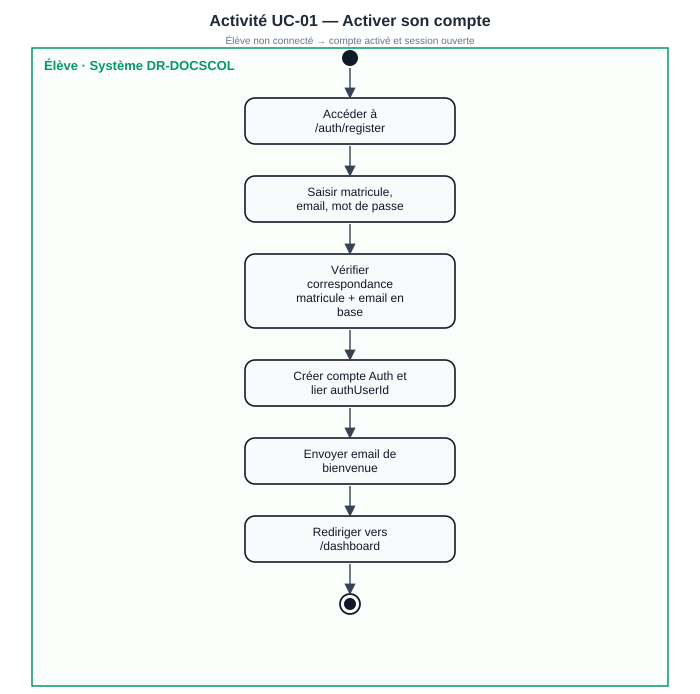

#### Diagramme de séquence

L'activation suit la même logique que la connexion (Prisma + Supabase Auth). Voir **§3.7.2 SEQ-ELEVE-01** pour le schéma d'échanges ; la différence est l'étape `signUp` au lieu de `signInWithPassword`.

---

### 3.7.2 — Authentifier (connexion élève)

#### Fiche descriptive

| Élément | Description |
| --- | --- |
| **Identifiant** | — *(cas sur diagramme Élève)* |
| **Nom** | Authentifier |
| **Acteur principal** | Élève |
| **Objectif** | Ouvrir une session sécurisée sur l'espace `/dashboard` |
| **Route / implémentation** | `/auth/login` — `signInAction()` |

**Préconditions** — Compte activé (`authUserId` renseigné) ; identifiants valides.

**Scénario nominal** — Saisie matricule, email, mot de passe → contrôle rôle `ELEVE` en Prisma → `signInWithPassword` → audit `LOGIN` → redirection `/dashboard`.

**Scénarios alternatifs** — Matricule inconnu ; rôle incorrect ; mot de passe invalide ; email ne correspond pas au matricule.

#### Diagramme d'activité

**Figure 3.5 — Activité : authentification élève**

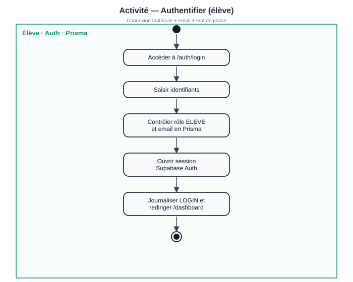

#### Diagramme de séquence

**SEQ-ELEVE-01** — Barrière métier Prisma avant Supabase ; trace `audit_logs` pour la soutenance.

**Figure 3.6 — SEQ-ELEVE-01 : connexion élève**

---

### 3.7.3 — UC-03 : Consulter la disponibilité par matricule (public)

#### Fiche descriptive

| Élément | Description |
| --- | --- |
| **Identifiant** | UC-03 |
| **Nom** | Consultation publique par matricule |
| **Acteur principal** | Visiteur |
| **Objectif** | Vérifier l'état des documents sans compte |
| **Route / implémentation** | `/consultation`, landing `#consultation` |

**Préconditions** — Aucune auth ; matricule 3–40 car. ; rate-limit IP non dépassé.

**Scénario nominal** — Saisie matricule → recherche élève → si activé : statuts documents (hors duplicatas) ; sinon prénom + lien activation.

**Postconditions** — Lecture seule ; aucune modification en base.

**Scénarios alternatifs** — A1 matricule inconnu (message générique) ; A2 compte non activé ; A3 matricule invalide ; A4 HTTP 429.

#### Diagramme d'activité

**Figure 3.7 — Activité UC-03 : consultation publique**

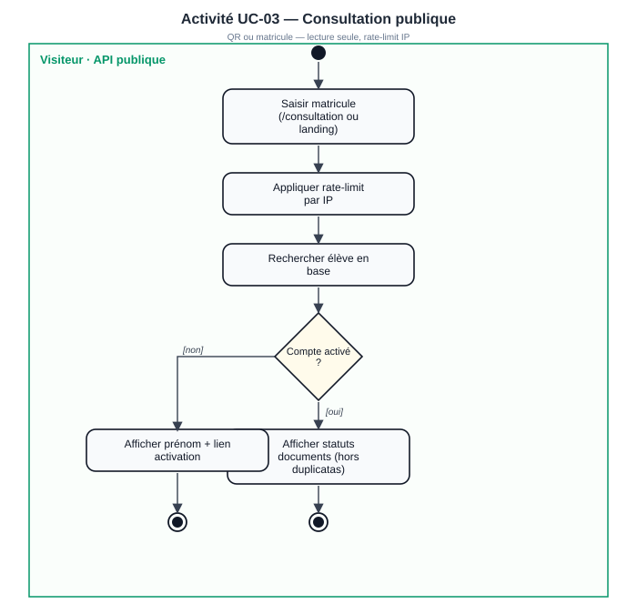

#### Diagramme de séquence

**SEQ-ELEVE-02** — `POST /api/public/consultation` ; branche compte non activé sans fuite documentaire.

**Figure 3.8 — SEQ-ELEVE-02 : consultation QR / matricule**

---

### 3.7.4 — UC-02 : Consulter Mes documents

#### Fiche descriptive

| Élément | Description |
| --- | --- |
| **Identifiant** | UC-02 |
| **Nom** | Consulter ses documents scolaires |
| **Acteur principal** | Élève connecté |
| **Objectif** | Visualiser statuts, lieux de retrait et actions possibles par diplôme |
| **Route / implémentation** | `/dashboard/documents` |

**Préconditions** — Session élève valide.

**Scénario nominal**

1. Chargement documents, duplicatas, examens validés.
2. `resolveDocumentRoute` pour chaque document (organisme, centre/antenne, `requiresAppointment`).
3. Affichage cartes par examen avec libellés de statut et boutons (Demander, RDV, Duplicata…).

**Postconditions** — Aucune mutation (consultation connectée).

**Scénarios alternatifs** — Session expirée → redirection login ; liste vide si aucun examen validé.

#### Diagramme d'activité

**Figure 3.9 — Activité UC-02 : Mes documents**

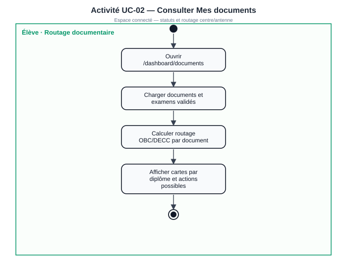

#### Diagramme de séquence

**SEQ-ELEVE-03** — Server Component ; routage OBC/DECC côté serveur.

**Figure 3.10 — SEQ-ELEVE-03 : vérifier disponibilité**

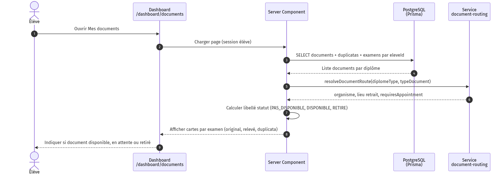

---

### 3.7.5 — UC-04 : Demander un relevé ou un diplôme original

#### Fiche descriptive

| Élément | Description |
| --- | --- |
| **Identifiant** | UC-04 |
| **Nom** | Enregistrer une demande de relevé ou de diplôme |
| **Acteur principal** | Élève connecté |
| **Objectif** | Soumettre officiellement une demande avant disponibilisation admin |
| **Route / implémentation** | `registerSchoolDocumentRequest()` |

**Préconditions** — Examen validé ; type autorisé ; pas de demande existante (`demandeSoumiseAt` vide).

**Scénario nominal** — Choix examen → Demander → routage → création/màj `DocumentAcademique` `PAS_DISPONIBLE` + notification.

**Postconditions** — `demandeSoumiseAt` renseigné ; attente action admin (UC-08/UC-09).

**Scénarios alternatifs** — A1 demande déjà enregistrée ; A2 type non autorisé ; A3 examen introuvable.

#### Diagramme d'activité

**Figure 3.11 — Activité UC-04 : demande relevé / diplôme**

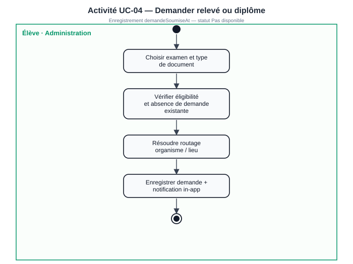

#### Diagramme de séquence

**SEQ-ELEVE-05** (relevé) — Le diplôme original suit **SEQ-ELEVE-04** avec contrôles de routage différents (ex. Bac original → antenne OBC).

**Figure 3.12 — SEQ-ELEVE-05 : demande relevé**

**Figure 3.13 — SEQ-ELEVE-04 : demande diplôme original** *(variante routage)*

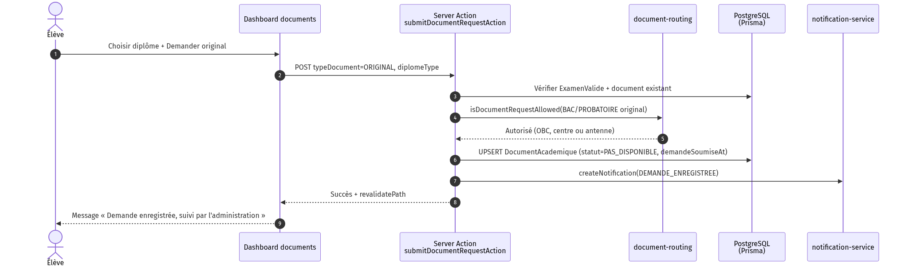

---

### 3.7.6 — UC-05 : Demander un duplicata et payer

#### Fiche descriptive

| Élément | Description |
| --- | --- |
| **Identifiant** | UC-05 |
| **Nom** | Soumettre duplicata avec pièces et paiement |
| **Acteur principal** | Élève connecté |
| **Objectif** | Initier dossier duplicata + règlement simulé |
| **Route / implémentation** | `submitDuplicataRequestAction()` |

**Préconditions** — Duplicata autorisé ; pas de dossier actif ; cooldown 1 an respecté ; 4 pièces obligatoires.

**Scénario nominal** — Formulaire → upload Storage → barème (10 000 / 15 000 FCFA) → transaction Prisma (`Duplicata`, `Paiement`, `Recu`) → notifications.

**Postconditions** — Dossier `SOUMISE` ; attente analyse admin (UC-10).

**Scénarios alternatifs** — A1 demande en cours ; A2 déjà disponible ; A3 cooldown ; A4 pièce manquante ; A5 formulaire invalide.

#### Diagramme d'activité

Vue **processus complet duplicata** (soumission → validation admin → retrait antenne) :

**Figure 3.14 — Activité UC-05 / processus duplicata (ACT-02)**

#### Diagrammes de séquence

**SEQ-ELEVE-06** — Formulaire et pièces. **SEQ-ELEVE-07** — Paiement. **SEQ-ELEVE-08** — Téléchargement reçu.

**Figure 3.15 — SEQ-ELEVE-06 : formulaire duplicata**

**Figure 3.16 — SEQ-ELEVE-07 : paiement duplicata**

**Figure 3.17 — SEQ-ELEVE-08 : télécharger reçu**

---

### 3.7.7 — UC-06 : Prendre ou annuler un rendez-vous de retrait

#### Fiche descriptive

| Élément | Description |
| --- | --- |
| **Identifiant** | UC-06 |
| **Nom** | Réserver ou annuler un créneau au centre d'examen |
| **Acteur principal** | Élève connecté |
| **Objectif** | Planifier le retrait physique au centre |
| **Route / implémentation** | `/dashboard/rendez-vous`, `createRendezVousAction()` |

**Préconditions** — Document `DISPONIBLE` ; routage centre (`requiresAppointment`) ; pas de RDV actif ; date ≥ lendemain, ouvrable, quota OK.

**Scénario nominal (prise)** — Choix date → créneaux `getAvailableSlots` → réservation `PLANIFIE` → notification.

**Scénario nominal (annulation)** — Annulation depuis `/dashboard/rendez-vous` → statut `ANNULE` → quota libéré.

**Postconditions** — RDV actif ou annulé ; agent informé via son espace (UC-11).

**Scénarios alternatifs** — Document non disponible ; retrait antenne ; date/quota invalides ; RDV déjà existant.

#### Diagramme d'activité

**Figure 3.18 — Activité UC-06 : rendez-vous de retrait**

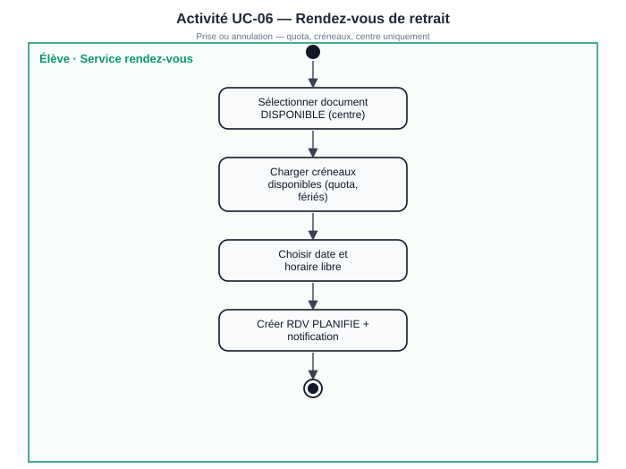

#### Diagrammes de séquence

**Figure 3.19 — SEQ-ELEVE-09 : prise de rendez-vous**

**Figure 3.20 — SEQ-ELEVE-10 : annulation RDV**

---

### 3.8 — Conception par cas — ACTEUR ADMINISTRATEUR OBC / DECC

*Référence diagramme : Figure 3.2 §3.2.*

### 3.8.1 — Authentifier (admin OBC / DECC)

#### Fiche descriptive

| Élément | Description |
| --- | --- |
| **Nom** | Authentifier |
| **Acteur** | Administrateur OBC ou DECC |
| **Objectif** | Accéder au back-office `/admin` dans son périmètre |
| **Route** | `/auth/login/obc` ou `/auth/login/decc` |

**Scénario nominal** — Identifiants → rôle `ADMINISTRATEUR` → session → redirection `/admin` → audit `LOGIN`.

#### Diagramme d'activité

**Figure 3.21 — Activité : authentification admin**

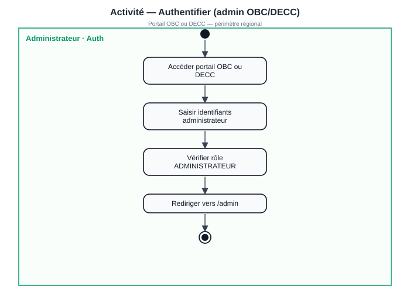

#### Diagramme de séquence

**Figure 3.22 — SEQ-ADMIN-01 : connexion administrateur**

---

### 3.8.2 — UC-07 : Importer des élèves (Import B)

#### Fiche descriptive

| Élément | Description |
| --- | --- |
| **Identifiant** | UC-07 |
| **Nom** | Import ajout élève (CSV) |
| **Acteur** | Administrateur |
| **Objectif** | Pré-enregistrer matricules pour activation UC-01 |
| **Route** | `/admin/students` — `importTestDataFromCsv` |

**Préconditions** — Admin authentifié ; CSV conforme `STUDENT_IMPORT_CSV_HEADER` ; périmètre organisme/région.

**Scénario nominal** — Upload CSV → traitement ligne par ligne → UPSERT `User` (`ELEVE`), `ExamenValide`, documents `PAS_DISPONIBLE` → rapport.

**Postconditions** — Élèves créés/mis à jour ; documents initiaux **Pas disponible**.

**Scénarios alternatifs** — Ligne hors périmètre ; matricule invalide ; diplôme inconnu.

#### Diagramme d'activité

**Figure 3.23 — Activité UC-07 : Import B**

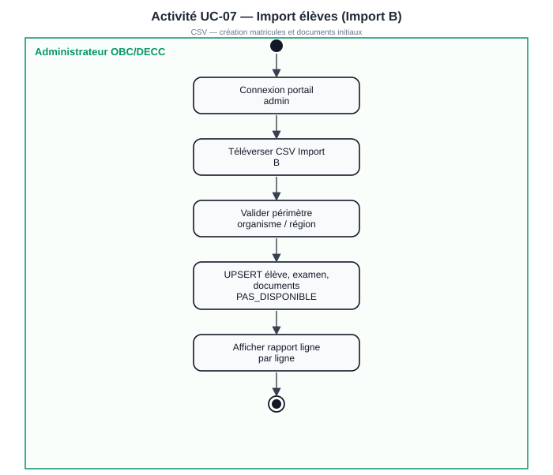

#### Diagramme de séquence

**Figure 3.24 — SEQ-ADMIN-11 : import élèves CSV**

---

### 3.8.3 — UC-08 : Disponibiliser un document

#### Fiche descriptive

| Élément | Description |
| --- | --- |
| **Identifiant** | UC-08 |
| **Nom** | Mettre un document à disposition |
| **Acteur** | Administrateur |
| **Objectif** | Passer **Pas disponible** → **Disponible** + notifier |
| **Route** | Import A ou `/admin/documents` |

**Préconditions** — Périmètre admin ; duplicata : dossier `VALIDEE` ; pas de duplicata dans Import A.

**Scénario nominal** — Import CSV ou action unitaire → `applyDocumentStatusTransition` → notification + audit.

**Postconditions** — Document `DISPONIBLE` ; élève informé (UC-06 si centre).

**Scénarios alternatifs** — Hors périmètre ; duplicata non validé ; ligne CSV duplicata ; déjà disponible.

#### Diagramme d'activité

**Figure 3.25 — Activité UC-08 / disponibilisation (ACT-03)**

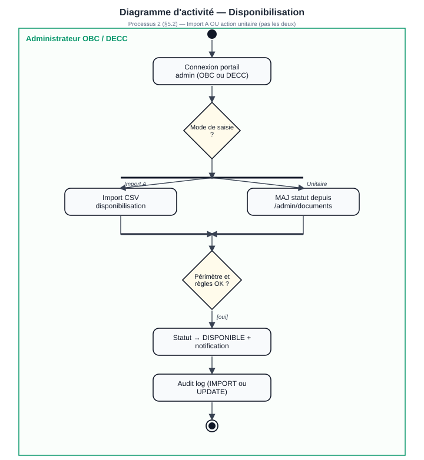

#### Diagramme de séquence

**Figure 3.26 — SEQ-ADMIN-10 : import disponibilisation**

---

### 3.8.4 — UC-09 : Mettre à jour le statut d'un document

#### Fiche descriptive

| Élément | Description |
| --- | --- |
| **Identifiant** | UC-09 |
| **Nom** | Changer le statut document (action unitaire) |
| **Acteur** | Administrateur |
| **Objectif** | Gérer cas par cas (dispo, retrait antenne) |
| **Route** | `/admin/documents` — `updateDocumentStatusAction` |

**Préconditions** — Document dans périmètre ; transitions autorisées (`document-status-transition.ts`).

**Scénario nominal** — Sélection document → nouveau statut → `assertAdminCanManageDocument` → transition → notification si `DISPONIBLE` → audit.

**Postconditions** — Statut mis à jour ; retrait antenne : `RETIRE` par admin (pas agent).

**Scénarios alternatifs** — Transition interdite ; duplicata non validé ; document hors scope.

#### Diagramme d'activité

**Figure 3.27 — Activité UC-09 : mise à jour statut**

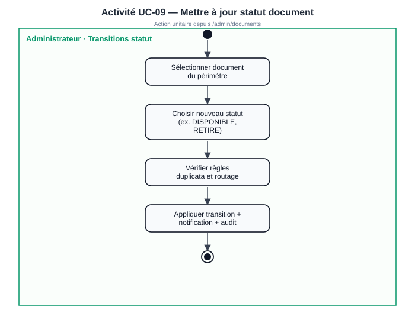

#### Diagramme de séquence

**Figure 3.28 — SEQ-ADMIN-06 : MAJ statut relevé**

---

### 3.8.5 — UC-10 : Valider une demande de duplicata

#### Fiche descriptive

| Élément | Description |
| --- | --- |
| **Identifiant** | UC-10 |
| **Nom** | Valider ou rejeter un dossier duplicata |
| **Acteur** | Administrateur antenne |
| **Objectif** | Autoriser la disponibilisation du duplicata |
| **Route** | `validateDuplicataRequestAction`, `updateDuplicataPieceReviewAction` |

**Préconditions** — Dossier `SOUMISE` ou `EN_ANALYSE` ; pièces téléversées.

**Scénario nominal** — Analyse pièces → validation individuelle → si toutes `VALIDEE` : dossier `VALIDEE` → sync document DUPLICATA.

**Postconditions** — Dossier validé ; admin peut disponibiliser (UC-08) ; retrait en antenne.

**Scénarios alternatifs** — Pièce rejetée → dossier `REJETEE` ; pièces manquantes.

#### Diagramme d'activité

**Figure 3.29 — Activité UC-10 : validation duplicata**

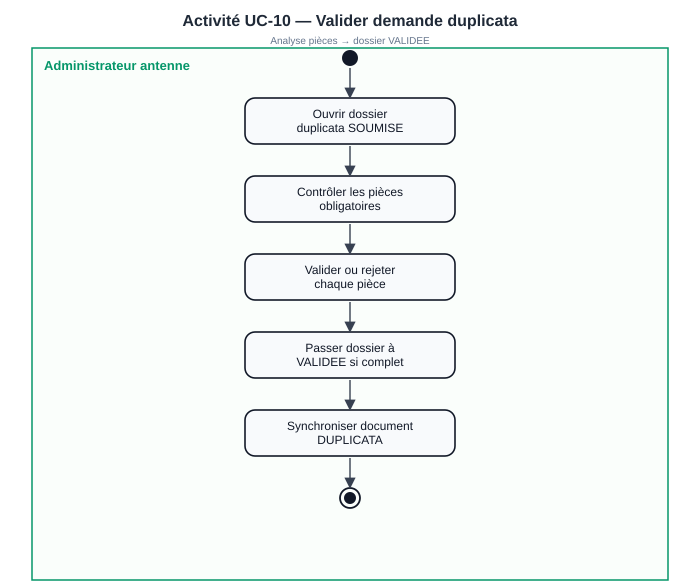

#### Diagramme de séquence

**Figure 3.30 — SEQ-ADMIN-08 : valider demande duplicata**

*Séquences complémentaires : SEQ-ADMIN-07 (traiter pièces), SEQ-ADMIN-09 (rejeter).*

---

### 3.8.6 — Définir le quota journalier de rendez-vous

#### Fiche descriptive

| Élément | Description |
| --- | --- |
| **Nom** | Définir quota journalier RDV |
| **Acteur** | Administrateur |
| **Objectif** | Limiter la charge des centres d'examen |
| **Route** | `/admin/rdv-disponibilites` |

**Scénario nominal** — Modification quota → persistance `parametres_rendez_vous` → impact immédiat sur `getAvailableSlots` (UC-06).

#### Diagramme de séquence

**Figure 3.31 — SEQ-ADMIN-02 : quota journalier**

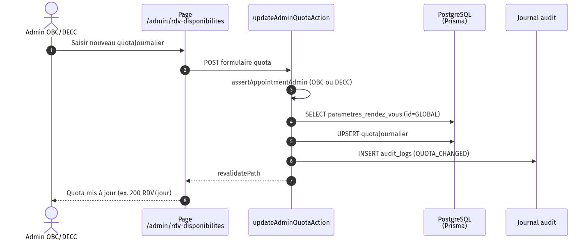

---

### 3.9 — Conception par cas — ACTEUR AGENT CENTRE D'EXAMEN

*Référence diagramme : Figure 3.3 §3.2.*

### 3.9.1 — Authentifier (agent centre)

#### Fiche descriptive

| Élément | Description |
| --- | --- |
| **Nom** | Authentifier |
| **Acteur** | Agent centre d'examen |
| **Objectif** | Accéder à `/centre-examen` |
| **Route** | `/auth/login/centre-examen` |

**Scénario nominal** — Identifiants → rôle `AGENT_CENTRE_EXAMEN` → redirection espace agent.

#### Diagramme d'activité

**Figure 3.32 — Activité : authentification agent**

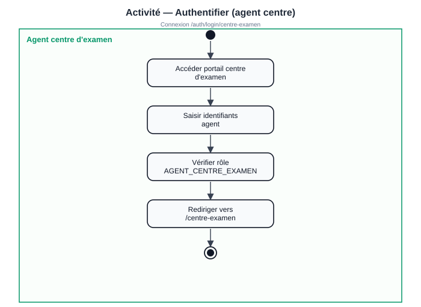

#### Diagramme de séquence

**Figure 3.33 — SEQ-AGENT-01 : connexion agent**

---

### 3.9.2 — UC-11 : Consulter les RDV et confirmer le retrait

#### Fiche descriptive

| Élément | Description |
| --- | --- |
| **Identifiant** | UC-11 |
| **Nom** | Confirmer le retrait au centre d'examen |
| **Acteur** | Agent centre |
| **Objectif** | Clôturer le parcours physique (centre uniquement) |
| **Route** | `/centre-examen`, `confirm-withdrawal` |

**Préconditions** — Agent authentifié ; RDV `PLANIFIE`/`CONFIRME` ; document éligible centre ; pas déjà `RETIRE`.

**Scénario nominal**

1. Consulter RDV transmis (région/centre).
2. Vérifier identité élève sur place.
3. Confirmer retrait → RDV `HONORE`, document `RETIRE`, notifications.

**Postconditions** — Document **Retiré** ; cooldown duplicata 1 an si applicable.

**Scénarios alternatifs** — RDV hors centre (403) ; déjà confirmé (409) ; retrait antenne réservé à l'admin.

**Note** — Retraits **antenne** (Bac original, duplicatas) : administrateur via UC-09.

#### Diagramme d'activité — consultation RDV

**Figure 3.34 — Activité UC-11a : consulter RDV transmis**

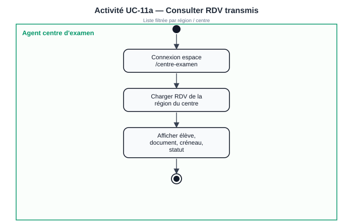

#### Diagramme de séquence — consultation

**Figure 3.35 — SEQ-AGENT-02 : consulter RDV**

#### Diagramme d'activité — confirmation retrait

**Figure 3.36 — Activité UC-11b / confirmation retrait (ACT-04)**

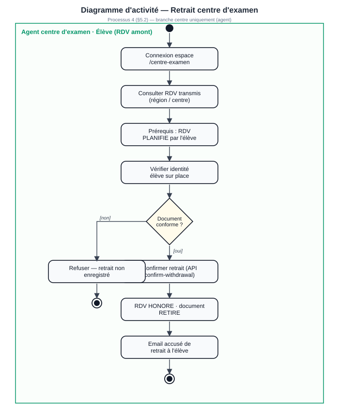

#### Diagramme de séquence — confirmation

**Figure 3.37 — SEQ-AGENT-03 : confirmer retrait effectué**

---

### 3.10 — Vue d'ensemble : diagrammes d'activité des processus globaux

Les diagrammes ci-dessous couvrent **plusieurs cas d'utilisation** enchaînés (alignés sur le cahier d'analyse §5.2). Ils complètent les blocs §3.7–3.9 pour la soutenance lorsque le jury demande une **vue processus bout en bout**.

| Réf. | Processus | Cas couverts | Fichier |
| --- | --- | --- | --- |
| ACT-01 | Retrait relevé / diplôme | UC-01, 02, 04, 06, 08, 09, 11 | `act-eleve-parcours-retrait-document.png` |
| ACT-02 | Duplicata complet | UC-05, 10, 08, 09 | `act-eleve-demande-duplicata.png` |
| ACT-03 | Disponibilisation | UC-08, 09 | `act-admin-disponibilisation.png` |
| ACT-04 | Retrait centre | UC-06, 11 | `act-agent-confirmation-retrait.png` |

**Figure 3.38 — ACT-01 : parcours retrait relevé / diplôme**

**Figure 3.39 — ACT-02 : processus duplicata**

**Figure 3.40 — ACT-03 : disponibilisation admin**

**Figure 3.41 — ACT-04 : confirmation retrait agent**

Régénération : `npm run diagrams:activites`.

---
