# CAHIER D'ANALYSE

## Application Web DR-DOCSCOL
### Gestion des retraits de documents scolaires — OBC / DECC

**Projet :** Application de demande document académique  
**Application :** DR-DOCSCOL (Document Retrieval — Documents Scolaires)  
**Contexte :** Cameroun — OBC et DECC  
**Version :** 2.0 — Juin 2026  
**Documents associés :** Cahier des charges (`docs/cahier_des_charges.md`), Cahier de conception (`docs/cahier_conception.md`)

---

## TABLE DES MATIÈRES

1. Introduction
2. Contexte et problématique
3. Analyse de l'existant
4. Acteurs, parties prenantes et périmètre
5. Rappel des fonctionnalités
6. Besoins fonctionnels (synthèse)
7. Besoins non fonctionnels (synthèse)
8. Modélisation UML *(packages, cas d'utilisation, fiches et séquences essentielles)*
9. Synthèse de l'analyse
10. Glossaire

---

## 1. INTRODUCTION

### 1.1 — Rôle du cahier d'analyse

Le présent **cahier d'analyse** décrit l'étude préalable à la réalisation de l'application **DR-DOCSCOL**. Il répond aux questions suivantes :

- Quel est le contexte et la problématique ?
- Comment fonctionne la situation actuelle (« sans portail ») ?
- Qui sont les acteurs et quel est le périmètre retenu ?
- Quels sont les besoins fonctionnels et non fonctionnels essentiels ?
- Quels cas d'utilisation couvrent la solution, avec leurs interactions système ?

Ce document constitue une **synthèse métier explicite** : il reprend les **fonctionnalités**, les **BF/BNF** (en synthèse) et la **modélisation UML** (diagrammes de packages, cas d'utilisation, fiches descriptives et diagrammes de séquence des cas essentiels). Le détail technique (architecture, classes, activités complémentaires) figure dans le **cahier de conception**.

### 1.2 — Méthode d'analyse

L'analyse s'appuie sur :

- le cahier des charges v3.0 (`docs/cahier_des_charges.md`) ;
- les règles métier OBC/DECC (retrait, antennes, centres) ;
- l'observation des dysfonctionnements du processus manuel ;
- la validation progressive par l'implémentation du dépôt source.

### 1.3 — Périmètre analysé

| Élément | Description |
| --- | --- |
| Diplômes | BEPC, Probatoire, Baccalauréat, ESG |
| Documents | Original, relevé de notes, duplicata |
| Organismes | OBC, DECC |
| Lieux | Centres d'examen, antennes régionales (10 régions) |
| Usagers | Élèves, admins OBC/DECC, agents centre d'examen |

### 1.4 — Découpage en trois modules métier

La solution est analysée selon **trois modules** correspondant aux acteurs principaux :

| Module | Acteur | Rôle dans le processus |
| --- | --- | --- |
| **Module Élève** | Élève / visiteur | Consultation, demandes, paiement duplicata, rendez-vous |
| **Module Administrateur** | Admin OBC / DECC | Imports CSV, disponibilisation, validation duplicata, suivi |
| **Module Agent centre** | Agent centre d'examen | Consultation des RDV, confirmation du retrait physique |

Pour chaque module, seuls les **cas d'utilisation essentiels** (parcours critiques de bout en bout) sont détaillés par une **fiche descriptive** et un **diagramme de séquence système**.

---

## 2. CONTEXTE ET PROBLÉMATIQUE

### 2.1 — Contexte institutionnel

Au Cameroun, la délivrance et le retrait des documents scolaires demeurent fortement dépendants de procédures physiques. Les usagers se rendent aux centres d'examen ou aux antennes régionales sans certitude sur la disponibilité de leurs dossiers.

| Organisme | Responsabilité principale |
| --- | --- |
| **OBC** | Probatoire, Baccalauréat |
| **DECC** | BEPC |

Chaque organisme dispose d'**antennes régionales** couvrant les dix régions administratives du Cameroun.

### 2.2 — Problématique générale

> ***Comment permettre aux élèves et diplômés camerounais de suivre et retirer leurs documents scolaires de manière sécurisée et traçable, tout en allégeant la charge administrative des services OBC / DECC ?***

### 2.3 — Questions d'analyse

| N° | Question |
| --- | --- |
| QA-01 | Comment réduire les déplacements inutiles liés à l'incertitude sur la disponibilité ? |
| QA-02 | Comment organiser le retrait physique sans files d'attente excessives ? |
| QA-03 | Comment garantir le respect des règles OBC/DECC (lieu, acteur, type de document) ? |
| QA-04 | Comment tracer qui retire quoi, quand et où ? |
| QA-05 | Comment intégrer les duplicatas payants et leurs justificatifs ? |

---

## 3. ANALYSE DE L'EXISTANT

### 3.1 — Processus actuel (situation « sans portail »)

```
Élève → déplacement centre/antenne → guichet → attente → renseignement manuel
      → éventuel second déplacement → retrait ou nouvelle attente
Administration → registres / fichiers → saisie manuelle → faible visibilité globale
```

### 3.2 — Constats par acteur

| Acteur | Problèmes identifiés |
| --- | --- |
| Élève / diplômé | Déplacements multiples, longues files d'attente, absence de visibilité sur le statut, frais de transport, instructions de retrait imprécises |
| Administration OBC/DECC | Gestion manuelle, charge de travail élevée, erreurs de saisie, traçabilité difficile, absence de tableaux de bord |
| Agent centre d'examen | Accueil non planifié, confirmation de retrait sur registre papier |
| Organisme | Risques d'erreurs, difficulté de pilotage statistique, fraude potentielle |

### 3.3 — Lacunes fonctionnelles de l'existant

| Lacune | Impact |
| --- | --- |
| Pas de consultation en ligne | Déplacements « à l'aveugle » |
| Pas de notification | L'élève ignore quand son document est prêt |
| Pas de rendez-vous | Congestion aux guichets |
| Pas de paiement tracé (duplicata) | Opacité sur les recettes et les dossiers |
| Pas d'audit centralisé | Difficulté de contrôle et de responsabilisation |

### 3.4 — Opportunité de digitalisation

La digitalisation permet de :

- informer l'usager **avant** le déplacement ;
- planifier les retraits par **créneaux** ;
- appliquer automatiquement le **routage** OBC/DECC ;
- conserver une **trace** de chaque action sensible.

---

## 4. ACTEURS, PARTIES PRENANTES ET PÉRIMÈTRE

### 4.1 — Cartographie des acteurs

| Acteur | Rôle dans le processus | Besoin principal |
| --- | --- | --- |
| Élève | Demandeur et bénéficiaire du document | Savoir où en est sa demande |
| Visiteur (sans compte) | Usager en phase de renseignement | Consulter statuts par matricule |
| Admin OBC | Gestion documents et élèves OBC | Outils de disponibilisation et suivi |
| Admin DECC | Gestion documents et élèves DECC | Idem, périmètre DECC |
| Agent centre | Accueil et confirmation retrait | Liste RDV du centre |
| Système | Notifications, audit | Automatisation fiable |

### 4.2 — Périmètre inclus dans l'analyse

- Consultation et suivi des documents scolaires.
- Demandes de relevé et de duplicata.
- Paiement applicatif des duplicatas (MVP).
- Rendez-vous de retrait.
- Back-office admin et espace agent.
- Imports CSV (élèves et disponibilisation).
- Consultation publique par matricule.

### 4.3 — Hors périmètre (exclus)

| Exclusion | Justification |
| --- | --- |
| Téléchargement PDF sécurisé du diplôme | Non demandé dans le périmètre MVP |
| Vérification employeur par QR | Évolution future |
| Traduction / rectification de diplôme | Hors scope actuel |
| Paiement Mobile Money réel en production | Analysé mais non branché (MVP simulé) |

---

## 5. RAPPEL DES FONCTIONNALITÉS

### 5.1 — Vue par module métier

| Module | Fonctionnalités principales |
| --- | --- |
| **Élève** | Activation et connexion ; consultation publique (matricule / QR) ; espace Mes documents ; demande de relevé ou diplôme ; duplicata avec pièces et paiement ; prise de rendez-vous de retrait |
| **Administrateur** | Connexion back-office ; import CSV élèves (Import B) ; import disponibilisation (Import A) ; mise à jour des statuts ; validation des dossiers duplicata ; paramétrage quota RDV ; journal d'audit |
| **Agent centre** | Connexion espace agent ; consultation des RDV transmis ; confirmation du retrait physique au centre |

### 5.2 — Récapitulatif par domaine fonctionnel

| Domaine | 🔴 Obligatoires | 🟡 Importants | 🟢 Optionnels |
| --- | --- | --- | --- |
| Authentification & accès | 3 | 2 | 0 |
| Consultation documents (connecté) | 4 | 2 | 0 |
| Consultation rapide publique | 5 | 0 | 0 |
| Notifications | 2 | 3 | 1 |
| Administration (back-office) | 5 | 2 | 0 |
| Rendez-vous & paiements | 6 | 4 | 0 |
| **Total** | **25** | **13** | **1** |

> Détail complet : `docs/cahier_des_charges.md` §5.

---

## 6. BESOINS FONCTIONNELS (SYNTHÈSE)

> Légende : 🔴 Obligatoire — 🟡 Important. Seuls les besoins **obligatoires** et **importants** liés aux cas essentiels sont repris ici.

### 6.1 — Module Élève

| ID | Fonctionnalité | Priorité |
| --- | --- | --- |
| F-01 | Activation compte élève (matricule pré-enregistré) | 🔴 |
| F-02 | Connexion / déconnexion (matricule, email, mot de passe) | 🔴 |
| F-06 | Espace Mes documents (statuts, lieux, actions) | 🔴 |
| F-07 | Affichage statut de disponibilité | 🔴 |
| F-09 | Demande de relevé de notes | 🟡 |
| F-10 | Demande de duplicata avec justificatifs | 🔴 |
| F-35 à F-39 | Consultation rapide publique (landing, matricule, QR code) | 🔴 |
| F-25 | Consultation des créneaux RDV | 🔴 |
| F-26 | Réservation de rendez-vous | 🔴 |
| F-31 à F-33 | Paiement duplicata, confirmation, reçu | 🔴 |
| F-12, F-13 | Notifications disponibilité et rendez-vous | 🔴 |

### 6.2 — Module Administrateur

| ID | Fonctionnalité | Priorité |
| --- | --- | --- |
| F-03 | Gestion des rôles (ELEVE, ADMINISTRATEUR, AGENT) | 🔴 |
| F-19 | Import CSV (élèves + disponibilisation) | 🔴 |
| F-20, F-21 | Gestion élèves et documents | 🔴 |
| F-22 | Mise à jour des statuts + notifications | 🔴 |
| F-23 | Historique des retraits | 🔴 |
| F-30 | Configuration quota RDV | 🟡 |

### 6.3 — Module Agent centre

| ID | Fonctionnalité | Priorité |
| --- | --- | --- |
| F-03 | Accès réservé au rôle AGENT_CENTRE_EXAMEN | 🔴 |
| F-29 | Enregistrement du retrait physique au centre | 🔴 |
| F-28 | Consultation des rendez-vous transmis | 🟡 |

---

## 7. BESOINS NON FONCTIONNELS (SYNTHÈSE)

| Catégorie | Exigence | Critère de satisfaction |
| --- | --- | --- |
| ⚡ Performance | Temps de réponse | Pages < 3 s ; API courantes < 500 ms |
| ⚡ Performance | Charge | ~200 utilisateurs simultanés sans dégradation majeure |
| 🔒 Sécurité | Authentification | Supabase Auth ; mots de passe hors Prisma |
| 🔒 Sécurité | Autorisation | Contrôle par rôle et périmètre organisme / antenne |
| 🔒 Sécurité | Données personnelles | Accès limité ; conformité RGPD formalisée |
| 🔒 Sécurité | Injections / XSS | Prisma ORM ; échappement React ; HTTPS en production |
| 📱 Accessibilité | Responsive & navigateurs | Mobile, tablette, desktop ; Chrome, Firefox, Edge, Safari |
| 🛠️ Maintenabilité | Architecture & validation | Next.js App Router, Server Actions, Prisma, Zod |
| 📊 Fiabilité | Disponibilité & erreurs | Vercel + Supabase ; messages clairs ; journalisation |
| 📊 Fiabilité | Emails | Traçabilité dans `mail_logs` |

> Détail complet : `docs/cahier_des_charges.md` §6.

---

## 8. MODÉLISATION UML

### 8.0 — Syntaxe de modélisation retenue

| Niveau | Artefact | Contenu dans le présent cahier |
| --- | --- | --- |
| **1 — Vue d'ensemble** | Diagramme général des cas d'utilisation | §8.2 |
| **2 — Packages** | Diagramme de packages + diagramme UC par module | §8.1, §8.3 à §8.5 |
| **3 — Cas essentiel** | Fiche descriptive + diagramme de séquence système | Pour chaque UC phare listé ci-dessous |

> **Règle de présentation** — Chaque figure est introduite par un titre (`Figure N — …`) **au-dessus** de l'image ; le texte explicatif suit **directement en dessous**.

**Cas essentiels retenus par module** *(parcours critiques de la soutenance)* :

| Module | Cas essentiels documentés |
| --- | --- |
| Élève | Authentifier ; Consulter via QR / matricule ; Demander un relevé ; Soumettre duplicata et payer ; Prendre rendez-vous |
| Administrateur | Authentifier ; Importer disponibilisation ; Importer élèves ; Valider duplicata ; Mettre à jour statut document |
| Agent centre | Authentifier ; Consulter les RDV ; Confirmer retrait effectué |

Les autres cas du diagramme (annulation RDV, journal audit, quota, etc.) restent modélisés sur les diagrammes UC mais ne sont pas détaillés ici pour limiter la longueur du document. Voir le cahier de conception pour le complément.

---

### 8.1 — Diagramme de packages

**Figure 8.0 — Diagramme de packages DR-DOCSCOL**


| Package | Contenu fonctionnel |
| --- | --- |
| PKG-PUBLIC | Landing, consultation rapide, QR code |
| PKG-ELEVE | Authentification, dashboard, demandes, duplicata, RDV |
| PKG-ADMIN | Back-office, imports CSV, statuts, validation duplicata |
| PKG-AGENT | Espace centre, RDV, confirmation retrait |
| PKG-COMMUN | Notifications, audit, routage documentaire |

---

### 8.2 — Diagramme général des cas d'utilisation

**Figure 8.1 — Diagramme général (trois acteurs)**


| Acteur | Cas principaux (vue générale) |
| --- | --- |
| Élève | consulter-via-QRcode, authentifier, effectuer-demande-retrait, prendre-rdv |
| Administrateur OBC / DECC | authentifier, METTRE-A-JOUR, EFFECTUER-IMPORT, valider/rejeter duplicata |
| Agent centre d'examen | authentifier, consulter-les-rdv, confirmer-les-retraits-effectuer |

---

## 8.3 — MODULE ÉLÈVE

**Figure 8.2 — Diagramme de cas d'utilisation — Module Élève**


| Cas sur le diagramme | Rôle |
| --- | --- |
| authentifier | Point d'entrée ; inclut consulter-via-QRcode |
| effectuer-demande-retrait | Généralise original-diplome, releve, duplicata |
| duplicata | Inclut formulaire, paiement et téléchargement reçu |
| prendre-rdv | Prise de créneau ; annuler-rdv en extension |

---

### 8.3.1 — UC-E01 : Authentifier (connexion élève)

#### Fiche descriptive

| Élément | Description |
| --- | --- |
| **Identifiant** | UC-E01 |
| **Nom** | Authentifier |
| **Acteur principal** | Élève |
| **Objectif** | Ouvrir une session sécurisée sur `/dashboard` |
| **Préconditions** | Compte activé (`authUserId` renseigné) ; identifiants valides |
| **Scénario nominal** | Saisie matricule, email, mot de passe → contrôle rôle `ELEVE` en Prisma → `signInWithPassword` (Supabase) → audit `LOGIN` → redirection dashboard |
| **Postconditions** | Session ouverte ; accès aux demandes et RDV |
| **Scénarios alternatifs** | Matricule inconnu ; rôle incorrect ; mot de passe invalide ; email ne correspond pas au matricule |

> L'**activation** initiale (UC-01, `/auth/register`) précède ce cas : matricule pré-enregistré par Import B → création compte Supabase → liaison `authUserId`.

#### Diagramme de séquence système

**Figure 8.3 — SEQ-ELEVE-01 : authentification élève**

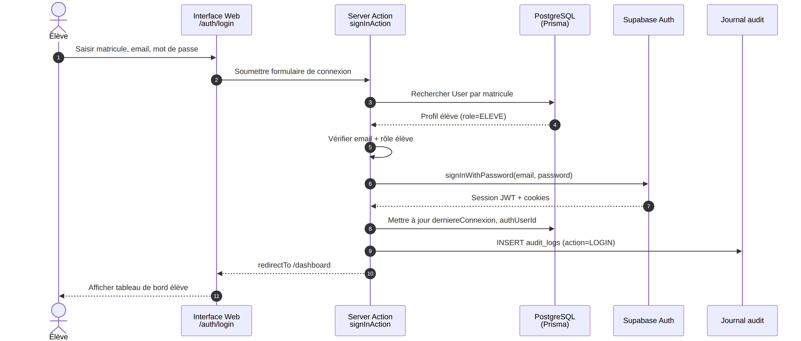

Échanges principaux : **Élève** → **Interface** → **Server Action** → **Prisma** (vérif matricule/rôle) → **Supabase Auth** → **Audit** → redirection.

---

### 8.3.2 — UC-E02 : Consulter via QR code / matricule (consultation publique)

#### Fiche descriptive

| Élément | Description |
| --- | --- |
| **Identifiant** | UC-E02 |
| **Nom** | Consulter via QR code |
| **Acteur principal** | Visiteur / Élève (non connecté) |
| **Objectif** | Vérifier l'état des documents sans compte complet |
| **Préconditions** | Aucune authentification ; matricule valide ; rate-limit IP respecté |
| **Scénario nominal** | Scan QR ou saisie matricule sur `/consultation` → recherche élève → si compte activé : affichage statuts documents ; sinon invitation à `/auth/register` |
| **Postconditions** | Lecture seule ; aucune modification en base |
| **Scénarios alternatifs** | Matricule inconnu (message générique) ; compte non activé ; HTTP 429 (limite requêtes) |

#### Diagramme de séquence système

**Figure 8.4 — SEQ-ELEVE-02 : consultation publique**

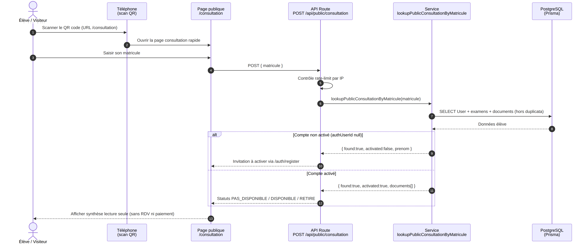

Échanges principaux : **Visiteur** → **Page consultation** → **API publique** → **Prisma** → réponse statuts ou message d'activation.

---

### 8.3.3 — UC-E03 : Demander un relevé de notes

#### Fiche descriptive

| Élément | Description |
| --- | --- |
| **Identifiant** | UC-E03 |
| **Nom** | Demande retrait relevé de notes |
| **Acteur principal** | Élève connecté |
| **Objectif** | Soumettre officiellement une demande avant disponibilisation admin |
| **Préconditions** | Session valide ; examen validé ; pas de demande existante |
| **Scénario nominal** | Choix examen → action Demander → routage OBC/DECC → création/màj document `PAS_DISPONIBLE` → notification |
| **Postconditions** | `demandeSoumiseAt` renseigné ; attente action admin (UC-A04) |
| **Scénarios alternatifs** | Demande déjà enregistrée ; type non autorisé ; examen introuvable |

#### Diagramme de séquence système

**Figure 8.5 — SEQ-ELEVE-05 : demande relevé**

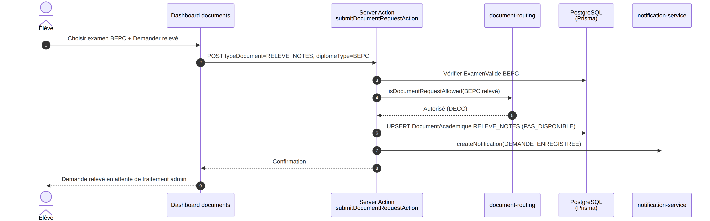

Échanges principaux : **Élève** → **Dashboard** → **Server Action** → **Routage document** → **Prisma** (document + notification) → confirmation.

---

### 8.3.4 — UC-E04 : Soumettre duplicata et effectuer le paiement

#### Fiche descriptive

| Élément | Description |
| --- | --- |
| **Identifiant** | UC-E04 |
| **Nom** | Demande duplicata avec pièces et paiement |
| **Acteur principal** | Élève connecté |
| **Objectif** | Initier un dossier duplicata et régler les frais (MVP simulé) |
| **Préconditions** | Duplicata autorisé ; pas de dossier actif ; cooldown 1 an ; 4 pièces obligatoires |
| **Scénario nominal** | Formulaire → upload Storage → barème (10 000 / 15 000 FCFA) → transaction Prisma (`Duplicata`, `Paiement`, `Recu`) → notifications |
| **Postconditions** | Dossier `SOUMISE` ; attente analyse admin (UC-A03) |
| **Scénarios alternatifs** | Demande en cours ; pièce manquante ; formulaire invalide ; échec paiement |

#### Diagramme de séquence système

**Figure 8.6 — SEQ-ELEVE-06 : formulaire duplicata**


**Figure 8.7 — SEQ-ELEVE-07 : paiement duplicata**


Échanges principaux : **Élève** → **Formulaire** → **Storage** (pièces) → **Prisma** (dossier + paiement + reçu) → **Notification**.

---

### 8.3.5 — UC-E05 : Prendre rendez-vous de retrait

#### Fiche descriptive

| Élément | Description |
| --- | --- |
| **Identifiant** | UC-E05 |
| **Nom** | Prendre rendez-vous de retrait |
| **Acteur principal** | Élève connecté |
| **Objectif** | Planifier le retrait physique au centre d'examen |
| **Préconditions** | Document `DISPONIBLE` ; routage centre (`requiresAppointment`) ; pas de RDV actif ; date ouvrable, quota OK |
| **Scénario nominal** | Choix date → créneaux disponibles → réservation `PLANIFIE` → notification élève et visibilité agent |
| **Postconditions** | RDV actif ; agent informé via son espace (UC-G02) |
| **Scénarios alternatifs** | Document non disponible ; retrait en antenne (pas de RDV centre) ; quota dépassé ; annulation possible (extension du diagramme) |

#### Diagramme de séquence système

**Figure 8.8 — SEQ-ELEVE-09 : prise de rendez-vous**


Échanges principaux : **Élève** → **Module RDV** → **Quota / créneaux** → **Prisma** (rendez-vous) → **Notification**.

---

## 8.4 — MODULE ADMINISTRATEUR OBC / DECC

**Figure 8.9 — Diagramme de cas d'utilisation — Module Administrateur**


| Cas sur le diagramme | Rôle |
| --- | --- |
| authentifier | Point d'entrée back-office |
| EFFECTUER-IMPORT | Généralise import-disponibilisation et import-ajout-élève |
| METTRE-A-JOUR | Généralise original-diplome, releve, duplicata |
| duplicata | Inclut TRAITER → valider ou rejeter |

---

### 8.4.1 — UC-A01 : Authentifier (administrateur)

#### Fiche descriptive

| Élément | Description |
| --- | --- |
| **Identifiant** | UC-A01 |
| **Nom** | Authentifier |
| **Acteur principal** | Administrateur OBC ou DECC |
| **Objectif** | Accéder au back-office `/admin` dans son périmètre |
| **Préconditions** | Compte admin existant ; organisme et antenne régionale renseignés |
| **Scénario nominal** | Saisie matricule, email, mot de passe → rôle `ADMINISTRATEUR` → session → redirection `/admin` → audit `LOGIN` |
| **Postconditions** | Session admin ; accès limité au périmètre organisme/région |
| **Scénarios alternatifs** | Identifiants invalides ; rôle non admin ; périmètre non autorisé |

#### Diagramme de séquence système

**Figure 8.10 — SEQ-ADMIN-01 : authentification administrateur**

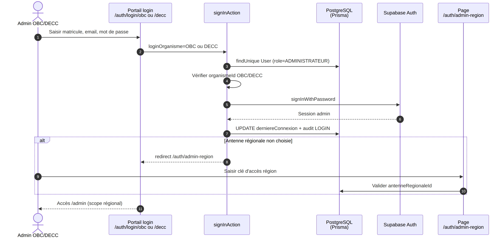

---

### 8.4.2 — UC-A02 : Importer disponibilisation (Import A)

#### Fiche descriptive

| Élément | Description |
| --- | --- |
| **Identifiant** | UC-A02 |
| **Nom** | Import disponibilisation CSV |
| **Acteur principal** | Administrateur |
| **Objectif** | Passer des documents de **Pas disponible** à **Disponible** en masse |
| **Préconditions** | Admin authentifié ; CSV conforme ; périmètre respecté ; pas de duplicata non validé |
| **Scénario nominal** | Upload CSV → traitement ligne par ligne → transition statut → notification élève → rapport import |
| **Postconditions** | Documents `DISPONIBLE` ; élève informé (peut prendre RDV si centre) |
| **Scénarios alternatifs** | Ligne hors périmètre ; duplicata non validé ; document déjà disponible |

#### Diagramme de séquence système

**Figure 8.11 — SEQ-ADMIN-10 : import disponibilisation**

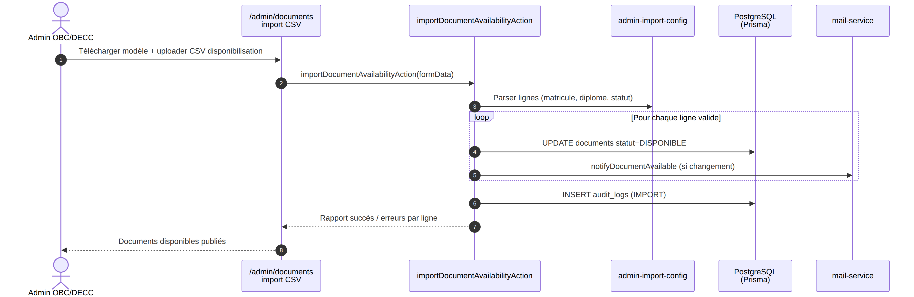

---

### 8.4.3 — UC-A03 : Importer élèves (Import B)

#### Fiche descriptive

| Élément | Description |
| --- | --- |
| **Identifiant** | UC-A03 |
| **Nom** | Import ajout élève CSV |
| **Acteur principal** | Administrateur |
| **Objectif** | Pré-enregistrer matricules pour activation élève (UC-E01) |
| **Préconditions** | Admin authentifié ; CSV conforme `STUDENT_IMPORT_CSV_HEADER` |
| **Scénario nominal** | Upload CSV → UPSERT `User` (ELEVE), `ExamenValide`, documents `PAS_DISPONIBLE` → rapport |
| **Postconditions** | Élèves créés/mis à jour ; prêts pour `/auth/register` |
| **Scénarios alternatifs** | Ligne hors périmètre ; matricule invalide ; diplôme inconnu |

#### Diagramme de séquence système

**Figure 8.12 — SEQ-ADMIN-11 : import élèves**

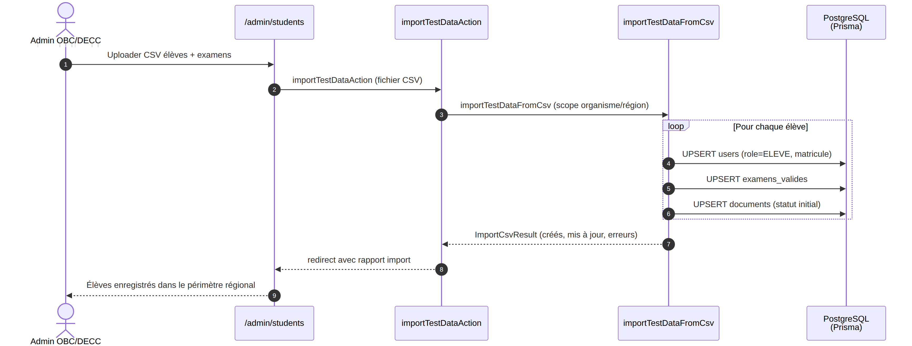

---

### 8.4.4 — UC-A04 : Valider une demande de duplicata

#### Fiche descriptive

| Élément | Description |
| --- | --- |
| **Identifiant** | UC-A04 |
| **Nom** | Valider demande duplicata |
| **Acteur principal** | Administrateur antenne |
| **Objectif** | Autoriser la disponibilisation du duplicata après analyse des pièces |
| **Préconditions** | Dossier `SOUMISE` ou `EN_ANALYSE` ; pièces téléversées |
| **Scénario nominal** | Analyse pièces → validation individuelle → si toutes validées : dossier `VALIDEE` → sync document DUPLICATA |
| **Postconditions** | Dossier validé ; admin peut disponibiliser (UC-A02) ; retrait en antenne |
| **Scénarios alternatifs** | Pièce rejetée → dossier `REJETEE` ; pièces manquantes |

#### Diagramme de séquence système

**Figure 8.13 — SEQ-ADMIN-08 : valider duplicata**

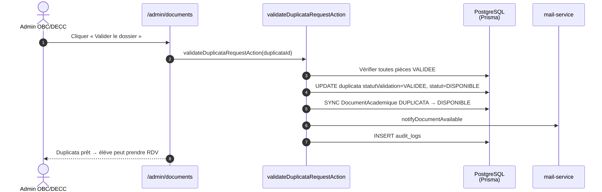

---

### 8.4.5 — UC-A05 : Mettre à jour le statut d'un document

#### Fiche descriptive

| Élément | Description |
| --- | --- |
| **Identifiant** | UC-A05 |
| **Nom** | Mettre à jour statut document |
| **Acteur principal** | Administrateur |
| **Objectif** | Gérer cas par cas (disponibilisation unitaire, retrait antenne) |
| **Préconditions** | Document dans périmètre ; transitions autorisées |
| **Scénario nominal** | Sélection document → nouveau statut → contrôle périmètre → transition → notification si `DISPONIBLE` → audit |
| **Postconditions** | Statut mis à jour ; retrait antenne : `RETIRE` par admin (pas par agent) |
| **Scénarios alternatifs** | Transition interdite ; document hors scope |

#### Diagramme de séquence système

**Figure 8.14 — SEQ-ADMIN-06 : mise à jour statut relevé**

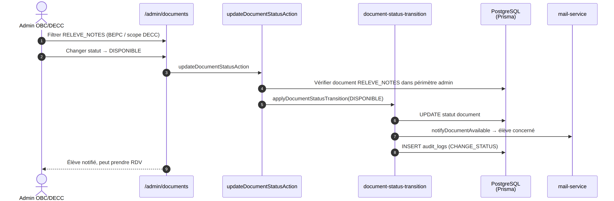

---

## 8.5 — MODULE AGENT CENTRE D'EXAMEN

**Figure 8.15 — Diagramme de cas d'utilisation — Module Agent centre**


| Cas sur le diagramme | Rôle |
| --- | --- |
| authentifier | Point d'entrée espace agent |
| consulter-les-rdv | Consultation des rendez-vous transmis |
| confirmer-les-retraits-effectuer | Extension : clôture du retrait physique |

> **Note métier** — Les retraits en **antenne régionale** (ex. Bac original, duplicatas) sont confirmés par l'**administrateur** (UC-A05), pas par l'agent centre.

---

### 8.5.1 — UC-G01 : Authentifier (agent centre)

#### Fiche descriptive

| Élément | Description |
| --- | --- |
| **Identifiant** | UC-G01 |
| **Nom** | Authentifier |
| **Acteur principal** | Agent centre d'examen |
| **Objectif** | Accéder à l'espace `/centre-examen` |
| **Préconditions** | Compte agent lié à un centre d'examen |
| **Scénario nominal** | Identifiants → rôle `AGENT_CENTRE_EXAMEN` → redirection espace agent → audit |
| **Postconditions** | Session agent ; accès RDV du centre uniquement |
| **Scénarios alternatifs** | Identifiants invalides ; rôle incorrect |

#### Diagramme de séquence système

**Figure 8.16 — SEQ-AGENT-01 : authentification agent**

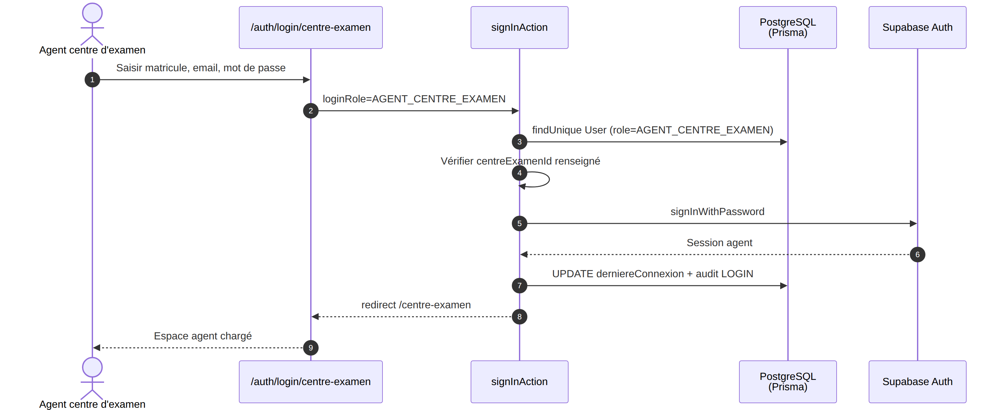

---

### 8.5.2 — UC-G02 : Consulter les rendez-vous transmis

#### Fiche descriptive

| Élément | Description |
| --- | --- |
| **Identifiant** | UC-G02 |
| **Nom** | Consulter les RDV |
| **Acteur principal** | Agent centre |
| **Objectif** | Visualiser les rendez-vous planifiés pour son centre |
| **Préconditions** | Agent authentifié |
| **Scénario nominal** | Accès liste RDV filtrée par centre → affichage élève, document, date/heure, statut |
| **Postconditions** | Lecture seule ; préparation accueil guichet |
| **Scénarios alternatifs** | Aucun RDV planifié ; session expirée |

#### Diagramme de séquence système

**Figure 8.17 — SEQ-AGENT-02 : consulter RDV**

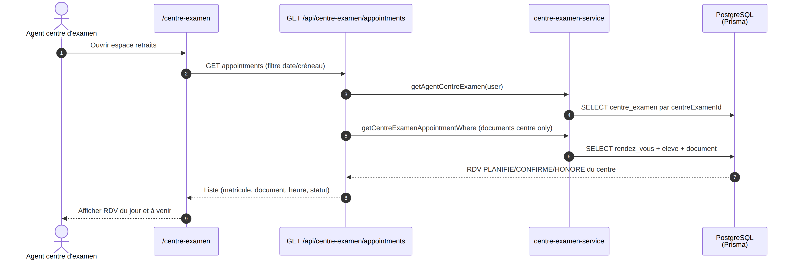

---

### 8.5.3 — UC-G03 : Confirmer retrait effectué

#### Fiche descriptive

| Élément | Description |
| --- | --- |
| **Identifiant** | UC-G03 |
| **Nom** | Confirmer retrait effectué |
| **Acteur principal** | Agent centre |
| **Objectif** | Clôturer le parcours physique au centre d'examen |
| **Préconditions** | RDV `PLANIFIE` ou `CONFIRME` ; document éligible centre ; pas déjà `RETIRE` |
| **Scénario nominal** | Vérification identité sur place → confirmation → RDV `HONORE`, document `RETIRE` → notifications |
| **Postconditions** | Document retiré ; traçabilité en base et audit |
| **Scénarios alternatifs** | RDV hors centre (403) ; déjà confirmé (409) ; retrait antenne réservé à l'admin |

#### Diagramme de séquence système

**Figure 8.18 — SEQ-AGENT-03 : confirmer retrait**

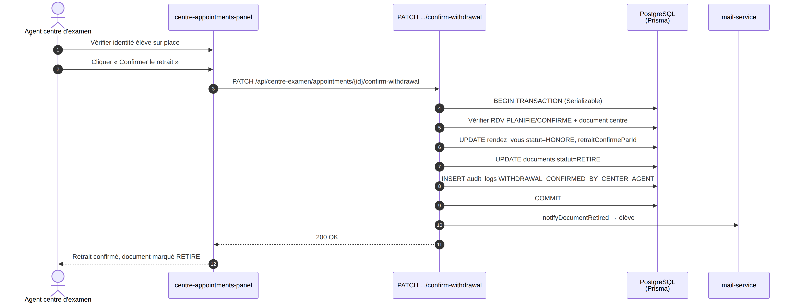

---

## 9. SYNTHÈSE DE L'ANALYSE

L'étude de l'existant met en évidence un **besoin fort** de portail unifié pour :

- **Informer** l'usager avant tout déplacement (consultation publique, notifications) ;
- **Organiser** les retraits (rendez-vous, routage centre / antenne OBC/DECC) ;
- **Tracer** les opérations sensibles (imports, validation duplicata, confirmation de retrait) ;
- **Alléger** le travail administratif (imports CSV, back-office, espace agent).

La solution **DR-DOCSCOL** répond à cette problématique en respectant le découpage institutionnel **OBC / DECC** et en séparant clairement **trois modules métier** (Élève, Administrateur, Agent centre). Les **13 cas d'utilisation essentiels** documentés (fiches + séquences) couvrent le parcours complet : de l'import élève à la confirmation de retrait.

Le détail technique (architecture, diagrammes de classes, diagrammes d'activité complémentaires) est reporté au **cahier de conception**, sans remettre en cause les choix d'analyse présentés ici.

---

## 10. GLOSSAIRE

| Terme | Définition |
| --- | --- |
| OBC | Office du Baccalauréat du Cameroun |
| DECC | Direction des Examens, des Concours et de la Certification |
| Antenne régionale | Structure de retrait par région |
| Centre d'examen | Lieu de composition et de retrait pour certains documents |
| Disponibilisation | Passage d'un document au statut Disponible |
| Import A | Import CSV de disponibilisation (liste OBC/DECC) |
| Import B | Import CSV de nouveaux élèves |
| Duplicata | Copie certifiée d'un document perdu ou détérioré |
| DR-DOCSCOL | Application web de gestion des retraits de documents scolaires |
| UC phare | Cas d'utilisation essentiel documenté par fiche + séquence |

---

**Fin du cahier d'analyse — DR-DOCSCOL v2.0**
