# CAHIER DE CONCEPTION

## Application Web DR-DOCSCOL
### Gestion des retraits de documents scolaires — OBC / DECC

**Projet :** Application de demande document académique  
**Application :** DR-DOCSCOL (Document Retrieval — Documents Scolaires)  
**Contexte :** Cameroun — OBC et DECC  
**Version :** 1.0 — Juin 2026  
**Document associé :** Cahier d'analyse (`docs/cahier_analyse.md`)

---

## TABLE DES MATIÈRES

1. Introduction et objet du cahier de conception
2. Architecture générale de la solution
3. Conception fonctionnelle *(tableau UC §3.2, fiches §3.6, séquences §3.7)*
4. Conception technique
5. Conception du modèle de données
6. Conception de l'interface utilisateur
7. Conception de la sécurité
8. Conception des imports et flux batch
9. Plan de tests et validation
10. Conception du déploiement
11. Conclusion et perspectives
12. Glossaire et références techniques

---

## 1. INTRODUCTION ET OBJET DU CAHIER DE CONCEPTION

### 1.1 — Objet

Le présent **cahier de conception** traduit les résultats du **cahier d'analyse** en choix de conception concrets pour l'application **DR-DOCSCOL**. Il décrit :

- l'architecture globale retenue ;
- la conception fonctionnelle (cas d'utilisation, fiches descriptives, flux, routage) ;
- la conception technique (stack, services, API) ;
- le modèle de données (entités Prisma, énumérations, transitions) ;
- les interfaces, la sécurité, les tests et le déploiement.

### 1.2 — Prérequis

La lecture du cahier d'analyse est recommandée pour comprendre le contexte, les besoins et les contraintes ayant guidé les choix présentés ici.

### 1.3 — État d'implémentation

La conception décrite correspond à l'**implémentation réelle** du dépôt source (Next.js 15, Prisma, Supabase, Vercel), version Juin 2026.

---

## 2. ARCHITECTURE GÉNÉRALE DE LA SOLUTION

### 2.1 — Vue d'ensemble

```
┌─────────────┐     HTTPS      ┌──────────────────────┐
│  Navigateur │ ──────────────►│  Vercel (Next.js 15) │
│  (React 19) │ ◄──────────────│  App Router + API      │
└─────────────┘                └──────────┬───────────┘
                                          │
                    ┌─────────────────────┼─────────────────────┐
                    ▼                     ▼                     ▼
            ┌──────────────┐    ┌──────────────┐    ┌──────────────┐
            │ Supabase Auth│    │ PostgreSQL   │    │ SMTP         │
            │ (sessions)   │    │ (Prisma ORM) │    │ (Nodemailer) │
            └──────────────┘    └──────────────┘    └──────────────┘
```

### 2.2 — Pattern architectural

Organisation **MVC adaptée à Next.js App Router** :

| Couche | Emplacement | Rôle |
| --- | --- | --- |
| Vue | `app/**/page.tsx`, `components/` | Rendu UI |
| Contrôleur | `app/api/**`, `app/**/actions.ts` | Entrées HTTP et Server Actions |
| Modèle | `prisma/schema.prisma` | Persistance relationnelle |
| Services métier | `lib/*.ts` | Règles métier centralisées |

### 2.3 — Découpage modulaire

| Module | Dossiers principaux |
| --- | --- |
| Authentification | `app/auth/`, `lib/auth.ts`, `lib/supabase/` |
| Espace élève | `app/dashboard/`, `components/dashboard/` |
| Back-office | `app/admin/`, `components/admin/` |
| Agent centre | `app/centre-examen/`, `lib/centre-examen-service.ts` |
| Consultation publique | `app/consultation/`, `lib/public-consultation.ts` |
| Documents et routage | `lib/document-routing.ts`, `lib/document-status-transition.ts` |
| Rendez-vous | `lib/appointment-service.ts` |
| Duplicatas | `lib/duplicata-service.ts`, `lib/duplicata-storage.ts` |
| Imports CSV | `lib/csv-import-parser.ts`, `lib/admin-student-import.ts`, `lib/document-availability-import.ts` |

---

## 3. CONCEPTION FONCTIONNELLE

### 3.1 — Acteurs et rôles implémentés

| Rôle Prisma | Espace | Fichier garde |
| --- | --- | --- |
| `ELEVE` | `/dashboard` | `lib/auth.ts` → `requireRole("ELEVE")` |
| `ADMINISTRATEUR` | `/admin` | Périmètre `organismeId` + `antenneRegionaleId` |
| `AGENT_CENTRE_EXAMEN` | `/centre-examen` | Filtre région + documents centre |

**Sous-profils admin :** connexion séparée OBC (`/auth/login/obc`) et DECC (`/auth/login/decc`).

### 3.2 — Diagramme de cas d'utilisation (synthèse)

| UC | Acteur | Description | Route / action |
| --- | --- | --- | --- |
| UC-01 | Élève | Activer compte | `/auth/register` |
| UC-02 | Élève | Consulter documents | `/dashboard/documents` |
| UC-03 | Visiteur | Consultation matricule | `/consultation`, `POST /api/public/consultation` |
| UC-04 | Élève | Demander relevé | `app/dashboard/actions.ts` |
| UC-05 | Élève | Demander duplicata + payer | Dashboard + `Paiement`, `Recu` |
| UC-06 | Élève | Réserver RDV | `/dashboard/rendez-vous` |
| UC-07 | Admin | Import élèves (B) | `/admin/students`, `importTestDataFromCsv` |
| UC-08 | Admin | Disponibilisation (A) | `importDocumentAvailabilityAction` |
| UC-09 | Admin | Changer statut | `/admin/documents`, `updateDocumentStatusAction` |
| UC-10 | Admin | Valider duplicata | `updateDuplicataPieceReviewAction` |
| UC-11 | Agent | Confirmer retrait | `confirm-withdrawal` API |
| UC-12 | Système | Notifier disponibilité | `applyDocumentStatusTransition` |

**Figure 3.1 — Diagramme de cas d'utilisation**

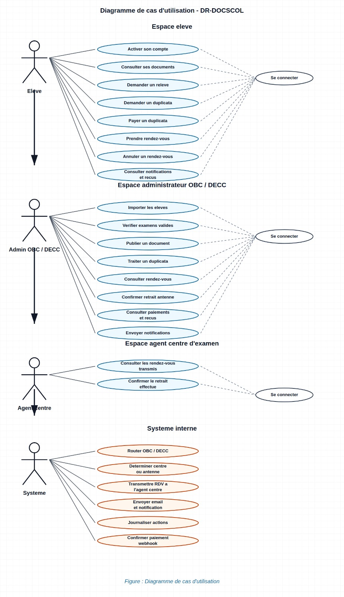

### 3.3 — Flux métier conçus

#### Flux 1 — Parcours élève complet

```
Import B / saisie manuelle → PAS_DISPONIBLE
        ↓
Activation compte (/auth/register)
        ↓
Import A / action admin → DISPONIBLE + notification
        ↓
Consultation + RDV (si routage centre/antenne)
        ↓
Retrait confirmé → RETIRE
```

#### Flux 2 — Consultation publique

| Étape | Conception |
| --- | --- |
| Entrée | Landing `#consultation` (QR) ou `/consultation` |
| Saisie | Matricule uniquement |
| Traitement | `lookupPublicConsultationByMatricule()` |
| Sortie | Statuts documents (hors duplicatas) |
| Actions | Liens Activer mon compte / Me connecter |
| Sécurité | Rate limiting par IP |

### 3.4 — Matrice de routage (conception métier)

Implémentée dans `lib/document-routing.ts` :

| Document | Organisme | Lieu | Confirmé par |
| --- | --- | --- | --- |
| BEPC original | DECC | Centre | Agent |
| BEPC relevé | DECC | Centre | Agent |
| BEPC duplicata | DECC | Antenne | Admin |
| Probatoire relevé | OBC | Centre | Agent |
| Probatoire duplicata | OBC | Antenne | Admin |
| Bac relevé | OBC | Centre | Agent |
| Bac original | OBC | Antenne | Admin |
| Bac duplicata | OBC | Antenne | Admin |

### 3.5 — Inventaire des pages

| Zone | Routes |
| --- | --- |
| Public | `/`, `/consultation` |
| Auth | `/auth/login`, `/auth/register`, `/auth/login/obc`, `/auth/login/decc`, `/auth/login/centre-examen` |
| Élève | `/dashboard`, `/dashboard/documents`, `/dashboard/rendez-vous`, `/dashboard/payments`, `/dashboard/notifications` |
| Admin | `/admin`, `/admin/documents`, `/admin/students`, `/admin/payments`, `/admin/appointments`, `/admin/rdv-disponibilites`, `/admin/audit-logs` |
| Agent | `/centre-examen` |

Référence complète : `docs/routes-implementees.md`

### 3.6 — Fiches descriptives des cas d'utilisation

Les fiches ci-dessous détaillent les cas d'utilisation principaux (voir §3.2). Chaque fiche suit le formalisme UML : **préconditions**, **scénario nominal**, **postconditions** et **scénarios alternatifs**. Les diagrammes de séquence correspondants figurent en §3.7.

---

#### Fiche UC-01 — Activer son compte élève

| Élément | Description |
| --- | --- |
| **Identifiant** | UC-01 |
| **Nom** | Activer son compte élève |
| **Acteur principal** | Élève (non encore connecté) |
| **Objectif** | Créer les identifiants de connexion à partir d'un matricule déjà enregistré par l'administration |
| **Route / implémentation** | `/auth/register` — `signUpAction()` dans `app/auth/actions.ts` |

**Préconditions**

- L'élève a été préalablement enregistré en base (Import B ou saisie admin) avec matricule et email.
- Le rôle associé au matricule est `ELEVE`.
- Le champ `authUserId` est vide (compte non encore activé).
- Supabase Auth est configuré et accessible.

**Scénario nominal**

1. L'élève accède à la page d'activation (`/auth/register`).
2. Il saisit matricule, email, mot de passe et confirmation.
3. Le système normalise le matricule et vérifie la correspondance matricule + email en base.
4. Le système crée ou met à jour l'utilisateur Supabase Auth (`email_confirm: true`).
5. Le système enregistre `authUserId` sur le profil Prisma et ouvre une session.
6. Le système envoie un email de bienvenue (`notifyAccountActivated`).
7. L'élève est redirigé vers `/dashboard`.

**Postconditions (succès)**

- Le compte est activé (`authUserId` renseigné).
- Une session élève est ouverte.
- L'élève peut consulter ses documents en statut initial **Pas disponible** ou **Demande non effectuée**.

**Scénarios alternatifs**

| Code | Condition | Résultat |
| --- | --- | --- |
| A1 | Matricule ou email non reconnus | Message : « Aucun élève ne correspond à ce matricule et à cet email. » |
| A2 | Compte déjà activé (`authUserId` présent) | Message : « Ce compte est déjà activé. Connectez-vous directement. » |
| A3 | Matricule d'un administrateur | Message : « Les comptes administrateurs sont créés manuellement. » |
| A4 | Données de formulaire invalides (Zod) | Message : « Informations d'inscription invalides. » |
| A5 | Échec connexion automatique après activation | Compte activé ; message invitant à se connecter manuellement |

---

#### Fiche UC-03 — Consulter la disponibilité par matricule (public)

| Élément | Description |
| --- | --- |
| **Identifiant** | UC-03 |
| **Nom** | Consultation publique par matricule |
| **Acteur principal** | Visiteur (élève ou tiers) |
| **Objectif** | Vérifier l'état des documents scolaires sans créer de compte |
| **Route / implémentation** | `/consultation`, landing `#consultation` — `lookupPublicConsultationByMatricule()` |

**Préconditions**

- Aucune authentification requise.
- Le matricule saisi respecte la longueur autorisée (3 à 40 caractères).
- Le rate limiting par IP n'est pas dépassé (`lib/simple-rate-limit.ts`).

**Scénario nominal**

1. Le visiteur saisit son matricule sur la page de consultation.
2. Le système recherche l'élève en base (`role = ELEVE`).
3. Si le compte est activé, le système construit la liste des documents (hors duplicatas) avec libellés de statut.
4. Le système affiche le prénom de l'élève et les statuts (Pas disponible, Disponible, Retiré, Demande non effectuée).
5. Des liens vers « Activer mon compte » ou « Me connecter » sont proposés selon l'état d'activation.

**Postconditions (succès)**

- Aucune modification en base (consultation en lecture seule).
- Le visiteur dispose d'une vision synthétique de la disponibilité.

**Scénarios alternatifs**

| Code | Condition | Résultat |
| --- | --- | --- |
| A1 | Matricule inconnu ou rôle ≠ élève | Message générique : aucune information personnelle divulguée (`found: false`) |
| A2 | Élève trouvé mais compte non activé | Affichage du prénom + invitation à activer le compte (pas de détail documentaire) |
| A3 | Matricule invalide (longueur) | Aucun résultat (`found: false`) |
| A4 | Trop de requêtes depuis la même IP | Réponse HTTP 429 |

---

#### Fiche UC-04 — Demander un relevé de notes (ou diplôme original)

| Élément | Description |
| --- | --- |
| **Identifiant** | UC-04 |
| **Nom** | Enregistrer une demande de relevé ou de diplôme |
| **Acteur principal** | Élève connecté |
| **Objectif** | Soumettre officiellement une demande auprès de l'administration |
| **Route / implémentation** | `/dashboard/documents` — `registerSchoolDocumentRequest()` dans `app/dashboard/actions.ts` |

**Préconditions**

- L'élève est authentifié (`role = ELEVE`).
- Un examen validé existe pour le diplôme concerné (`ExamenValide`).
- Le type de document est autorisé pour ce diplôme (`isDocumentRequestAllowed` — ex. pas d'original Probatoire).
- Aucune demande n'a déjà été enregistrée pour ce couple diplôme / type (`demandeSoumiseAt` vide).

**Scénario nominal**

1. L'élève ouvre « Mes documents » et choisit l'examen (BEPC, Probatoire, Bac).
2. Il clique sur « Demander » pour un relevé ou un diplôme original éligible.
3. Le système résout le routage OBC/DECC et l'antenne (`resolveDocumentRoute`).
4. Le système crée ou met à jour le `DocumentAcademique` avec `demandeSoumiseAt` et statut **Pas disponible**.
5. Une notification in-app est créée (type `DEMANDE_RELEVE` ou `DEMANDE_DIPLOME`).
6. L'interface affiche la demande comme enregistrée, en attente de disponibilisation admin.

**Postconditions (succès)**

- Le document porte `demandeSoumiseAt` renseigné et reste **Pas disponible** jusqu'à action admin (UC-08/UC-09).
- Le lieu de retrait futur est déterminé par le routage (centre ou antenne).

**Scénarios alternatifs**

| Code | Condition | Résultat |
| --- | --- | --- |
| A1 | Demande déjà enregistrée | Erreur : « Une demande est déjà enregistrée pour ce document. » |
| A2 | Type non autorisé (ex. original Probatoire) | Erreur métier |
| A3 | Examen introuvable | Erreur : « Examen introuvable pour cet élève. » |

---

#### Fiche UC-05 — Demander un duplicata et payer

| Élément | Description |
| --- | --- |
| **Identifiant** | UC-05 |
| **Nom** | Soumettre une demande de duplicata avec pièces et paiement |
| **Acteur principal** | Élève connecté |
| **Objectif** | Initier un dossier de duplicata (relevé ou diplôme) avec justificatifs et règlement |
| **Route / implémentation** | `/dashboard/documents` — `submitDuplicataRequestAction()` |

**Préconditions**

- L'élève est authentifié.
- Le duplicata cible est autorisé pour le diplôme (cible `ORIGINAL` ou `RELEVE_NOTES`).
- Aucune autre demande de duplicata active pour le même document.
- Le délai de carence d'un an est respecté si un duplicata du même type a déjà été retiré (`getDuplicataRequestAvailability`).
- Les pièces justificatives obligatoires sont fournies.

**Scénario nominal**

1. L'élève ouvre le formulaire duplicata (session, centre d'examen, motif, mode de paiement).
2. Il téléverse les pièces requises (`DUPLICATA_REQUIRED_PIECES`).
3. Le système calcule les frais (10 000 FCFA relevé / 15 000 FCFA diplôme).
4. Le système enregistre le `Duplicata`, les `PieceDuplicata`, le `Paiement` simulé et le `Recu`.
5. Le document `DUPLICATA` associé est créé ou mis à jour en **Pas disponible**, dossier en statut `SOUMISE`.
6. Notification in-app et email de confirmation sont envoyés.

**Postconditions (succès)**

- Dossier duplicata créé, en attente d'analyse admin (UC-10).
- Paiement enregistré (simulation) avec reçu consultable dans `/dashboard/payments`.
- Le duplicata ne peut pas être disponibilisé tant que le dossier n'est pas `VALIDEE`.

**Scénarios alternatifs**

| Code | Condition | Résultat |
| --- | --- | --- |
| A1 | Demande déjà en cours | Erreur : demande en traitement |
| A2 | Duplicata déjà prêt (`DISPONIBLE`) | Erreur invitant à prendre RDV |
| A3 | Cooldown d'un an non écoulé | Erreur avec date de prochaine demande possible |
| A4 | Pièce manquante ou upload échoué | Erreur sur la pièce concernée |
| A5 | Formulaire invalide (Zod) | Erreur : formulaire invalide |

---

#### Fiche UC-06 — Prendre rendez-vous de retrait

| Élément | Description |
| --- | --- |
| **Identifiant** | UC-06 |
| **Nom** | Réserver un créneau de retrait au centre d'examen |
| **Acteur principal** | Élève connecté |
| **Objectif** | Planifier le retrait physique d'un document disponible au centre |
| **Route / implémentation** | `/dashboard/rendez-vous` — `createRendezVousAction()` |

**Préconditions**

- L'élève est authentifié.
- Le document appartient à l'élève et est en statut **Disponible**.
- Pour un relevé/diplôme : une demande a été enregistrée (`demandeSoumiseAt`).
- Pour un duplicata : le dossier associé est en statut `DISPONIBLE`.
- Le routage impose un rendez-vous (`requiresAppointment = true`, retrait au centre d'examen).
- Aucun rendez-vous actif (`PLANIFIE` ou `CONFIRME`) n'existe pour ce document.
- La date choisie est au minimum le lendemain, un jour ouvrable, non férié, avec créneau et quota disponibles.

**Scénario nominal**

1. L'élève sélectionne le document et une date à partir de demain.
2. Le système charge les créneaux disponibles (`getAvailableSlots`) en respectant quota journalier et capacité par créneau.
3. L'élève choisit un créneau horaire libre.
4. Le système crée un `RendezVous` en statut `PLANIFIE` avec lieu de retrait résolu.
5. Notification email et in-app de confirmation (`notifyAppointmentConfirmed`).
6. Redirection vers la page rendez-vous du document.

**Postconditions (succès)**

- Un rendez-vous actif est associé au document.
- Le créneau est décompté du quota du jour.
- L'agent du centre verra ce RDV dans son espace (UC-11).

**Scénarios alternatifs**

| Code | Condition | Résultat |
| --- | --- | --- |
| A1 | Document non disponible | Erreur : document pas encore disponible |
| A2 | Retrait en antenne (pas de RDV) | Erreur : suivre les instructions sans RDV |
| A3 | Date invalide (week-end, férié, avant demain) | Erreur sur la date |
| A4 | Quota ou créneau saturé | Erreur : choisir une autre date |
| A5 | RDV actif déjà existant | Redirection vers le RDV en cours |

---

#### Fiche UC-08 — Disponibiliser un document (Import A ou action admin)

| Élément | Description |
| --- | --- |
| **Identifiant** | UC-08 |
| **Nom** | Mettre un document à disposition pour retrait |
| **Acteur principal** | Administrateur OBC ou DECC |
| **Objectif** | Passer un document de **Pas disponible** à **Disponible** et notifier l'élève |
| **Route / implémentation** | `/admin/students` (Import A), `/admin/documents` — `importDocumentAvailabilityAction`, `updateDocumentStatusAction` |

**Préconditions**

- L'administrateur est authentifié (`role = ADMINISTRATEUR`) sur le portail OBC ou DECC correspondant.
- Le document relève du périmètre organisme/antenne de l'admin (`assertAdminCanManageDocument`).
- Pour un duplicata : le dossier est en statut `VALIDEE` (sinon transition refusée).
- Les duplicatas ne sont pas disponibilisés via l'Import A CSV (règle métier).

**Scénario nominal**

1. L'administrateur importe un fichier CSV de disponibilisation (Import A) **ou** change manuellement le statut d'un document.
2. Le système valide chaque ligne (matricule, diplôme, type) et le périmètre admin.
3. Le système applique la transition vers **Disponible** via `applyDocumentStatusTransition`.
4. Le système crée une notification in-app et envoie un email à l'élève (`notifyDocumentAvailable`).
5. Un enregistrement `AuditLog` trace l'action.

**Postconditions (succès)**

- Le document est en statut **Disponible**.
- L'élève est informé et peut consulter le lieu de retrait et, si applicable, réserver un RDV (UC-06).

**Scénarios alternatifs**

| Code | Condition | Résultat |
| --- | --- | --- |
| A1 | Document hors périmètre admin | Ligne ignorée ou erreur d'accès |
| A2 | Duplicata non validé | Transition refusée |
| A3 | Ligne CSV duplicata dans Import A | Erreur par ligne |
| A4 | Document déjà disponible | Ligne signalée comme déjà traitée |
| A5 | Élève inconnu dans le CSV | Erreur par ligne |

---

#### Fiche UC-11 — Confirmer le retrait physique (agent centre)

| Élément | Description |
| --- | --- |
| **Identifiant** | UC-11 |
| **Nom** | Confirmer le retrait au centre d'examen |
| **Acteur principal** | Agent centre d'examen |
| **Objectif** | Valider que l'élève a retiré son document lors du rendez-vous |
| **Route / implémentation** | `/centre-examen` — `PATCH /api/centre-examen/appointments/[id]/confirm-withdrawal` |

**Préconditions**

- L'agent est authentifié (`role = AGENT_CENTRE_EXAMEN`) et rattaché à un centre de sa région.
- Un rendez-vous existe en statut `PLANIFIE` ou `CONFIRME` pour un document éligible au centre (`isCentreExamenDocumentEligible`).
- Le document n'est pas déjà en statut **Retiré**.
- Le retrait n'a pas déjà été confirmé (`retraitConfirmeAt` vide).

**Scénario nominal**

1. L'agent consulte la liste des rendez-vous de sa région pour la journée (ou période élargie).
2. À l'issue du retrait physique, l'agent clique sur « Confirmer le retrait ».
3. Le système met le rendez-vous en statut `HONORE` avec horodatage et identité de l'agent.
4. Le système passe le document en statut **Retiré**.
5. Pour un duplicata, le statut du dossier est synchronisé (`syncLatestDuplicataStatus`).
6. Notification et email de retrait sont envoyés à l'élève (`notifyDocumentRetired`).

**Postconditions (succès)**

- Document en statut **Retiré** ; rendez-vous **Honoré**.
- Traçabilité complète (agent, date, audit).
- Cooldown d'un an activé pour une nouvelle demande de duplicata du même type.

**Scénarios alternatifs**

| Code | Condition | Résultat |
| --- | --- | --- |
| A1 | RDV hors centre de l'agent | HTTP 403 |
| A2 | Retrait déjà confirmé | HTTP 409 |
| A3 | Document déjà retiré | HTTP 409 |
| A4 | RDV annulé ou invalide | HTTP 409 |
| A5 | Retrait en antenne (Bac original, duplicatas) | Action réservée à l'administrateur, pas à l'agent |

**Note de périmètre :** les retraits en **antenne régionale** (Bac original, tous les duplicatas) sont confirmés par l'**administrateur** via `updateDocumentStatusAction`, avec les mêmes postconditions sur le statut document.

### 3.7 — Diagrammes de séquence

Les diagrammes de séquence décrivent l'ordre des échanges entre l'acteur, le système DR-DOCSCOL et la base de données. Ils complètent les fiches descriptives §3.6.

| Réf. | Cas d'utilisation | Fichier image |
| --- | --- | --- |
| SEQ-01 | Activation compte (UC-01) | `sequence-01-inscription-v3-soutenance.png` |
| SEQ-02 | Connexion | `sequence-02-connexion-v3-soutenance.png` |
| SEQ-03 | Consultation documents (UC-02) | `sequence-03-consultation-documents-v3-soutenance.png` |
| SEQ-04 | Disponibilisation (UC-08) | `sequence-04-notification-disponibilite-v3-soutenance.png` |
| SEQ-05 | Duplicata et paiement (UC-05) | `sequence-05-duplicata-paiement-v3-soutenance.png` |
| SEQ-06 | Rendez-vous (UC-06) | `sequence-06-rendez-vous-v3-soutenance.png` |
| SEQ-07 | Changement de statut (UC-09) | `sequence-07-statut-document-v3-soutenance.png` |
| SEQ-08 | Retrait physique (UC-11) | `sequence-08-retrait-physique-v3-soutenance.png` |
| SEQ-09 | Ajout élève admin (UC-07) | `sequence-09-ajout-eleve-admin-v3-soutenance.png` |
| SEQ-10 | Demande relevé/diplôme (UC-04) | `sequence-10-demande-document-v3-soutenance.png` |

#### Figure 3.2 — Activation du compte élève (SEQ-01 / UC-01)

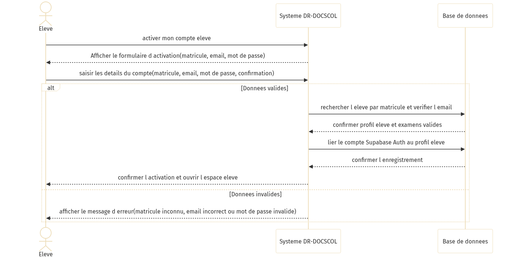

#### Figure 3.3 — Connexion (SEQ-02)

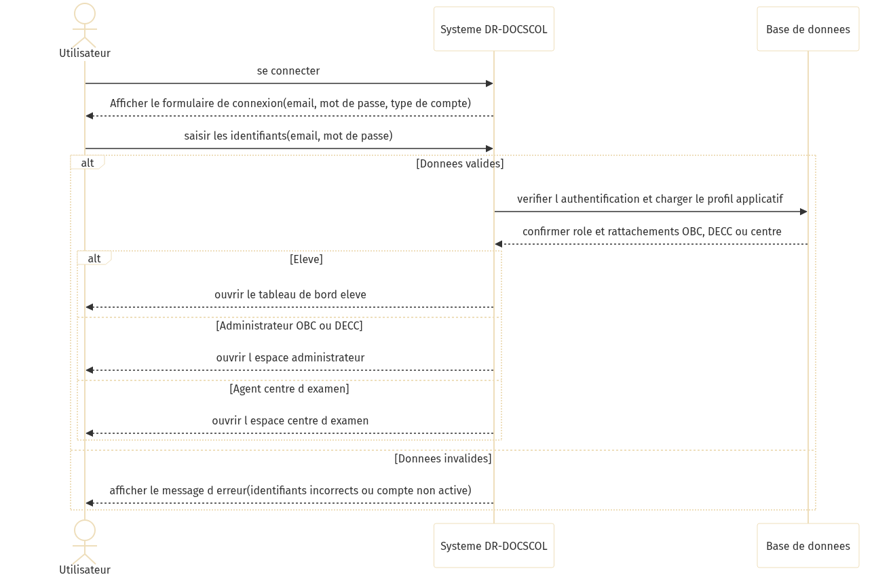

#### Figure 3.4 — Consultation des documents (SEQ-03 / UC-02)

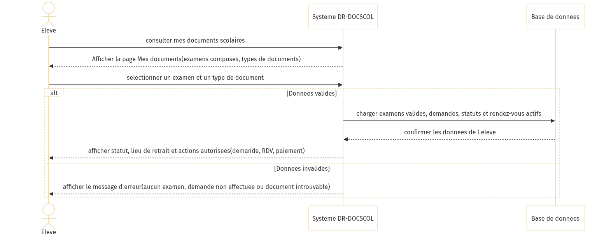

#### Figure 3.5 — Disponibilisation et notification (SEQ-04 / UC-08)

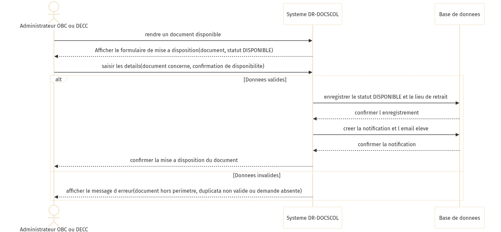

#### Figure 3.6 — Demande de duplicata et paiement (SEQ-05 / UC-05)

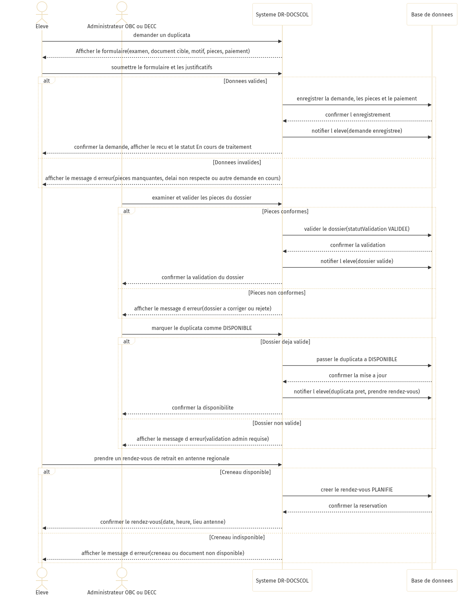

#### Figure 3.7 — Prise de rendez-vous (SEQ-06 / UC-06)

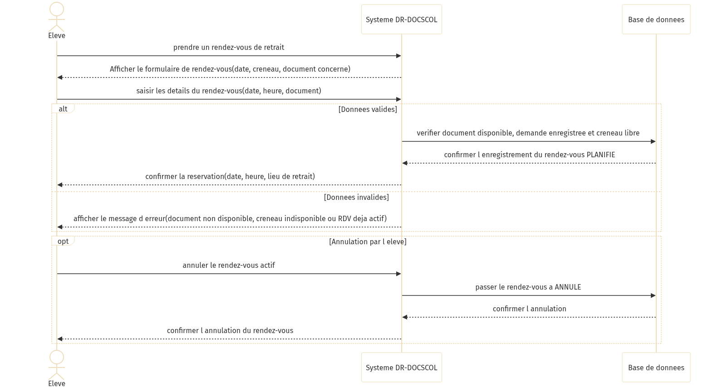

#### Figure 3.8 — Changement de statut document (SEQ-07 / UC-09)

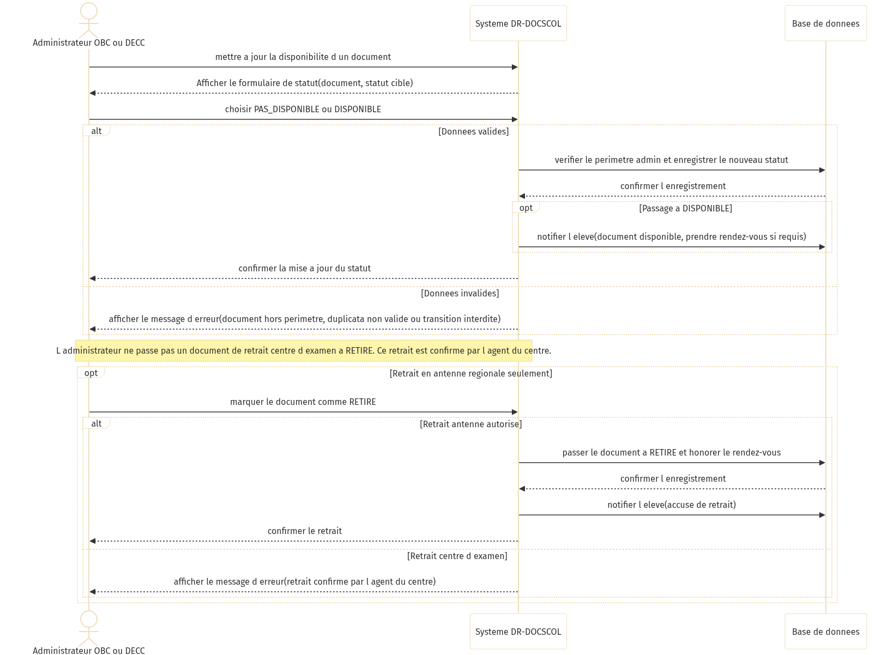

#### Figure 3.9 — Confirmation du retrait physique (SEQ-08 / UC-11)

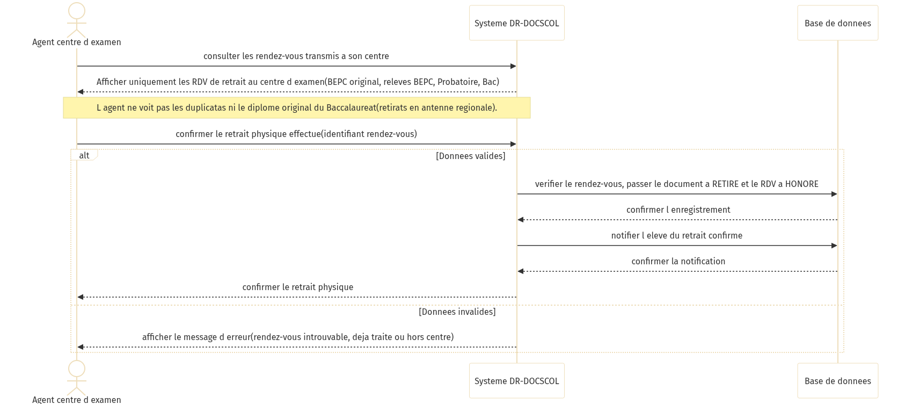

#### Figure 3.10 — Ajout d'élèves par l'administrateur (SEQ-09 / UC-07)

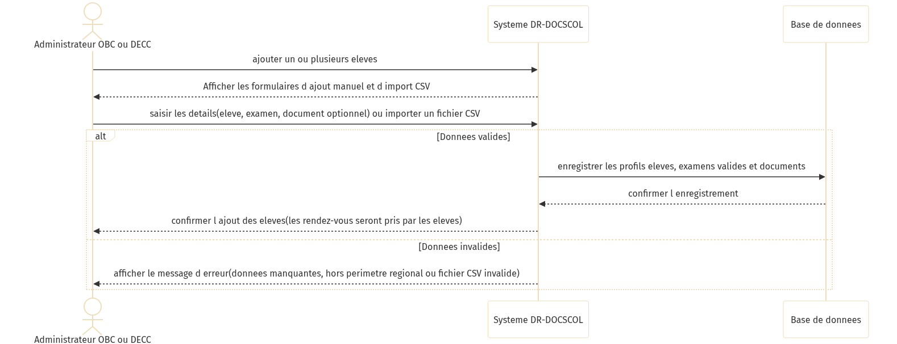

#### Figure 3.11 — Demande de relevé ou diplôme (SEQ-10 / UC-04)

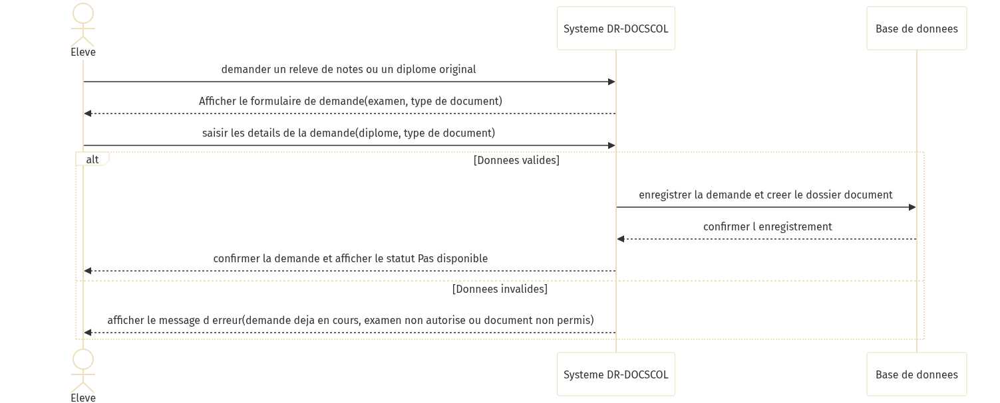

---

## 4. CONCEPTION TECHNIQUE

### 4.1 — Stack retenue

| Composant | Technologie | Version |
| --- | --- | --- |
| Framework | Next.js App Router | 15.x |
| UI | React, Tailwind, Radix UI | React 19 |
| Langage | TypeScript | 5.x |
| ORM | Prisma | 6.x |
| BDD | PostgreSQL (Supabase) | — |
| Auth | Supabase Auth + `@supabase/ssr` | — |
| Validation | Zod | — |
| Email | Nodemailer | — |
| Hébergement | Vercel | Serverless |

### 4.2 — Services métier (couche `lib/`)

| Service | Fichier | Responsabilité |
| --- | --- | --- |
| Routage | `lib/document-routing.ts` | OBC/DECC, antennes, scope admin |
| Statuts | `lib/document-status-transition.ts` | Transitions, notifications, audit |
| RDV | `lib/appointment-service.ts` | Créneaux, quota, fériés |
| Duplicata | `lib/duplicata-service.ts` | Barème, cooldown, sync statut |
| Import élèves | `lib/admin-student-import.ts` | Import B |
| Import dispo | `lib/document-availability-import.ts` | Import A |
| Parser CSV | `lib/csv-import-parser.ts` | Parsing partagé |
| Consultation | `lib/public-consultation.ts` | Lookup matricule |
| Auth | `lib/auth.ts` | Session, rôles |
| Notifications | `lib/notification-service.ts`, `lib/mail-service.ts` | In-app + email |
| Rate limit | `lib/simple-rate-limit.ts` | Protection API publique |

### 4.3 — Conception API REST

38 handlers sous `app/api/` :

| Domaine | Routes clés |
| --- | --- |
| Santé | `GET /api/health` |
| Auth | `/api/auth/login`, `register`, `me`, `logout` |
| Élève | `/api/students/me/documents`, `appointments`, `notifications` |
| RDV | `GET /api/appointments/slots` |
| Admin | `/api/admin/documents`, `students`, `dashboard/stats` |
| Centre | `/api/centre-examen/appointments`, `confirm-withdrawal` |
| Public | `POST /api/public/consultation` |
| Interne | `/api/internal/notifications/dispatch` |
| Paiement | `POST /api/payments/webhook` |

**Helpers :** `lib/api-utils.ts` — `requireApiUser()`, `requireInternalRequest()`, validation Zod.

### 4.4 — Server Actions

| Fichier | Actions principales |
| --- | --- |
| `app/auth/actions.ts` | Connexion, inscription, sélection région admin |
| `app/dashboard/actions.ts` | Demandes relevé/duplicata, RDV |
| `app/admin/actions.ts` | Statuts, imports A/B, quota, fériés, duplicata |
| `app/account/actions.ts` | Profil utilisateur |

### 4.5 — Middleware et session

- `middleware.ts` : rafraîchissement session Supabase, protection routes privées.
- Cookies `sb-*` vérifiés pour `/dashboard`, `/admin`, `/account`.

---

## 5. CONCEPTION DU MODÈLE DE DONNÉES

**Source :** `prisma/schema.prisma` — 20 migrations versionnées.

### 5.1 — Entités principales

| Modèle | Table | Rôle |
| --- | --- | --- |
| `User` | users | Élève, admin, agent |
| `Organisme` | organismes | OBC, DECC |
| `AntenneRegionale` | antennes_regionales | Périmètre régional |
| `CentreExamen` | centres_examen | Agent rattaché |
| `ExamenValide` | examens_valides | Examen par élève/diplôme |
| `DocumentAcademique` | documents | Document + statut |
| `Duplicata` | duplicatas | Dossier duplicata |
| `PieceDuplicata` | pieces_duplicata | Justificatifs |
| `RendezVous` | rendez_vous | RDV retrait |
| `DisponibiliteRdv` | disponibilites_rdv | Créneaux |
| `Paiement` | paiements | Transaction |
| `Recu` | recus | Reçu généré |
| `Notification` | notifications | Alertes in-app |
| `AuditLog` | audit_logs | Traçabilité |
| `ParametreRendezVous` | parametres_rdv | Quota global |

### 5.2 — Énumérations

| Enum | Valeurs |
| --- | --- |
| `Role` | ELEVE, ADMINISTRATEUR, AGENT_CENTRE_EXAMEN |
| `StatutDocument` | PAS_DISPONIBLE, DISPONIBLE, RETIRE |
| `TypeDocument` | ORIGINAL, RELEVE_NOTES, DUPLICATA |
| `DiplomePrincipal` | BEPC, PROBATOIRE, BACCALAUREAT |
| `StatutRendezVous` | PLANIFIE, CONFIRME, ANNULE, HONORE |
| `StatutValidationDuplicata` | SOUMISE, EN_ANALYSE, VALIDEE, REJETEE |

### 5.3 — Conception des transitions de statut

Service : `lib/document-status-transition.ts`

| Transition | Acteur | Règle |
| --- | --- | --- |
| → DISPONIBLE | Admin | Duplicata : validation `VALIDEE` requise |
| → RETIRE (centre) | Agent | Routage `CENTRE_EXAMEN` uniquement |
| → RETIRE (antenne) | Admin | Duplicata, Bac original |
| PAS_DISPONIBLE ↔ DISPONIBLE | Admin | Périmètre organisme/antenne |

Effets collatéraux conçus : notification email, `AuditLog`, sync duplicata, RDV → `HONORE`.

### 5.4 — Conception duplicata et paiement

| Élément | Conception |
| --- | --- |
| Tarif relevé duplicata | 10 000 FCFA |
| Tarif original duplicata | 15 000 FCFA |
| Cooldown | 1 an après RETIRE |
| Pièces | 4 types enum `TypePieceDuplicata` |
| Stockage | Bucket Supabase `duplicata-documents` (MVP partiel) |
| Paiement | MVP simulé, webhook `/api/payments/webhook` |

**Figure 5.1 — Diagramme de classes**

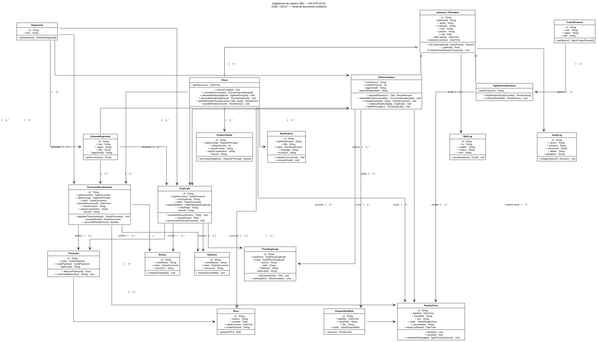

*Source éditable : `docs/diagrammes-graphviz/diagramme-classes-uml-complet.dot` — Notation : généralisation (△ vide), composition (◆ plein), agrégation (◇ vide), associations avec cardinalités, visibilité + / - / #.*

---

## 6. CONCEPTION DE L'INTERFACE UTILISATEUR

### 6.1 — Charte graphique

- Palette ardoise / ambre : `docs/CHARTE_GRAPHIQUE_COULEURS.md`
- Logo : `components/ui/DocScolLogo.tsx`
- Tokens CSS : `styles/globals.css`, `tailwind.config.js`

### 6.2 — Composants structurants

| Composant | Fichier | Usage |
| --- | --- | --- |
| Shell dashboard | `components/dashboard/dashboard-shell.tsx` | Layout mobile-first |
| Header | `components/dashboard/dashboard-header.tsx` | Navigation |
| List panel | `components/dashboard/dashboard-list-panel.tsx` | Listes responsives |
| Landing | `components/landing/landing-page.tsx` | Page d'accueil |
| Consultation QR | `components/landing/consultation-access.tsx` | Section QR |
| Import admin | `components/admin/admin-availability-import-form.tsx` | Import A |
| Dialogues | `components/ui/dialog.tsx`, `sheet.tsx` | Modales scrollables |

### 6.3 — Parcours UI par profil

| Profil | Écrans conçus |
| --- | --- |
| Visiteur | Hero, problème/solution, QR consultation, FAQ |
| Élève | Dashboard, documents, RDV, paiements, notifications |
| Admin | Documents, élèves (imports A/B), audit, RDV OBC |
| Agent | Liste RDV centre, bouton confirmation retrait |

### 6.4 — Responsive

- `h-dvh` + scroll `<main>` dans le shell dashboard.
- Cartes empilées sur mobile (`rendez-vous/page.tsx`).
- Dialogues avec overflow scroll pour petits écrans.

---

## 7. CONCEPTION DE LA SÉCURITÉ

### 7.1 — Authentification

| Étape | Conception |
| --- | --- |
| Credentials | Supabase Auth (email + mot de passe) |
| Lien profil | `User.authUserId` unique |
| Activation | Matricule + email préexistants en Prisma |
| Connexion | Matricule + email + mot de passe |

### 7.2 — Autorisation (defense in depth)

| Niveau | Mécanisme |
| --- | --- |
| Edge | `middleware.ts` |
| Page | `requireUser()`, `requireRole()` |
| API | `requireApiUser(role?)` |
| Métier | `canAdminAccessDocument()`, `getCentreDocumentWhere()` |
| Interne | Header `INTERNAL_API_SECRET` |
| Public | Rate limit consultation |

### 7.3 — Traçabilité

- `AuditLog` : changements statut, imports, validations.
- `MailLog` : succès/échec emails.
- Mots de passe **jamais** stockés en Prisma.

---

## 8. CONCEPTION DES IMPORTS ET FLUX BATCH

### 8.1 — Import B — Nouveaux élèves

| Élément | Conception |
| --- | --- |
| En-tête CSV | `STUDENT_IMPORT_CSV_HEADER` (sans colonne statut) |
| Modèle | `public/templates/import-eleves.csv` |
| Action | `importTestDataFromCsv` → `upsertStudentImportRow` |
| Statut document | Toujours `PAS_DISPONIBLE` |
| UI | `AdminStudentsImportForm` |

### 8.2 — Import A — Disponibilisation

| Élément | Conception |
| --- | --- |
| En-tête CSV | `AVAILABILITY_IMPORT_CSV_HEADER` |
| Modèle | `public/templates/import-disponibilisation.csv` |
| Action | `importDocumentAvailabilityFromCsv` |
| Règle | 1 ligne = 1 document → `DISPONIBLE` |
| Prérequis | Élève + document existants |
| Exclusion | Duplicatas |
| Effet | Notification via `applyDocumentStatusTransition` |
| UI | `AdminAvailabilityImportForm` |
| Revalidation | `/admin/documents`, `/dashboard/documents` |

### 8.3 — Gestion des erreurs import

- Erreurs collectées **par ligne** (matricule inconnu, document absent, type invalide).
- Retour URL : `availStatus`, `availMessage`, `availErrors`.
- Affichage détaillé dans le formulaire admin.

---

## 9. PLAN DE TESTS ET VALIDATION

### 9.1 — Stratégie de test conçue

| Niveau | Méthode | Outils / docs |
| --- | --- | --- |
| Manuel fonctionnel | Scénarios par rôle | `docs/GUIDE_TEST_FONCTIONNEL.md` |
| API | Requêtes curl | `docs/CURL_TEST_EXAMPLES.md` |
| Données | Seeds et CSV | Scripts `npm run seed:*` |
| Post-implémentation | Checklist | `docs/CHECKLIST_POST_IMPLEMENTATION.md` |

### 9.2 — Scénarios critiques

| ID | Scénario | Résultat attendu |
| --- | --- | --- |
| T-01 | Consultation matricule valide | Statuts affichés, pas de duplicatas |
| T-02 | Import B nouvel élève | Document PAS_DISPONIBLE |
| T-03 | Import A ligne valide | DISPONIBLE + notification |
| T-04 | RDV document DISPONIBLE | Créneau réservé |
| T-05 | Retrait agent centre | RETIRE + RDV HONORE |
| T-06 | Duplicata non validé → DISPONIBLE | Erreur métier |
| T-07 | Admin hors périmètre | Accès refusé |

### 9.3 — Jeux de test

- Comptes : `docs/connexions-tests-completes.md`
- 5 élèves demo : `npm run seed:soutenance-eleves` + `docs/demo/KIT_DEMO_COMPLET.pdf`
- Modèles CSV : `public/templates/`

---

## 10. CONCEPTION DU DÉPLOIEMENT

### 10.1 — Architecture de déploiement

| Composant | Cible |
| --- | --- |
| Application | Vercel (serverless) |
| Base | Supabase PostgreSQL |
| Auth | Supabase Auth |
| Email | SMTP externe |

### 10.2 — Configuration Vercel

Fichier `vercel.json` :

- `installCommand` : `npm ci`
- `buildCommand` : `npm run vercel-build`

Script build :

```
prisma generate && next build && node scripts/copy-prisma-engines.mjs
```

### 10.3 — Variables d'environnement

| Variable | Usage |
| --- | --- |
| `DATABASE_URL` | Prisma pooler |
| `DIRECT_URL` | Migrations |
| `NEXT_PUBLIC_SUPABASE_URL` | Client Supabase |
| `NEXT_PUBLIC_SUPABASE_ANON_KEY` | Clé publique |
| `SUPABASE_SERVICE_ROLE_KEY` | Admin Supabase |
| `INTERNAL_API_SECRET` | Routes internes / webhook |
| `NEXT_PUBLIC_SITE_URL` | URL QR consultation |

### 10.4 — Commandes de déploiement

```bash
vercel --prod          # Production
npm run db:migrate:deploy   # Migrations BDD
npm run vercel-build   # Build local identique CI
```

### 10.5 — Limites de conception connues

| Point | Statut |
| --- | --- |
| Pooler Prisma/Supabase | Stabilisation production à finaliser |
| Paiement réel | Conception webhook prête, prestataire à brancher |
| Storage duplicata | Bucket défini, intégration complète TBD |
| Tests E2E automatisés | Non conçus dans le MVP |

---

## 11. CONCLUSION ET PERSPECTIVES

### 11.1 — Bilan de la conception

La conception de DR-DOCSCOL repose sur :

- un **routage documentaire centralisé** ;
- **deux pipelines CSV distincts** ;
- une **consultation publique minimale** ;
- une **architecture Next.js + Prisma + Supabase** déployable sur Vercel ;
- une **traçabilité** systématique des actions sensibles.

### 11.2 — Évolutions prévues

| Évolution | Impact conception |
| --- | --- |
| Paiement Mobile Money | Brancher prestataire sur webhook existant |
| Storage pièces | Finaliser Supabase Storage |
| Tests E2E | Suite Playwright |
| Statistiques avancées | Nouveaux endpoints admin |
| Traduction diplôme | Nouveau module documentaire |

---

## 12. GLOSSAIRE ET RÉFÉRENCES TECHNIQUES

### 12.1 — Glossaire technique

| Terme | Définition |
| --- | --- |
| App Router | Système de routage Next.js 13+ basé sur `app/` |
| Server Action | Fonction serveur `"use server"` appelée depuis le client |
| Prisma | ORM TypeScript pour PostgreSQL |
| Scope admin | Filtre `organismeId` + `antenneRegionaleId` |
| Revalidate | Invalidation cache Next.js après mutation |

### 12.2 — Fichiers de référence

| Ressource | Chemin |
| --- | --- |
| Schéma BDD | `prisma/schema.prisma` |
| Routage métier | `lib/document-routing.ts` |
| Transitions statut | `lib/document-status-transition.ts` |
| Routes | `docs/routes-implementees.md` |
| API | `docs/guide_api_mis_a_jour.md` |
| UML | `docs/diagrammes-images/` |
| Cahier d'analyse | `docs/cahier_analyse.md` |

---

**Fin du cahier de conception — DR-DOCSCOL v1.0**
