# CAHIER DE CONCEPTION — VERSION SOUTENANCE (IMPRESSION)

## Application Web DR-DOCSCOL
### Gestion des retraits de documents scolaires — OBC / DECC

**Projet :** Application de demande document académique  
**Application :** DR-DOCSCOL (Document Retrieval — Documents Scolaires)  
**Contexte :** Cameroun — OBC et DECC  
**Version :** 1.0 — Juin 2026  
> **Version impression / soutenance** — Document allégé (~20–25 pages).  
> Le cahier intégral avec toutes les figures activité/séquence par cas : `docs/cahier_conception.md`  
> Dossier annexe numérique des diagrammes : `docs/diagrammes-images/`

**Document associé :** Cahier d'analyse (`docs/cahier_analyse.md`)

> **Impression** : pour limiter le volume (~20–25 pages), utiliser **`docs/cahier_conception_soutenance.md`** (généré par `python3 scripts/build-cahier-conception-soutenance.py`). Le présent fichier reste la **version intégrale** (toutes les figures activité/séquence par cas).

---

## TABLE DES MATIÈRES

1. Introduction et objet du cahier de conception
2. Architecture générale de la solution *(§2.1 contexte ; §2.2–2.3 MVC ; §2.4 packages ; §2.5 modules)*
3. Conception fonctionnelle *(§3.0 UC général → §3.2 package Élève + modules → §3.3 package Admin + modules → §3.4 package Agent + modules → §3.5 compléments)*
4. Conception du modèle de données *(diagramme de classes après les cas d'utilisation détaillés)*
5. Conception technique
6. Conception de l'interface utilisateur
7. Conception de la sécurité
8. Conception des imports et flux batch
9. Plan de tests et validation
10. Conception du déploiement
11. Conclusion et perspectives
12. Glossaire et références techniques

## 1. INTRODUCTION ET OBJET DU CAHIER DE CONCEPTION

### 1.1 — Objet

Le présent **cahier de conception** traduit les résultats du **cahier d'analyse** en choix de conception concrets pour l'application **DR-DOCSCOL**. Il décrit :

- l'architecture globale retenue (contexte, packages, MVC) ;
- le **diagramme général des cas d'utilisation** (3 acteurs) puis le détail **par package** (UC → fiche → activité → séquence) ;
- le **modèle de données** (diagramme de classes) une fois les cas d'utilisation documentés ;
- les interfaces, la sécurité, les tests et le déploiement.

### 1.2 — Prérequis

La lecture du cahier d'analyse est recommandée pour comprendre le contexte, les besoins et les contraintes ayant guidé les choix présentés ici.

### 1.3 — État d'implémentation

La conception décrite correspond à l'**implémentation réelle** du dépôt source (Next.js 15, Prisma, Supabase, Vercel), version Juin 2026.

---

## 2. ARCHITECTURE GÉNÉRALE DE LA SOLUTION

### 2.1 — Diagramme de contexte

Le **diagramme de contexte** situe le système **DR-DOCSCOL** dans son environnement : acteurs métier à l'extérieur, services transverses en aval. Il précise la **frontière du système** (ce qui est dans le portail web) sans détailler la structure interne — celle-ci est modélisée au §2.4 (packages) et à la Figure 2.2 (couches MVC).

**Figure 2.1 — Diagramme de contexte**

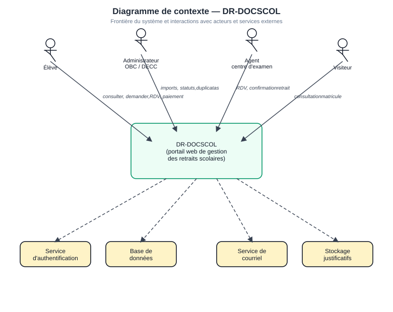

| Élément externe | Interaction principale |
| --- | --- |
| **Élève** | Consultation, demandes, RDV, paiements duplicata, notifications |
| **Administrateur OBC/DECC** | Imports CSV, disponibilisation, statuts, validation duplicatas |
| **Agent centre d'examen** | Consultation RDV transmis, confirmation retrait physique |
| **Visiteur** | Consultation publique par matricule (QR / page dédiée) |
| **Services externes** | Authentification, persistance, courriel, stockage des pièces |

Régénération : `npm run diagrams:contexte-packages`.

### 2.2 — Architecture logique en couches (MVC)

L'architecture interne est **logique** : elle décrit les couches du système **sans nommer les technologies** (framework, base, hébergeur). Le choix des outils concrets est documenté au **chapitre 5 — Conception technique**.

**Principes retenus**

- Application web accessible par navigateur (élève, admin, agent, visiteur).
- Système central **DR-DOCSCOL** organisé en **couches MVC**.
- Séparation **présentation / contrôle / métier / données**.
- Appels vers des **services transverses** : authentification, persistance, courriel, stockage des pièces.

**Figure 2.2 — Architecture générale de la solution (vue logique MVC)**

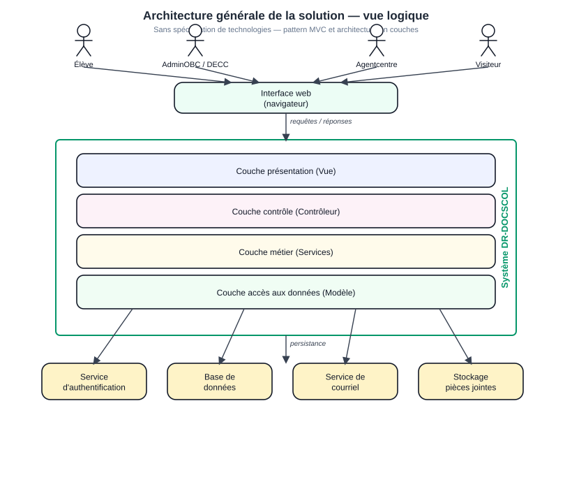

| Élément | Rôle |
| --- | --- |
| **Interface web** | Point d'accès unique : pages publiques, espace élève, back-office, portail agent |
| **Couche présentation** | Affichage des écrans et formulaires |
| **Couche contrôle** | Réception des actions utilisateur, validation, orchestration |
| **Couche métier** | Règles OBC/DECC, routage documents, rendez-vous, duplicatas, imports |
| **Couche accès aux données** | Lecture et écriture des entités métier |
| **Services externes** | Authentification, base de données, envoi de courriels, stockage des justificatifs |

Régénération : `npm run diagrams:architecture`.

### 2.3 — Pattern architectural MVC

Organisation **MVC** (Modèle – Vue – Contrôleur), adaptée à une application web en couches :

| Couche MVC | Rôle dans DR-DOCSCOL |
| --- | --- |
| **Vue** | Interfaces utilisateur : consultation, dashboard, administration, centre d'examen |
| **Contrôleur** | Traitement des requêtes et des actions utilisateur |
| **Modèle** | Données persistées : élèves, documents, rendez-vous, paiements, notifications |
| **Services métier** | Règles métier centralisées (routage OBC/DECC, statuts, rendez-vous, duplicatas) |

La correspondance avec l'organisation du code source figure au §2.5 et au chapitre 5.

### 2.4 — Diagramme de packages

Le **diagramme de packages** découpe DR-DOCSCOL en **modules métier cohérents**. Chaque package regroupe des cas d'utilisation et des composants de présentation ; le package **PKG-CORE** centralise les règles transverses (`lib/*`).

**Figure 2.3 — Diagramme de packages**

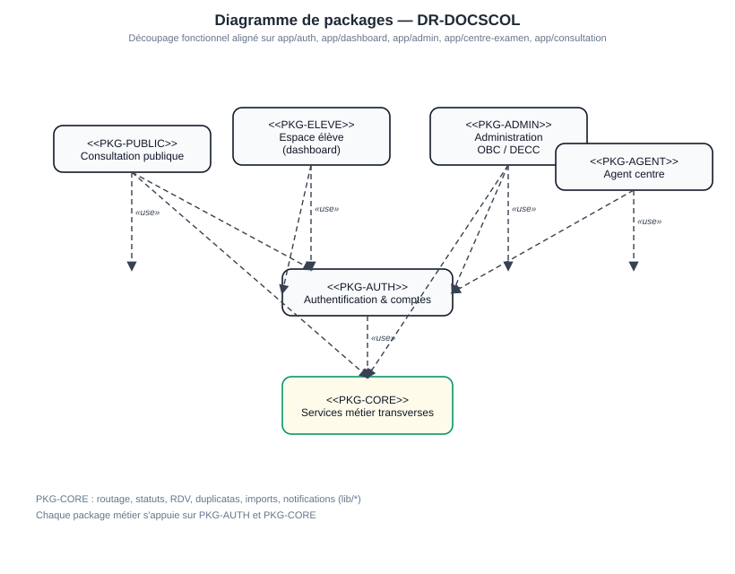

| Package | Dossiers / composants | Cas d'utilisation (§3.2) |
| --- | --- | --- |
| **PKG-PUBLIC** | `app/consultation/`, landing `#consultation` | UC-03 |
| **PKG-AUTH** | `app/auth/`, `lib/auth.ts`, `lib/supabase/` | UC-01, authentifier (élève, admin, agent) |
| **PKG-ELEVE** | `app/dashboard/`, `components/dashboard/` | UC-02, UC-04, UC-05, UC-06 |
| **PKG-ADMIN** | `app/admin/`, `components/admin/` | UC-07, UC-08, UC-09, UC-10, quota RDV |
| **PKG-AGENT** | `app/centre-examen/`, `lib/centre-examen-service.ts` | UC-11 |
| **PKG-CORE** | `lib/document-routing.ts`, `lib/appointment-service.ts`, imports, mail… | UC-12 (notifications système), services partagés |

Pour **chaque package métier** (PKG-PUBLIC à PKG-AGENT), le chapitre 3 présente : **diagramme UC du package** → **fiche** → **activité** → **séquence**, après le **diagramme général** (§3.0).

### 2.5 — Découpage modulaire (implémentation)

| Module | Dossiers principaux |
| --- | --- |
| Authentification | `app/auth/`, `lib/auth.ts`, `lib/supabase/` |
| Espace élève | `app/dashboard/`, `components/dashboard/` |
| Back-office | `app/admin/`, `components/admin/` |
| Agent centre | `app/centre-examen/`, `lib/centre-examen-service.ts` |
| Consultation publique | `app/consultation/`, `lib/public-consultation.ts` |
| Documents et routage | `lib/document-routing.ts`, `lib/document-status-transition.ts` |
| Rendez-vous | `lib/appointment-service.ts` |
| Duplicatas | `lib/duplicata-service.ts`, `lib/duplicata-storage.ts` |
| Imports CSV | `lib/csv-import-parser.ts`, `lib/admin-student-import.ts`, `lib/document-availability-import.ts` |

---

## 3. CONCEPTION FONCTIONNELLE

> **Ordre de présentation (syntaxe générale)**  
> 1. **Diagramme de cas d'utilisation général** (Figure 3.0 — trois acteurs)  
> 2. **Package Élève** (Figure 3.1) → pour chaque **module phare** : *fiche descriptive → diagramme d'activité → diagramme de séquence* (§3.2)  
> 3. **Package Administrateur OBC / DECC** (Figure 3.2) → idem (§3.3)  
> 4. **Package Agent centre d'examen** (Figure 3.3) → idem (§3.4)  
> 5. **Diagramme de classes** — chapitre 4, **après** tous les cas d'utilisation détaillés  

### 3.0 — Diagramme général des cas d'utilisation

Le **diagramme général** (Figure 3.0) regroupe les **trois acteurs** et reprend **l'intégralité** des cas, relations `<<include>>`, `<<extend>>` et généralisations des diagrammes par acteur (Fig. 3.1 à 3.3).

La **consultation publique** (`consulter-via-QRcode`) est rattachée à l'**élève** (accès avant connexion).

Les figures UC sont des **exports draw.io** (dossier source `diagramme cas utilisation/`, copies dans `diagrammes-images/`). Chaque figure est insérée à **pleine résolution** ; le texte et les tableaux reprennent **directement en dessous**.

**Figure 3.0 — Diagramme général des cas d'utilisation**

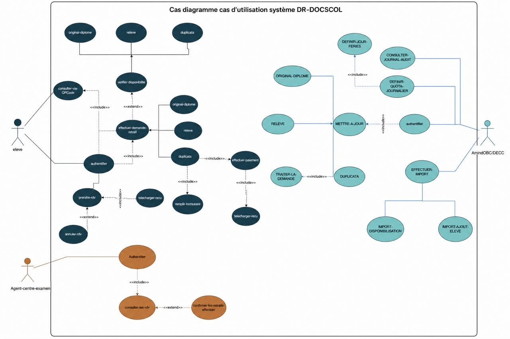

| Colonne | Acteur | Cas principaux (vue générale) |
| --- | --- | --- |
| Gauche | Élève | consulter-via-QRcode, authentifier, effectuer-demande-retrait, prendre-rdv, annuler-rdv |
| Centre | Administrateur OBC/DECC | authentifier, METTRE-A-JOUR, EFFECTUER-IMPORT, DEFINIR-QUOTA-JOURNALIER, CONSULTER-JOURNAL-AUDIT |
| Droite | Agent centre | authentifier, consulter-les-rdv, confirmer-les-retraits-effectuer |

Sources draw.io : `diagramme cas utilisation/` (`Image collée.png`, `cas utilisation eleve .drawio.png`, `vivi.drawio.png`, `agent centre.drawio.png`). Mise à jour des figures : recopier vers `diagrammes-images/cas-utilisation-*.png`. Variante vectorielle programmatique : `npm run diagrams:cas-utilisation`.

### 3.0 bis — Syntaxe générale de modélisation (3 niveaux)

Chaque cas d'utilisation ou module est documenté selon la **syntaxe générale** suivante, **dans cet ordre** :

```
Niveau 1 — Diagramme général des cas d'utilisation (3 acteurs)
    ↓
Niveau 2 — Diagramme de cas d'utilisation du package (par acteur : Élève, Admin, Agent)
    ↓
Niveau 3 — Pour 3 à 4 modules phares du package :
              fiche descriptive → diagramme d'activité → diagramme de séquence
```

| Niveau | Artefact | Figures (exemple package élève) |
| --- | --- | --- |
| **1 — Général** | Diagramme UC **global** (3 acteurs) | Figure 3.0 |
| **2 — Package** | Diagramme UC **complet du package** | Figure 3.1 (élève), 3.2 (admin), 3.3 (agent) |
| **3 — Module** | **Fiche** → **Activité** → **Séquence** | §3.2.1–3.2.7 (ex. UC-03 : fiche §3.2.3, Fig. 3.7 activité, Fig. 3.8 séquence) |

> **Règle de présentation** — **Titre de figure** (`Figure N — …`) **obligatoire immédiatement au-dessus** de chaque diagramme ou capture ; le **texte reprend directement en dessous** (fiche, tableau ou commentaire), sans page vide.

À partir du **diagramme de packages** (§2.4), la conception fonctionnelle suit **deux niveaux détaillés** (2 et 3 ci-dessus) :

| Niveau | Artefact | Exemple (package élève) |
| --- | --- | --- |
| **1. Package** | Un **diagramme de cas d'utilisation** couvrant **tout le package** | Figure 3.1 — tous les cas de l'espace élève |
| **2. Module** (sous-ensemble fonctionnel du package) | Pour **chaque module** : **fiche descriptive** → **diagramme d'activité** → **diagramme de séquence** | Module *Authentification* : §3.2.1 + §3.2.2 ; module *Duplicata* : §3.2.6 ; etc. |

**Modules du package élève (PKG-ELEVE / PKG-PUBLIC)** — détail en §3.2 :

| Module | Cas / UC | Fiche | Activité | Séquence |
| --- | --- | --- | --- | --- |
| Consultation publique & authentification | UC-03, authentifier, UC-01 | §3.2.1–3.2.3 | ACT-UC-03, ACT-AUTH-ELEVE | SEQ-ELEVE-01, 02 |
| Mes documents | UC-02 | §3.2.4 | ACT-UC-02 | SEQ-ELEVE-03 |
| Demande relevé / diplôme | UC-04 | §3.2.5 | ACT-UC-04 | SEQ-ELEVE-05 |
| Duplicata & paiement | UC-05 | §3.2.6 | ACT-02 | SEQ-ELEVE-06, 07, 08 |
| Rendez-vous de retrait | UC-06 | §3.2.7 | ACT-UC-06 | SEQ-ELEVE-09, 10 |

**Modules du package administrateur (PKG-ADMIN)** — détail en §3.3 : imports (§3.3.2–3.3.3), mise à jour statuts (§3.3.4), validation duplicata (§3.3.5), quota RDV (§3.3.6).

**Module du package agent (PKG-AGENT)** — détail en §3.4 : consultation RDV et confirmation retrait (§3.4.2).

Une fois **tous les modules de tous les packages** documentés (fiche → activité → séquence), le **diagramme de classes** est présenté au **chapitre 4**.

### 3.1 — Acteurs, inventaire UC et rôles implémentés

| UC | Package | Acteur | Description | Route / action |
| --- | --- | --- | --- | --- |
| UC-01 | PKG-AUTH | Élève | Activer compte | `/auth/register` |
| — | PKG-AUTH | Élève / Admin / Agent | Authentifier | `/auth/login/*` |
| UC-03 | PKG-PUBLIC | Visiteur | Consultation matricule | `/consultation` |
| UC-02 | PKG-ELEVE | Élève | Consulter documents | `/dashboard/documents` |
| UC-04 | PKG-ELEVE | Élève | Demander relevé | `app/dashboard/actions.ts` |
| UC-05 | PKG-ELEVE | Élève | Demander duplicata + payer | Dashboard + `Paiement`, `Recu` |
| UC-06 | PKG-ELEVE | Élève | Réserver RDV | `/dashboard/rendez-vous` |
| UC-07 | PKG-ADMIN | Admin | Import élèves (B) | `/admin/students` |
| UC-08 | PKG-ADMIN | Admin | Disponibilisation (A) | `importDocumentAvailabilityAction` |
| UC-09 | PKG-ADMIN | Admin | Changer statut | `/admin/documents` |
| UC-10 | PKG-ADMIN | Admin | Valider duplicata | `updateDuplicataPieceReviewAction` |
| UC-11 | PKG-AGENT | Agent | Confirmer retrait | `confirm-withdrawal` API |
| UC-12 | PKG-CORE | Système | Notifier disponibilité | `applyDocumentStatusTransition` |

| Rôle Prisma | Espace | Fichier garde |
| --- | --- | --- |
| `ELEVE` | `/dashboard` | `lib/auth.ts` → `requireRole("ELEVE")` |
| `ADMINISTRATEUR` | `/admin` | Périmètre `organismeId` + `antenneRegionaleId` |
| `AGENT_CENTRE_EXAMEN` | `/centre-examen` | Filtre région + documents centre |

**Sous-profils admin :** connexion séparée OBC (`/auth/login/obc`) et DECC (`/auth/login/decc`).

**Packages transverses (sans diagramme UC dédié)** — PKG-PUBLIC (consultation matricule, cas sur Fig. 3.1), PKG-AUTH (authentification par acteur), PKG-CORE (règles `lib/*`, notifications UC-12).

---

## 3.2 — Package Élève *(diagramme UC + modules phares)*

Après la vue générale (§3.0), on détaille le **parcours élève** : consultation publique, authentification, documents, demandes, duplicata, rendez-vous.

**Figure 3.1 — Diagramme de cas d'utilisation — package Élève**

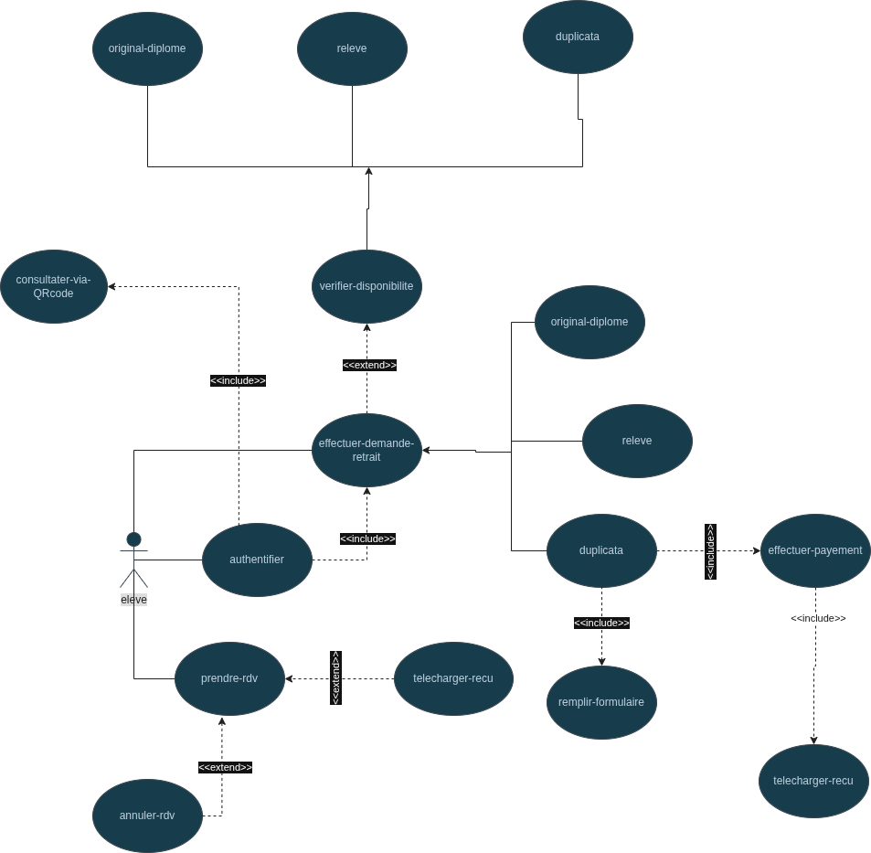

| Module phare | Cas / UC | Sections |
| --- | --- | --- |
| **Authentification** | UC-01, authentifier | §3.2.1, §3.2.2 |
| **Consultation publique** | UC-03 | §3.2.3 |
| **Mes documents** | UC-02 | §3.2.4 |
| **Demande relevé / diplôme** | UC-04 | §3.2.5 |
| **Duplicata & paiement** | UC-05 | §3.2.6 |
| **Rendez-vous de retrait** | UC-06 | §3.2.7 |

Pour **chaque module** ci-dessous : **fiche descriptive** → **diagramme d'activité** (description) → **diagramme de séquence** (description).

### 3.2.1 — Module Authentification — UC-01 : Activer son compte élève

#### Fiche descriptive

| Élément | Description |
| --- | --- |
| **Identifiant** | UC-01 |
| **Nom** | Activer son compte élève |
| **Acteur principal** | Élève (non connecté) |
| **Objectif** | Créer les identifiants à partir d'un matricule pré-enregistré |
| **Route / implémentation** | `/auth/register` — `signUpAction()` |

**Préconditions** — Élève en base (Import B) ; rôle `ELEVE` ; `authUserId` vide ; Supabase Auth configuré.

**Scénario nominal**

1. Accès à `/auth/register`.
2. Saisie matricule, email, mot de passe.
3. Vérification matricule + email en Prisma.
4. Création Supabase Auth (`email_confirm: true`) et liaison `authUserId`.
5. Email de bienvenue ; redirection `/dashboard`.

**Postconditions** — Compte activé ; session ouverte.

**Scénarios alternatifs** — A1 matricule/email inconnu ; A2 compte déjà activé ; A3 matricule admin ; A4 formulaire invalide ; A5 échec connexion auto post-activation.

#### Diagramme d'activité

*Figure en annexe numérique — dossier `diagrammes-images/activites/`.*


#### Diagramme de séquence

L'activation suit la même logique que la connexion (Prisma + Supabase Auth). Voir **§3.2.2 SEQ-ELEVE-01** pour le schéma d'échanges ; la différence est l'étape `signUp` au lieu de `signInWithPassword`.

---

### 3.2.2 — Module Authentification — Authentifier (connexion élève)

#### Fiche descriptive

| Élément | Description |
| --- | --- |
| **Identifiant** | — *(cas sur diagramme Élève)* |
| **Nom** | Authentifier |
| **Acteur principal** | Élève |
| **Objectif** | Ouvrir une session sécurisée sur l'espace `/dashboard` |
| **Route / implémentation** | `/auth/login` — `signInAction()` |

**Préconditions** — Compte activé (`authUserId` renseigné) ; identifiants valides.

**Scénario nominal** — Saisie matricule, email, mot de passe → contrôle rôle `ELEVE` en Prisma → `signInWithPassword` → audit `LOGIN` → redirection `/dashboard`.

**Scénarios alternatifs** — Matricule inconnu ; rôle incorrect ; mot de passe invalide ; email ne correspond pas au matricule.

#### Diagramme d'activité

*Figure en annexe numérique — dossier `diagrammes-images/activites/`.*


#### Diagramme de séquence

**SEQ-ELEVE-01** — Barrière métier Prisma avant Supabase ; trace `audit_logs` pour la soutenance.

**Figure 3.6 — SEQ-ELEVE-01 : connexion élève**


---

### 3.2.3 — Module Consultation publique — UC-03

#### Fiche descriptive

| Élément | Description |
| --- | --- |
| **Identifiant** | UC-03 |
| **Nom** | Consultation publique par matricule |
| **Acteur principal** | Visiteur |
| **Objectif** | Vérifier l'état des documents sans compte |
| **Route / implémentation** | `/consultation`, landing `#consultation` |

**Préconditions** — Aucune auth ; matricule 3–40 car. ; rate-limit IP non dépassé.

**Scénario nominal** — Saisie matricule → recherche élève → si activé : statuts documents (hors duplicatas) ; sinon prénom + lien activation.

**Postconditions** — Lecture seule ; aucune modification en base.

**Scénarios alternatifs** — A1 matricule inconnu (message générique) ; A2 compte non activé ; A3 matricule invalide ; A4 HTTP 429.

#### Diagramme d'activité

*Figure en annexe numérique — dossier `diagrammes-images/activites/`.*


#### Diagramme de séquence

**SEQ-ELEVE-02** — `POST /api/public/consultation` ; branche compte non activé sans fuite documentaire.

**Figure 3.8 — SEQ-ELEVE-02 : consultation QR / matricule**


---

### 3.2.4 — Module Mes documents — UC-02

#### Fiche descriptive

| Élément | Description |
| --- | --- |
| **Identifiant** | UC-02 |
| **Nom** | Consulter ses documents scolaires |
| **Acteur principal** | Élève connecté |
| **Objectif** | Visualiser statuts, lieux de retrait et actions possibles par diplôme |
| **Route / implémentation** | `/dashboard/documents` |

**Préconditions** — Session élève valide.

**Scénario nominal**

1. Chargement documents, duplicatas, examens validés.
2. `resolveDocumentRoute` pour chaque document (organisme, centre/antenne, `requiresAppointment`).
3. Affichage cartes par examen avec libellés de statut et boutons (Demander, RDV, Duplicata…).

**Postconditions** — Aucune mutation (consultation connectée).

**Scénarios alternatifs** — Session expirée → redirection login ; liste vide si aucun examen validé.

#### Diagramme d'activité

*Figure en annexe numérique — dossier `diagrammes-images/activites/`.*


#### Diagramme de séquence

**SEQ-ELEVE-03** — Server Component ; routage OBC/DECC côté serveur.

**Figure 3.10 — SEQ-ELEVE-03 : vérifier disponibilité**


---

### 3.2.5 — Module Demande relevé / diplôme — UC-04

#### Fiche descriptive

| Élément | Description |
| --- | --- |
| **Identifiant** | UC-04 |
| **Nom** | Enregistrer une demande de relevé ou de diplôme |
| **Acteur principal** | Élève connecté |
| **Objectif** | Soumettre officiellement une demande avant disponibilisation admin |
| **Route / implémentation** | `registerSchoolDocumentRequest()` |

**Préconditions** — Examen validé ; type autorisé ; pas de demande existante (`demandeSoumiseAt` vide).

**Scénario nominal** — Choix examen → Demander → routage → création/màj `DocumentAcademique` `PAS_DISPONIBLE` + notification.

**Postconditions** — `demandeSoumiseAt` renseigné ; attente action admin (UC-08/UC-09).

**Scénarios alternatifs** — A1 demande déjà enregistrée ; A2 type non autorisé ; A3 examen introuvable.

#### Diagramme d'activité

*Figure en annexe numérique — dossier `diagrammes-images/activites/`.*


#### Diagramme de séquence

**SEQ-ELEVE-05** (relevé) — Le diplôme original suit **SEQ-ELEVE-04** avec contrôles de routage différents (ex. Bac original → antenne OBC).

**Figure 3.12 — SEQ-ELEVE-05 : demande relevé**


**Figure 3.13 — SEQ-ELEVE-04 : demande diplôme original** *(variante routage)*


---

### 3.2.6 — Module Duplicata & paiement — UC-05

#### Fiche descriptive

| Élément | Description |
| --- | --- |
| **Identifiant** | UC-05 |
| **Nom** | Soumettre duplicata avec pièces et paiement |
| **Acteur principal** | Élève connecté |
| **Objectif** | Initier dossier duplicata + règlement simulé |
| **Route / implémentation** | `submitDuplicataRequestAction()` |

**Préconditions** — Duplicata autorisé ; pas de dossier actif ; cooldown 1 an respecté ; 4 pièces obligatoires.

**Scénario nominal** — Formulaire → upload Storage → barème (10 000 / 15 000 FCFA) → transaction Prisma (`Duplicata`, `Paiement`, `Recu`) → notifications.

**Postconditions** — Dossier `SOUMISE` ; attente analyse admin (UC-10).

**Scénarios alternatifs** — A1 demande en cours ; A2 déjà disponible ; A3 cooldown ; A4 pièce manquante ; A5 formulaire invalide.

#### Diagramme d'activité

*Figure en annexe numérique — dossier `diagrammes-images/activites/`.*

Vue **processus complet duplicata** (soumission → validation admin → retrait antenne) :


#### Diagrammes de séquence

**SEQ-ELEVE-06** — Formulaire et pièces. **SEQ-ELEVE-07** — Paiement. **SEQ-ELEVE-08** — Téléchargement reçu.

**Figure 3.15 — SEQ-ELEVE-06 : formulaire duplicata**

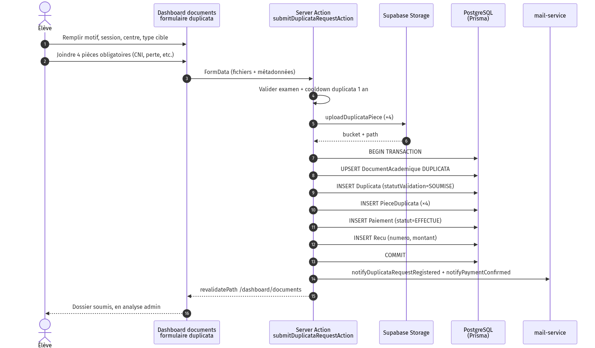

**Figure 3.16 — SEQ-ELEVE-07 : paiement duplicata**

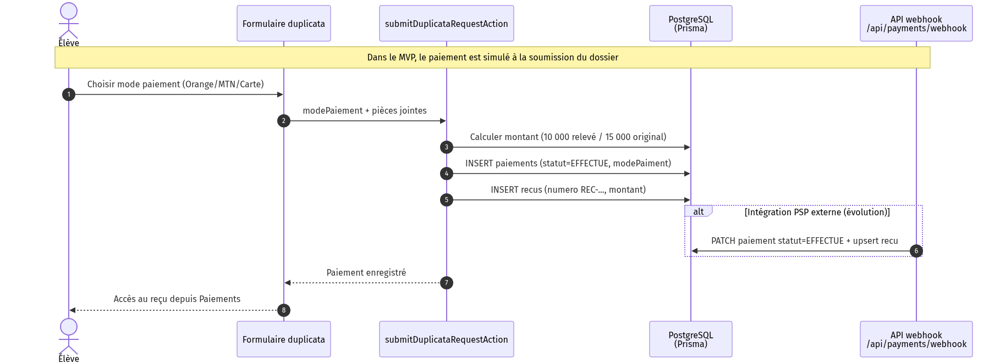

**Figure 3.17 — SEQ-ELEVE-08 : télécharger reçu**

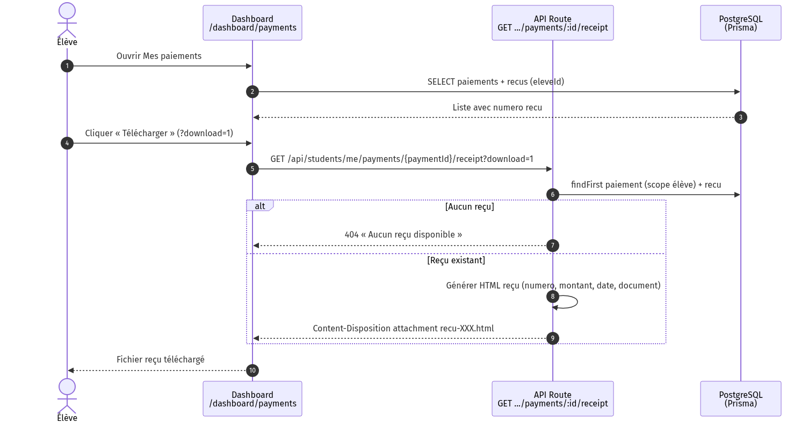

---

### 3.2.7 — Module Rendez-vous de retrait — UC-06

#### Fiche descriptive

| Élément | Description |
| --- | --- |
| **Identifiant** | UC-06 |
| **Nom** | Réserver ou annuler un créneau au centre d'examen |
| **Acteur principal** | Élève connecté |
| **Objectif** | Planifier le retrait physique au centre |
| **Route / implémentation** | `/dashboard/rendez-vous`, `createRendezVousAction()` |

**Préconditions** — Document `DISPONIBLE` ; routage centre (`requiresAppointment`) ; pas de RDV actif ; date ≥ lendemain, ouvrable, quota OK.

**Scénario nominal (prise)** — Choix date → créneaux `getAvailableSlots` → réservation `PLANIFIE` → notification.

**Scénario nominal (annulation)** — Annulation depuis `/dashboard/rendez-vous` → statut `ANNULE` → quota libéré.

**Postconditions** — RDV actif ou annulé ; agent informé via son espace (UC-11).

**Scénarios alternatifs** — Document non disponible ; retrait antenne ; date/quota invalides ; RDV déjà existant.

#### Diagramme d'activité

*Figure en annexe numérique — dossier `diagrammes-images/activites/`.*


#### Diagrammes de séquence

**Figure 3.19 — SEQ-ELEVE-09 : prise de rendez-vous**

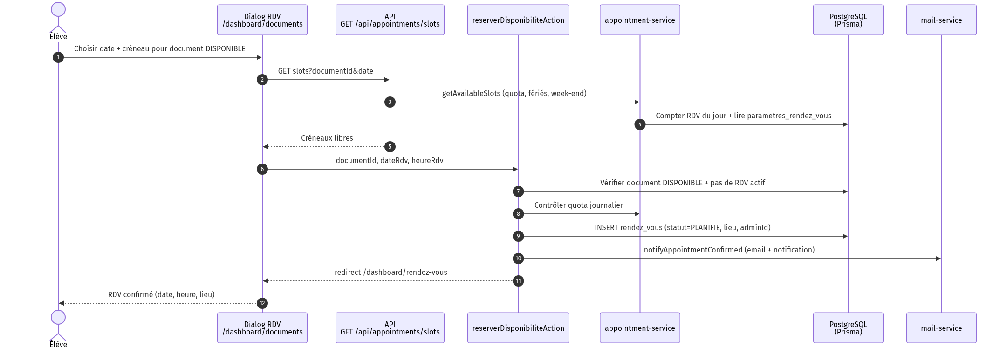

**Figure 3.20 — SEQ-ELEVE-10 : annulation RDV**

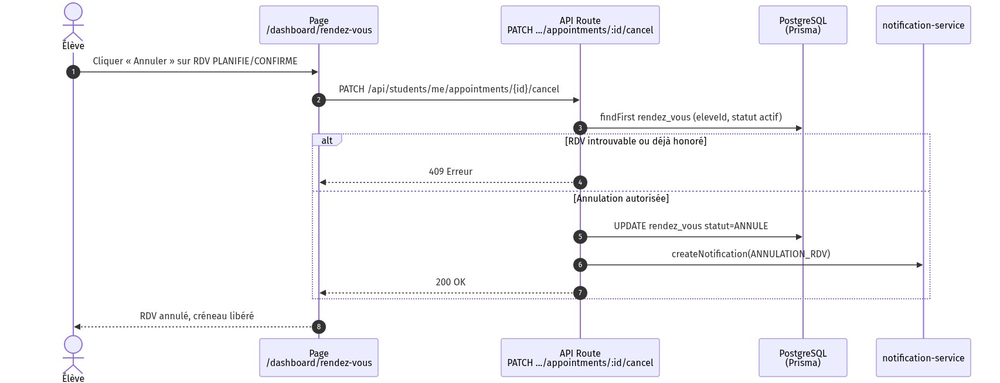

---

## 3.3 — Package Administrateur OBC / DECC *(diagramme UC + modules phares)*

**Figure 3.2 — Diagramme de cas d'utilisation — package Administrateur OBC / DECC**

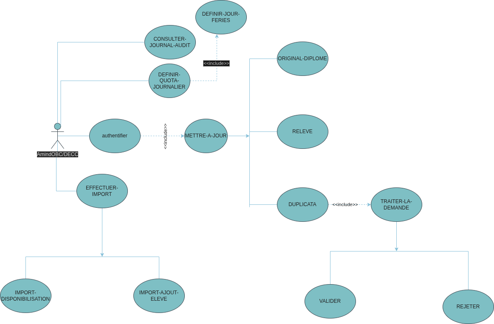

| Module phare | Cas / UC | Section |
| --- | --- | --- |
| **Authentification admin** | authentifier | §3.3.1 |
| **Import élèves** | UC-07 | §3.3.2 |
| **Disponibilisation** | UC-08 | §3.3.3 |
| **Mise à jour statuts** | UC-09 | §3.3.4 |
| **Validation duplicata** | UC-10 | §3.3.5 |
| **Quota rendez-vous** | paramètres RDV | §3.3.6 |

### 3.3.1 — Module Authentification — Admin OBC / DECC

#### Fiche descriptive

| Élément | Description |
| --- | --- |
| **Nom** | Authentifier |
| **Acteur** | Administrateur OBC ou DECC |
| **Objectif** | Accéder au back-office `/admin` dans son périmètre |
| **Route** | `/auth/login/obc` ou `/auth/login/decc` |

**Scénario nominal** — Identifiants → rôle `ADMINISTRATEUR` → session → redirection `/admin` → audit `LOGIN`.

#### Diagramme d'activité

*Figure en annexe numérique — dossier `diagrammes-images/activites/`.*


#### Diagramme de séquence

**Figure 3.22 — SEQ-ADMIN-01 : connexion administrateur**


---

### 3.3.2 — Module Import élèves — UC-07

#### Fiche descriptive

| Élément | Description |
| --- | --- |
| **Identifiant** | UC-07 |
| **Nom** | Import ajout élève (CSV) |
| **Acteur** | Administrateur |
| **Objectif** | Pré-enregistrer matricules pour activation UC-01 |
| **Route** | `/admin/students` — `importTestDataFromCsv` |

**Préconditions** — Admin authentifié ; CSV conforme `STUDENT_IMPORT_CSV_HEADER` ; périmètre organisme/région.

**Scénario nominal** — Upload CSV → traitement ligne par ligne → UPSERT `User` (`ELEVE`), `ExamenValide`, documents `PAS_DISPONIBLE` → rapport.

**Postconditions** — Élèves créés/mis à jour ; documents initiaux **Pas disponible**.

**Scénarios alternatifs** — Ligne hors périmètre ; matricule invalide ; diplôme inconnu.

#### Diagramme d'activité

*Figure en annexe numérique — dossier `diagrammes-images/activites/`.*


#### Diagramme de séquence

**Figure 3.24 — SEQ-ADMIN-11 : import élèves CSV**


---

### 3.3.3 — Module Disponibilisation — UC-08

#### Fiche descriptive

| Élément | Description |
| --- | --- |
| **Identifiant** | UC-08 |
| **Nom** | Mettre un document à disposition |
| **Acteur** | Administrateur |
| **Objectif** | Passer **Pas disponible** → **Disponible** + notifier |
| **Route** | Import A ou `/admin/documents` |

**Préconditions** — Périmètre admin ; duplicata : dossier `VALIDEE` ; pas de duplicata dans Import A.

**Scénario nominal** — Import CSV ou action unitaire → `applyDocumentStatusTransition` → notification + audit.

**Postconditions** — Document `DISPONIBLE` ; élève informé (UC-06 si centre).

**Scénarios alternatifs** — Hors périmètre ; duplicata non validé ; ligne CSV duplicata ; déjà disponible.

#### Diagramme d'activité

*Figure en annexe numérique — dossier `diagrammes-images/activites/`.*


#### Diagramme de séquence

**Figure 3.26 — SEQ-ADMIN-10 : import disponibilisation**


---

### 3.3.4 — Module Mise à jour statut — UC-09

#### Fiche descriptive

| Élément | Description |
| --- | --- |
| **Identifiant** | UC-09 |
| **Nom** | Changer le statut document (action unitaire) |
| **Acteur** | Administrateur |
| **Objectif** | Gérer cas par cas (dispo, retrait antenne) |
| **Route** | `/admin/documents` — `updateDocumentStatusAction` |

**Préconditions** — Document dans périmètre ; transitions autorisées (`document-status-transition.ts`).

**Scénario nominal** — Sélection document → nouveau statut → `assertAdminCanManageDocument` → transition → notification si `DISPONIBLE` → audit.

**Postconditions** — Statut mis à jour ; retrait antenne : `RETIRE` par admin (pas agent).

**Scénarios alternatifs** — Transition interdite ; duplicata non validé ; document hors scope.

#### Diagramme d'activité

*Figure en annexe numérique — dossier `diagrammes-images/activites/`.*


#### Diagramme de séquence

**Figure 3.28 — SEQ-ADMIN-06 : MAJ statut relevé**


---

### 3.3.5 — Module Validation duplicata — UC-10

#### Fiche descriptive

| Élément | Description |
| --- | --- |
| **Identifiant** | UC-10 |
| **Nom** | Valider ou rejeter un dossier duplicata |
| **Acteur** | Administrateur antenne |
| **Objectif** | Autoriser la disponibilisation du duplicata |
| **Route** | `validateDuplicataRequestAction`, `updateDuplicataPieceReviewAction` |

**Préconditions** — Dossier `SOUMISE` ou `EN_ANALYSE` ; pièces téléversées.

**Scénario nominal** — Analyse pièces → validation individuelle → si toutes `VALIDEE` : dossier `VALIDEE` → sync document DUPLICATA.

**Postconditions** — Dossier validé ; admin peut disponibiliser (UC-08) ; retrait en antenne.

**Scénarios alternatifs** — Pièce rejetée → dossier `REJETEE` ; pièces manquantes.

#### Diagramme d'activité

*Figure en annexe numérique — dossier `diagrammes-images/activites/`.*


#### Diagramme de séquence

**Figure 3.30 — SEQ-ADMIN-08 : valider demande duplicata**


*Séquences complémentaires : SEQ-ADMIN-07 (traiter pièces), SEQ-ADMIN-09 (rejeter).*

---

### 3.3.6 — Module Quota journalier RDV

#### Fiche descriptive

| Élément | Description |
| --- | --- |
| **Nom** | Définir quota journalier RDV |
| **Acteur** | Administrateur |
| **Objectif** | Limiter la charge des centres d'examen |
| **Route** | `/admin/rdv-disponibilites` |

**Scénario nominal** — Modification quota → persistance `parametres_rendez_vous` → impact immédiat sur `getAvailableSlots` (UC-06).

#### Diagramme de séquence

**Figure 3.31 — SEQ-ADMIN-02 : quota journalier**


---

## 3.4 — Package Agent centre d'examen *(diagramme UC + modules phares)*

**Figure 3.3 — Diagramme de cas d'utilisation — package Agent centre**

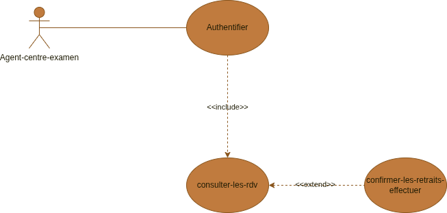

| Module phare | Cas / UC | Section |
| --- | --- | --- |
| **Authentification agent** | authentifier | §3.4.1 |
| **Consultation RDV & retrait** | UC-11 | §3.4.2 |

### 3.4.1 — Module Authentification — Agent centre

#### Fiche descriptive

| Élément | Description |
| --- | --- |
| **Nom** | Authentifier |
| **Acteur** | Agent centre d'examen |
| **Objectif** | Accéder à `/centre-examen` |
| **Route** | `/auth/login/centre-examen` |

**Scénario nominal** — Identifiants → rôle `AGENT_CENTRE_EXAMEN` → redirection espace agent.

#### Diagramme d'activité

*Figure en annexe numérique — dossier `diagrammes-images/activites/`.*


#### Diagramme de séquence

**Figure 3.33 — SEQ-AGENT-01 : connexion agent**


---

### 3.4.2 — Module Consultation RDV et confirmation retrait — UC-11

#### Fiche descriptive

| Élément | Description |
| --- | --- |
| **Identifiant** | UC-11 |
| **Nom** | Confirmer le retrait au centre d'examen |
| **Acteur** | Agent centre |
| **Objectif** | Clôturer le parcours physique (centre uniquement) |
| **Route** | `/centre-examen`, `confirm-withdrawal` |

**Préconditions** — Agent authentifié ; RDV `PLANIFIE`/`CONFIRME` ; document éligible centre ; pas déjà `RETIRE`.

**Scénario nominal**

1. Consulter RDV transmis (région/centre).
2. Vérifier identité élève sur place.
3. Confirmer retrait → RDV `HONORE`, document `RETIRE`, notifications.

**Postconditions** — Document **Retiré** ; cooldown duplicata 1 an si applicable.

**Scénarios alternatifs** — RDV hors centre (403) ; déjà confirmé (409) ; retrait antenne réservé à l'admin.

**Note** — Retraits **antenne** (Bac original, duplicatas) : administrateur via UC-09.

#### Diagramme d'activité — consultation RDV

*Figure en annexe numérique — dossier `diagrammes-images/activites/`.*


#### Diagramme de séquence — consultation

**Figure 3.35 — SEQ-AGENT-02 : consulter RDV**


#### Diagramme d'activité — confirmation retrait

*Figure en annexe numérique — dossier `diagrammes-images/activites/`.*


#### Diagramme de séquence — confirmation

**Figure 3.37 — SEQ-AGENT-03 : confirmer retrait effectué**


---

## 3.5 — Compléments métier *(flux, routage, traçabilité, processus globaux)*

### 3.5.1 — Flux métier conçus

#### Flux 1 — Parcours élève complet

```
Import B / saisie manuelle → PAS_DISPONIBLE
        ↓
Activation compte (/auth/register)
        ↓
Import A / action admin → DISPONIBLE + notification
        ↓
Consultation + RDV (si routage centre/antenne)
        ↓
Retrait confirmé → RETIRE
```

#### Flux 2 — Consultation publique

| Étape | Conception |
| --- | --- |
| Entrée | Landing `#consultation` (QR) ou `/consultation` |
| Saisie | Matricule uniquement |
| Traitement | `lookupPublicConsultationByMatricule()` |
| Sortie | Statuts documents (hors duplicatas) |
| Actions | Liens Activer mon compte / Me connecter |
| Sécurité | Rate limiting par IP |

### 3.5.2 — Matrice de routage (conception métier)

Implémentée dans `lib/document-routing.ts` :

| Document | Organisme | Lieu | Confirmé par |
| --- | --- | --- | --- |
| BEPC original | DECC | Centre | Agent |
| BEPC relevé | DECC | Centre | Agent |
| BEPC duplicata | DECC | Antenne | Admin |
| Probatoire relevé | OBC | Centre | Agent |
| Probatoire duplicata | OBC | Antenne | Admin |
| Bac relevé | OBC | Centre | Agent |
| Bac original | OBC | Antenne | Admin |
| Bac duplicata | OBC | Antenne | Admin |

### 3.5.3 — Tableau de traçabilité (fiche → activité → séquence)

| UC / cas | Package | Acteur | Fiche | Activité | Séquence(s) |
| --- | --- | --- | --- | --- | --- |
| UC-01 | PKG-AUTH | Élève | §3.2.1 | ACT-UC-01 | — |
| Authentifier | PKG-AUTH | Élève | §3.2.2 | ACT-AUTH-ELEVE | SEQ-ELEVE-01 |
| UC-03 | PKG-PUBLIC | Visiteur | §3.2.3 | ACT-UC-03 | SEQ-ELEVE-02 |
| UC-02 | PKG-ELEVE | Élève | §3.2.4 | ACT-UC-02 | SEQ-ELEVE-03 |
| UC-04 | PKG-ELEVE | Élève | §3.2.5 | ACT-UC-04 | SEQ-ELEVE-05 |
| UC-05 | PKG-ELEVE | Élève | §3.2.6 | ACT-02 | SEQ-ELEVE-06–08 |
| UC-06 | PKG-ELEVE | Élève | §3.2.7 | ACT-UC-06 | SEQ-ELEVE-09, 10 |
| Authentifier | PKG-AUTH | Admin | §3.3.1 | ACT-AUTH-ADMIN | SEQ-ADMIN-01 |
| UC-07 | PKG-ADMIN | Admin | §3.3.2 | ACT-UC-07 | SEQ-ADMIN-11 |
| UC-08 | PKG-ADMIN | Admin | §3.3.3 | ACT-03 | SEQ-ADMIN-10 |
| UC-09 | PKG-ADMIN | Admin | §3.3.4 | ACT-UC-09 | SEQ-ADMIN-06 |
| UC-10 | PKG-ADMIN | Admin | §3.3.5 | ACT-UC-10 | SEQ-ADMIN-08 |
| Quota RDV | PKG-ADMIN | Admin | §3.3.6 | — | SEQ-ADMIN-02 |
| Authentifier | PKG-AUTH | Agent | §3.4.1 | ACT-AUTH-AGENT | SEQ-AGENT-01 |
| UC-11 | PKG-AGENT | Agent | §3.4.2 | ACT-UC-11 | SEQ-AGENT-02, 03 |

Index complet : `docs/SEQUENCES_PAR_CAS_UTILISATION.md`.

### 3.5.4 — Vue d'ensemble : diagrammes d'activité des processus globaux

Ils complètent les blocs §3.2 à §3.4 pour la soutenance lorsque le jury demande une **vue processus bout en bout**.

| Réf. | Processus | Cas couverts | Fichier |
| --- | --- | --- | --- |
| ACT-01 | Retrait relevé / diplôme | UC-01, 02, 04, 06, 08, 09, 11 | `act-eleve-parcours-retrait-document.png` |
| ACT-02 | Duplicata complet | UC-05, 10, 08, 09 | `act-eleve-demande-duplicata.png` |
| ACT-03 | Disponibilisation | UC-08, 09 | `act-admin-disponibilisation.png` |
| ACT-04 | Retrait centre | UC-06, 11 | `act-agent-confirmation-retrait.png` |

**Figure 3.38 — ACT-01 : parcours retrait relevé / diplôme**

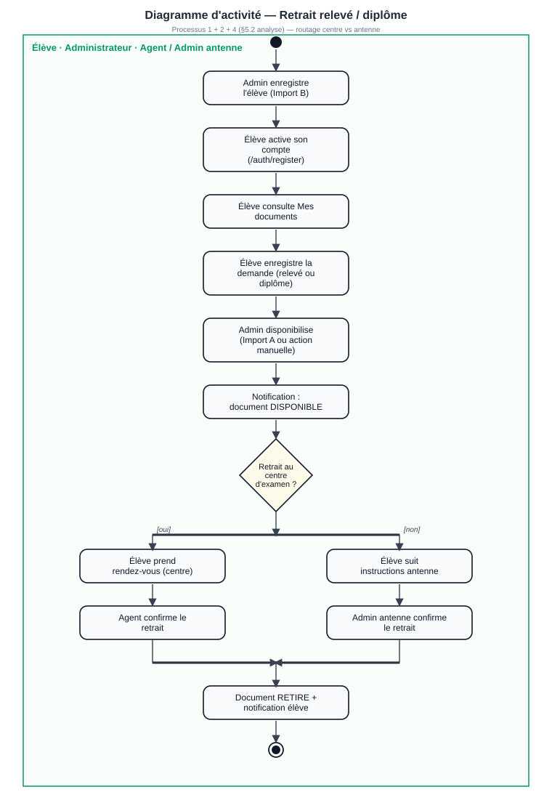

**Figure 3.39 — ACT-02 : processus duplicata**

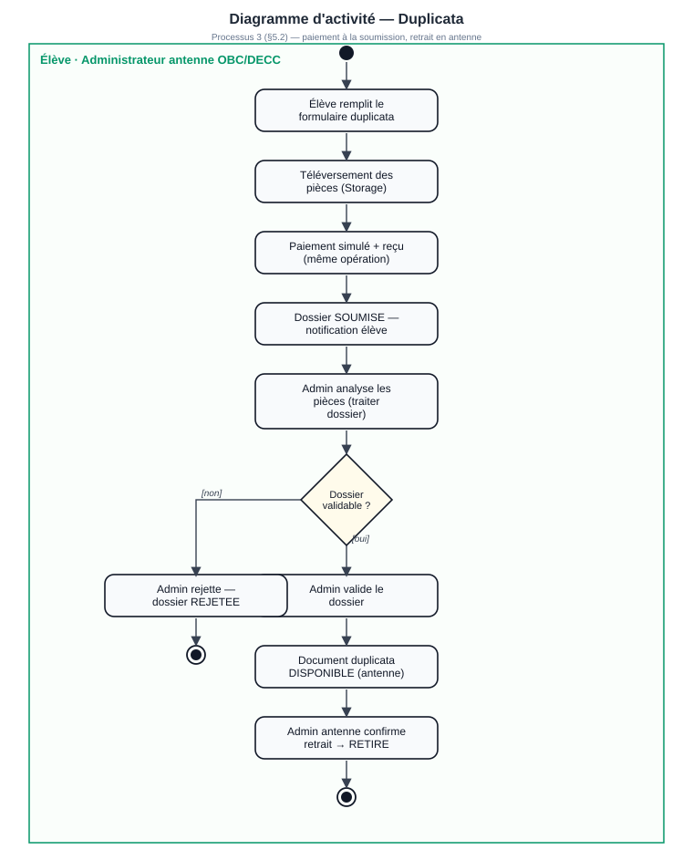

**Figure 3.40 — ACT-03 : disponibilisation admin**


**Figure 3.41 — ACT-04 : confirmation retrait agent**


Régénération : `npm run diagrams:activites`.

Une fois l'ensemble des cas d'utilisation documentés (fiches, activités, séquences), le **modèle de données** et le **diagramme de classes** sont présentés au **chapitre 4**.

---

## 4. CONCEPTION DU MODÈLE DE DONNÉES

> **Placement** — Le **diagramme de classes** (Figure 4.1) est présenté **après** l'ensemble des cas d'utilisation détaillés (§3.0 à §3.4), conformément à la syntaxe générale de modélisation.

**Source :** `prisma/schema.prisma` — 20 migrations versionnées.

### 4.1 — Entités principales

| Modèle | Table | Rôle |
| --- | --- | --- |
| `User` | users | Élève, admin, agent |
| `Organisme` | organismes | OBC, DECC |
| `AntenneRegionale` | antennes_regionales | Périmètre régional |
| `CentreExamen` | centres_examen | Agent rattaché |
| `ExamenValide` | examens_valides | Examen par élève/diplôme |
| `DocumentAcademique` | documents | Document + statut |
| `Duplicata` | duplicatas | Dossier duplicata |
| `PieceDuplicata` | pieces_duplicata | Justificatifs |
| `RendezVous` | rendez_vous | RDV retrait |
| `DisponibiliteRdv` | disponibilites_rdv | Créneaux |
| `Paiement` | paiements | Transaction |
| `Recu` | recus | Reçu généré |
| `Notification` | notifications | Alertes in-app |
| `AuditLog` | audit_logs | Traçabilité |
| `ParametreRendezVous` | parametres_rdv | Quota global |

### 4.2 — Énumérations

| Enum | Valeurs |
| --- | --- |
| `Role` | ELEVE, ADMINISTRATEUR, AGENT_CENTRE_EXAMEN |
| `StatutDocument` | PAS_DISPONIBLE, DISPONIBLE, RETIRE |
| `TypeDocument` | ORIGINAL, RELEVE_NOTES, DUPLICATA |
| `DiplomePrincipal` | BEPC, PROBATOIRE, BACCALAUREAT |
| `StatutRendezVous` | PLANIFIE, CONFIRME, ANNULE, HONORE |
| `StatutValidationDuplicata` | SOUMISE, EN_ANALYSE, VALIDEE, REJETEE |

### 4.3 — Conception des transitions de statut

Service : `lib/document-status-transition.ts`

| Transition | Acteur | Règle |
| --- | --- | --- |
| → DISPONIBLE | Admin | Duplicata : validation `VALIDEE` requise |
| → RETIRE (centre) | Agent | Routage `CENTRE_EXAMEN` uniquement |
| → RETIRE (antenne) | Admin | Duplicata, Bac original |
| PAS_DISPONIBLE ↔ DISPONIBLE | Admin | Périmètre organisme/antenne |

Effets collatéraux conçus : notification email, `AuditLog`, sync duplicata, RDV → `HONORE`.

### 4.4 — Conception duplicata et paiement

| Élément | Conception |
| --- | --- |
| Tarif relevé duplicata | 10 000 FCFA |
| Tarif original duplicata | 15 000 FCFA |
| Cooldown | 1 an après RETIRE |
| Pièces | 4 types enum `TypePieceDuplicata` |
| Stockage | Bucket Supabase `duplicata-documents` (MVP partiel) |
| Paiement | MVP simulé, webhook `/api/payments/webhook` |

**Figure 4.1 — Diagramme de classes (vue simplifiée)**

Le diagramme ci-dessous retient les entités métier essentielles pour la soutenance : héritage **Utilisateur** → Élève, Administrateur, AgentCentreExamen ; héritage **DocumentScolaire** → OriginalDiplome, ReleveNote ; classe **Duplicata** ; et les associations principales (paiement, reçu, notification, rendez-vous, mise à jour admin, confirmation de retrait). Les multiplicités sont conformes au schéma Prisma (`prisma/schema.prisma`).

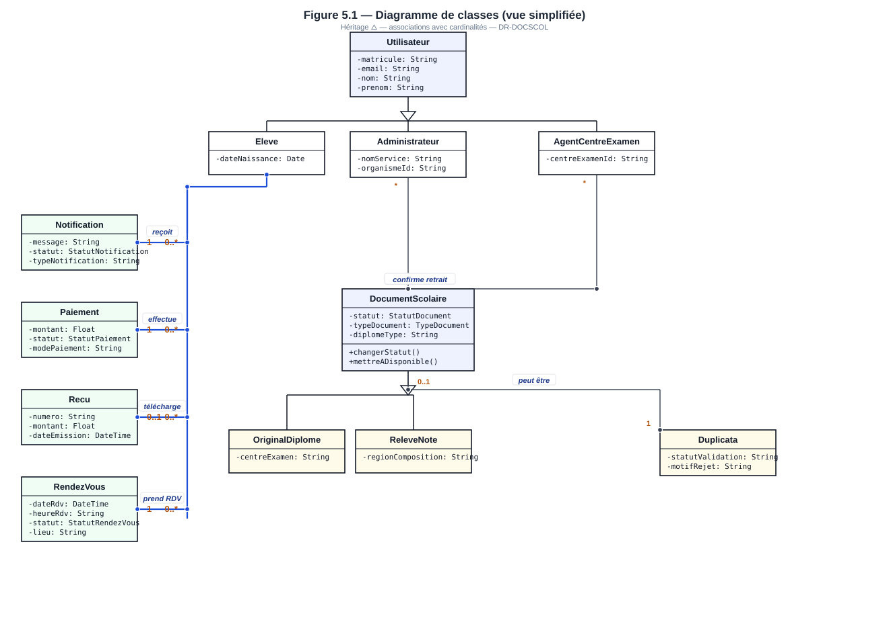

**Tableau 4.1 — Cardinalités des associations (Figure 4.1)**

| Association | Extrémité 1 | Multiplicité 1 | Extrémité 2 | Multiplicité 2 |
| --- | --- | --- | --- | --- |
| Élève → Notification (*reçoit*) | Élève | 0..* | Notification | 1 |
| Élève → Paiement (*effectue*) | Élève | 0..* | Paiement | 1 |
| Élève → Reçu (*télécharge*) | Élève | 0..* | Reçu | 0..1 |
| Élève → RendezVous (*prend RDV*) | Élève | 0..* | RendezVous | 1 |
| Administrateur → DocumentScolaire (*met à jour*) | Administrateur | * | DocumentScolaire | * |
| AgentCentreExamen → DocumentScolaire (*confirme retrait*) | AgentCentreExamen | * | DocumentScolaire | * |
| DocumentScolaire → Duplicata (*peut être*) | DocumentScolaire | 0..1 | Duplicata | 1 |

*Régénération figure : `npm run diagrams:classes-simple` — Source : `scripts/generate-class-diagram-simple.mjs` — Notation : généralisation (△ vide, sans multiplicité), associations nommées avec multiplicités aux deux extrémités. Le modèle exhaustif (20 tables Prisma) reste documenté au §4.1.*

---

## 5. CONCEPTION TECHNIQUE

### 5.1 — Stack retenue

| Composant | Technologie | Version |
| --- | --- | --- |
| Framework | Next.js App Router | 15.x |
| UI | React, Tailwind, Radix UI | React 19 |
| Langage | TypeScript | 5.x |
| ORM | Prisma | 6.x |
| BDD | PostgreSQL (Supabase) | — |
| Auth | Supabase Auth + `@supabase/ssr` | — |
| Validation | Zod | — |
| Email | Nodemailer | — |
| Hébergement | Vercel | Serverless |

### 5.2 — Services métier (couche `lib/`)

| Service | Fichier | Responsabilité |
| --- | --- | --- |
| Routage | `lib/document-routing.ts` | OBC/DECC, antennes, scope admin |
| Statuts | `lib/document-status-transition.ts` | Transitions, notifications, audit |
| RDV | `lib/appointment-service.ts` | Créneaux, quota, fériés |
| Duplicata | `lib/duplicata-service.ts` | Barème, cooldown, sync statut |
| Import élèves | `lib/admin-student-import.ts` | Import B |
| Import dispo | `lib/document-availability-import.ts` | Import A |
| Parser CSV | `lib/csv-import-parser.ts` | Parsing partagé |
| Consultation | `lib/public-consultation.ts` | Lookup matricule |
| Auth | `lib/auth.ts` | Session, rôles |
| Notifications | `lib/notification-service.ts`, `lib/mail-service.ts` | In-app + email |
| Rate limit | `lib/simple-rate-limit.ts` | Protection API publique |

### 5.3 — Conception API REST

38 handlers sous `app/api/` :

| Domaine | Routes clés |
| --- | --- |
| Santé | `GET /api/health` |
| Auth | `/api/auth/login`, `register`, `me`, `logout` |
| Élève | `/api/students/me/documents`, `appointments`, `notifications` |
| RDV | `GET /api/appointments/slots` |
| Admin | `/api/admin/documents`, `students`, `dashboard/stats` |
| Centre | `/api/centre-examen/appointments`, `confirm-withdrawal` |
| Public | `POST /api/public/consultation` |
| Interne | `/api/internal/notifications/dispatch` |
| Paiement | `POST /api/payments/webhook` |

**Helpers :** `lib/api-utils.ts` — `requireApiUser()`, `requireInternalRequest()`, validation Zod.

### 5.4 — Server Actions

| Fichier | Actions principales |
| --- | --- |
| `app/auth/actions.ts` | Connexion, inscription, sélection région admin |
| `app/dashboard/actions.ts` | Demandes relevé/duplicata, RDV |
| `app/admin/actions.ts` | Statuts, imports A/B, quota, fériés, duplicata |
| `app/account/actions.ts` | Profil utilisateur |

### 5.5 — Middleware et session

- `middleware.ts` : rafraîchissement session Supabase, protection routes privées.
- Cookies `sb-*` vérifiés pour `/dashboard`, `/admin`, `/account`.

---

## 6. SYNTHÈSE TECHNIQUE (version impression)

Les chapitres détaillés **interface (§6 complet), imports batch (§8), tests (§9), déploiement (§10)** figurent dans le cahier de conception intégral (`docs/cahier_conception.md`) et dans le dépôt source. Synthèse :

| Thème | Choix retenus |
| --- | --- |
| **Interface** | Tailwind, responsive mobile-first, charte ardoise/ambre (`docs/CHARTE_GRAPHIQUE_COULEURS.md`) |
| **Imports CSV** | Import B (élèves) et Import A (disponibilisation), erreurs par ligne |
| **Tests** | Scénarios manuels par rôle — `docs/GUIDE_TEST_FONCTIONNEL.md` |
| **Déploiement** | Vercel + Supabase ; variables d'environnement documentées §10.3 du cahier intégral |
| **Sécurité** | Supabase Auth, rôles, périmètre admin, rate-limit consultation publique |

---

## 11. CONCLUSION ET PERSPECTIVES

### 11.1 — Bilan de la conception

La conception de DR-DOCSCOL repose sur :

- un **routage documentaire centralisé** ;
- **deux pipelines CSV distincts** ;
- une **consultation publique minimale** ;
- une **architecture Next.js + Prisma + Supabase** déployable sur Vercel ;
- une **traçabilité** systématique des actions sensibles.

### 11.2 — Évolutions prévues

| Évolution | Impact conception |
| --- | --- |
| Paiement Mobile Money | Brancher prestataire sur webhook existant |
| Storage pièces | Finaliser Supabase Storage |
| Tests E2E | Suite Playwright |
| Statistiques avancées | Nouveaux endpoints admin |
| Traduction diplôme | Nouveau module documentaire |

---

## 12. GLOSSAIRE ET RÉFÉRENCES TECHNIQUES

### 12.1 — Glossaire technique

| Terme | Définition |
| --- | --- |
| App Router | Système de routage Next.js 13+ basé sur `app/` |
| Server Action | Fonction serveur `"use server"` appelée depuis le client |
| Prisma | ORM TypeScript pour PostgreSQL |
| Scope admin | Filtre `organismeId` + `antenneRegionaleId` |
| Revalidate | Invalidation cache Next.js après mutation |

### 12.2 — Fichiers de référence

| Ressource | Chemin |
| --- | --- |
| Schéma BDD | `prisma/schema.prisma` |
| Routage métier | `lib/document-routing.ts` |
| Transitions statut | `lib/document-status-transition.ts` |
| Routes | `docs/routes-implementees.md` |
| API | `docs/guide_api_mis_a_jour.md` |
| UML | `docs/diagrammes-images/` |
| Cahier d'analyse | `docs/cahier_analyse.md` |

---

**Fin du cahier de conception — DR-DOCSCOL v1.0**