# DIAGRAMMES UML — Application de Gestion des Documents Scolaires
## OBC / DECC — Cameroun | Version 2.1

---

## TABLE DES MATIÈRES

1. Diagramme de Cas d'Utilisation
2. Diagramme de Classes
3. Diagrammes de Séquence
4. Diagramme MCD / MLD
5. Notes de Cohérence avec le Code Actuel

---

## Note de synchronisation du 02/06/2026

Le code actuel contient trois roles applicatifs:

- `ELEVE`
- `ADMINISTRATEUR`
- `AGENT_CENTRE_EXAMEN`

Les diagrammes ci-dessous sont alignes avec le code et les regles metier validees le 02/06/2026. Les images PNG/SVG correspondantes sont dans `diagrammes-images/` et les sources Mermaid separees sont dans `diagrammes-mermaid/`.

Mise a jour de conformité: les versions finales conformes a la notation de reference fournie sont des diagrammes personnalises et detailles, generes dans `docs/diagrammes-images/`:

- `diagramme-mcd-v2.png` / `.svg`: MCD detaille avec toutes les entites, associations en ovales, cardinalites et liaisons.
- `diagramme-mld-v2.png` / `.svg`: MLD detaille avec toutes les tables Prisma, tous les attributs, cles PK/FK et traits de liaison rattaches aux tables concernees.
- `diagramme-classes-v2.png` / `.svg`: diagramme de classes detaille aligne sur les tables et relations actuelles.
- `diagramme-mcd-mld-v2.png` / `.svg`: planche de synthese qui renvoie vers les versions detaillees.

Important: pour les livrables Word/PDF, utiliser les images finales ci-dessus plutot que les anciens rendus Mermaid lorsque la notation attendue est celle du modele de reference.

Le document de reference final est `ETAT_FINAL_PROJET.md`.

Mise a jour du 04/06/2026 — diagrammes de sequence **v3 soutenance** :

- Sources : `docs/diagrammes-mermaid/sequence-*-v3-soutenance.mmd`
- Images PNG/SVG : `docs/diagrammes-images/sequence-*-v3-soutenance.{png,svg}`
- Structure : Acteur → Systeme DR-DOCSCOL → Base de donnees, avec `alt` Donnees valides / invalides
- Regeneration : `npm run diagrams:export-v3`
- Cas supplementaires par rapport a la v2 : ajout eleves admin (SEQ-09), demande releve/diplome par l eleve (SEQ-10)

Pour la soutenance, preferer les images v3 ; la section 3 ci-dessous conserve les diagrammes v2 detailles (composants API, Supabase, etc.).

---

## 1. Diagramme de Cas d'Utilisation

Ce diagramme représente les interactions entre les acteurs principaux et le système de gestion des documents scolaires. Les acteurs humains restent à l’extérieur du système, tandis que les cas d’utilisation sont regroupés dans le rectangle système intitulé "Gestion de retrait de documents scolaires".

```mermaid
%%{init: {"theme": "base", "themeVariables": {"fontFamily": "Arial", "fontSize": "22px", "primaryColor": "#eaf6ff", "primaryBorderColor": "#1f6f9f", "lineColor": "#4b5563"}}}%%
flowchart TB
    Connexion([Se connecter])

    subgraph Diagramme["Diagramme de cas d'utilisation"]
        direction TB

        subgraph BlocEleve["Espace eleve"]
            direction LR
            Eleve["Acteur : Eleve"]
            subgraph CasEleve[" "]
                direction TB
                E1([Activer son compte])
                E2([Consulter ses documents])
                E3([Demander un releve])
                E4([Demander un duplicata])
                E5([Payer un duplicata])
                E6([Prendre rendez-vous])
                E7([Annuler un rendez-vous])
                E8([Consulter notifications et recus])
            end

            Eleve --> E1
            Eleve --> E2
            Eleve --> E3
            Eleve --> E4
            Eleve --> E5
            Eleve --> E6
            Eleve --> E7
            Eleve --> E8
        end

        subgraph BlocAdmin["Espace administrateur OBC / DECC"]
            direction LR
            Admin["Acteur : Admin OBC / DECC"]
            subgraph CasAdmin[" "]
                direction TB
                A1([Importer les eleves])
                A2([Verifier les examens valides])
                A3([Publier un document])
                A4([Traiter un duplicata])
                A5([Consulter les rendez-vous])
                A6([Confirmer un retrait antenne])
                A7([Consulter paiements et recus])
                A8([Envoyer notifications])
            end

            Admin --> A1
            Admin --> A2
            Admin --> A3
            Admin --> A4
            Admin --> A5
            Admin --> A6
            Admin --> A7
            Admin --> A8
        end

        subgraph BlocAgent["Espace agent centre d'examen"]
            direction LR
            Agent["Acteur : Agent centre"]
            subgraph CasAgent[" "]
                direction TB
                C1([Consulter les rendez-vous transmis])
                C2([Confirmer le retrait effectue])
            end

            Agent --> C1
            Agent --> C2
        end

        subgraph BlocSysteme["Systeme"]
            direction LR
            Systeme["Acteur : Systeme interne"]
            subgraph CasSysteme[" "]
                direction TB
                S1([Router OBC / DECC])
                S2([Determiner centre ou antenne])
                S3([Transmettre RDV a l'agent centre])
                S4([Envoyer email et notification])
                S5([Journaliser actions])
                S6([Confirmer paiement webhook])
            end

            Systeme --> S1
            Systeme --> S2
            Systeme --> S3
            Systeme --> S4
            Systeme --> S5
            Systeme --> S6
        end
    end

    E1 -.-> Connexion
    E2 -.-> Connexion
    E3 -.-> Connexion
    E4 -.-> Connexion
    E5 -.-> Connexion
    E6 -.-> Connexion
    E7 -.-> Connexion
    E8 -.-> Connexion
    A1 -.-> Connexion
    A2 -.-> Connexion
    A3 -.-> Connexion
    A4 -.-> Connexion
    A5 -.-> Connexion
    A6 -.-> Connexion
    A7 -.-> Connexion
    A8 -.-> Connexion
    C1 -.-> Connexion
    C2 -.-> Connexion

    E3 --> S1
    E4 --> S1
    E6 --> S2
    S2 --> S3
    A3 --> S4
    A4 --> S4
    C2 --> S5
    E5 --> S6

    Eleve ==> Admin
    Admin ==> Agent
    Agent ==> Systeme

    classDef actor fill:#ffffff,stroke:#111827,stroke-width:2px,color:#111827;
    classDef usecase fill:#eef8ff,stroke:#1f6f9f,stroke-width:2px,color:#0f172a;
    classDef system fill:#fff7ed,stroke:#c2410c,stroke-width:2px,color:#0f172a;
    class Eleve,Admin,Agent,Systeme actor;
    class E1,E2,E3,E4,E5,E6,E7,E8,A1,A2,A3,A4,A5,A6,A7,A8,C1,C2,Connexion usecase;
    class S1,S2,S3,S4,S5,S6 system;
```

**Acteurs :**

| Acteur | Rôle |
|--------|------|
| Étudiant | Élève ou diplômé souhaitant consulter, demander ou retirer un document scolaire. |
| Administration | Service OBC / DECC chargé de gérer les élèves, documents, statuts, rendez-vous, retraits et statistiques. |
| Système interne | Composant technique chargé des notifications, emails, webhooks de paiement et traitements internes protégés. |

**Relations :**

| Relation | Type | Signification |
|----------|------|---------------|
| prendre rdv → authentifier | <<include>> | Toute réservation de rendez-vous nécessite une authentification préalable. |
| annuler rdv → authentifier | <<include>> | Toute annulation côté élève nécessite une session active. |
| demander retrait → vérifier disponibilité | <<include>> | Le système doit vérifier la disponibilité avant d’autoriser un retrait ou une réservation. |
| demander retrait de duplicata → effectuer paiement | <<include>> | Le paiement est obligatoire pour une demande de duplicata. |
| envoyer notification → journaliser email | <<include>> | Chaque email envoyé ou échoué est journalisé dans `mail_logs`. |
| mettre à jour statut document → envoyer notification | <<extend>> | Une notification est déclenchée lorsque le statut devient `DISPONIBLE` ou `RETIRE`. |
| enregistrer retrait → envoyer notification | <<extend>> | Un accusé de retrait est envoyé lorsque le retrait physique est enregistré. |
| prendre rdv → envoyer notification | <<extend>> | Une confirmation est envoyée après la réservation d’un rendez-vous. |

---

## 2. Diagramme de Classes

Ce diagramme présente la structure statique du système, les entités métier, leurs attributs, leurs méthodes principales et les relations entre elles. Les classes reprennent les concepts historiques des diagrammes initiaux tout en les alignant avec le code actuel : Supabase Auth, Prisma, OBC / DECC, antennes régionales, paiements, reçus et journaux d’emails.

Version detaillee: `docs/diagrammes-images/diagramme-classes-v2.png`.

Version principale pour la soutenance (structure en croix du modele de reference + 9 classes metier : Eleve, Document, Duplicata, ExamenValide, CentreExamen, RendezVous, Organisme, Paiement, types de documents) : `docs/diagrammes-images/diagramme-classes-soutenance.png`. Regeneration : `npm run diagrams:classes-soutenance`.

Version technique exhaustive (20 tables Prisma) : `diagramme-classes-v2.png` via `npm run diagrams:conform`.

Cette image remplace le rendu Mermaid pour la presentation finale lorsque la notation stricte du modele fourni est exigee.

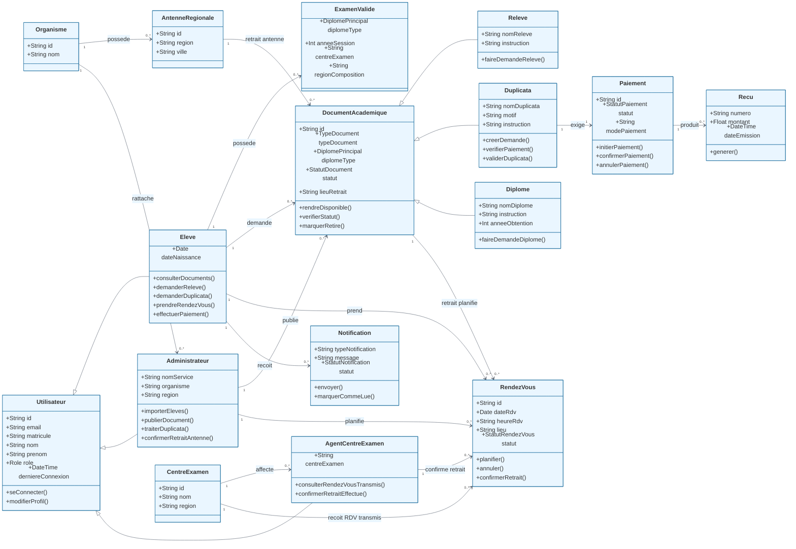

**Description des classes :**

| Classe | Rôle |
|--------|------|
| Utilisateur | Classe mère logique de tous les utilisateurs du système ; dans le code, elle correspond au modèle Prisma `User`. |
| Eleve | Élève ou diplômé utilisant l’application pour consulter, demander, payer et réserver. |
| Administrateur | Agent OBC / DECC gérant les documents, imports, rendez-vous, retraits et statistiques. |
| Organisme | Structure responsable des documents, actuellement OBC ou DECC. |
| AntenneRegionale | Antenne régionale OBC ou DECC utilisée selon l'organisme, le diplome et la region de composition. |
| ExamenValide | Examen obtenu par l’élève, utilisé pour déterminer les documents demandables. |
| DocumentAcademique | Entité centrale représentant un document scolaire : diplôme, relevé ou duplicata. |
| RendezVous | Planification d’un retrait physique ou trace d’un retrait honoré. |
| DisponibiliteRdv | Modèle de disponibilité dédié encore présent dans le schéma. |
| ParametreRendezVous | Paramètres globaux de rendez-vous, notamment quota journalier et lieu OBC. |
| CreneauHoraire | Plage horaire configurable pour les rendez-vous. |
| JourFerie | Date bloquée dans le calendrier de rendez-vous. |
| Paiement | Gestion du paiement lié à une demande, principalement le duplicata dans le MVP. |
| Recu | Trace de paiement générée pour l’élève. |
| Notification | Message applicatif envoyé à un élève. |
| MailLog | Journalisation des emails envoyés ou échoués. |
| Diplome, Releve, Duplicata | Spécialisations fonctionnelles de `DocumentAcademique`. |

---

## 3. Diagrammes de Séquence

### Version v3 soutenance (recommandee pour le dossier)

| Ref. | Image | Cas metier |
|------|-------|------------|
| SEQ-01 | `diagrammes-images/sequence-01-inscription-v3-soutenance.png` | Activation compte eleve |
| SEQ-02 | `diagrammes-images/sequence-02-connexion-v3-soutenance.png` | Connexion multi-role |
| SEQ-03 | `diagrammes-images/sequence-03-consultation-documents-v3-soutenance.png` | Consultation Mes documents |
| SEQ-04 | `diagrammes-images/sequence-04-notification-disponibilite-v3-soutenance.png` | Admin : disponibilite + notification |
| SEQ-05 | `diagrammes-images/sequence-05-duplicata-paiement-v3-soutenance.png` | Duplicata et paiement |
| SEQ-06 | `diagrammes-images/sequence-06-rendez-vous-v3-soutenance.png` | RDV planifie par l eleve |
| SEQ-07 | `diagrammes-images/sequence-07-statut-document-v3-soutenance.png` | Admin : changement de statut |
| SEQ-08 | `diagrammes-images/sequence-08-retrait-physique-v3-soutenance.png` | Agent : confirmation retrait |
| SEQ-09 | `diagrammes-images/sequence-09-ajout-eleve-admin-v3-soutenance.png` | Admin : ajout manuel ou import CSV |
| SEQ-10 | `diagrammes-images/sequence-10-demande-document-v3-soutenance.png` | Eleve : demande releve ou diplome |

Formats vectoriels : remplacer `.png` par `.svg` si besoin.

### Version v2 detaillee (reference technique)

### SEQ-01 — Inscription et activation du compte

Ce diagramme décrit le processus d’inscription d’un élève dans le MVP actuel. L’élève ne crée pas un compte totalement libre : son matricule et son email doivent déjà exister dans la base métier, puis le système active ou crée le compte Supabase Auth correspondant.

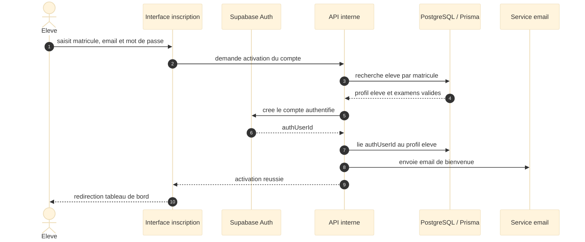

**Étapes clés :**

| Étape | Action | Résultat |
|-------|--------|----------|
| 1 | L’élève soumet matricule, email et mot de passe. | Le système reçoit la demande d’activation. |
| 2 | Le système vérifie le profil Prisma. | Le compte n’est activé que si le matricule et l’email correspondent. |
| 3 | Supabase Auth crée ou met à jour le compte. | Le mot de passe est géré hors Prisma. |
| 4 | Prisma reçoit `authUserId`. | Le profil métier est relié au compte Auth. |
| 5 | L’élève est connecté. | L’utilisateur est redirigé vers le tableau de bord. |

### SEQ-02 — Connexion et déconnexion

Ce diagramme décrit la connexion d’un utilisateur avec matricule, email et mot de passe. Le système vérifie d’abord la cohérence du matricule dans Prisma, puis délègue l’authentification du mot de passe à Supabase Auth.

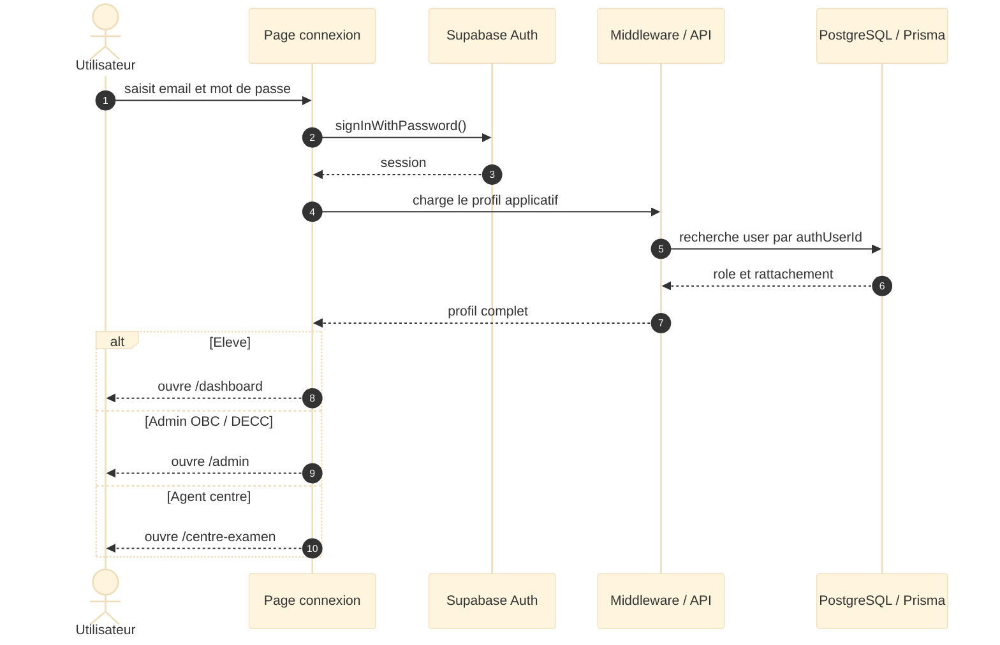

**Étapes clés :**

| Étape | Action | Résultat |
|-------|--------|----------|
| 1 | L’utilisateur saisit ses identifiants. | Le système reçoit matricule, email et mot de passe. |
| 2 | Prisma vérifie le matricule et l’email. | Les erreurs de couple matricule/email sont bloquées. |
| 3 | Supabase Auth vérifie le mot de passe. | Une session sécurisée est ouverte. |
| 4 | Prisma met à jour la dernière connexion. | La traçabilité de connexion est conservée. |
| 5 | L’utilisateur se déconnecte. | La session Supabase est fermée. |

### SEQ-03 — Consultation des documents scolaires

Ce diagramme décrit la consultation des documents par un élève connecté. Le système garantit que seuls les documents de l’élève courant sont chargés, puis affiche le statut, le lieu de retrait et l’éventuel rendez-vous actif.

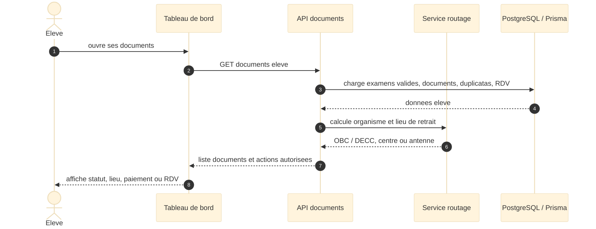

**Étapes clés :**

| Étape | Action | Résultat |
|-------|--------|----------|
| 1 | L’élève ouvre la page des documents. | Le système identifie l’utilisateur connecté. |
| 2 | Les documents sont synchronisés depuis les examens validés. | Les documents demandables sont disponibles en base. |
| 3 | Le système charge la liste. | Les statuts et rendez-vous actifs sont récupérés. |
| 4 | Le routage calcule le lieu de retrait. | Le système distingue centre d’examen et antenne régionale. |
| 5 | L’élève consulte un détail. | Les instructions de retrait sont affichées. |

### SEQ-04 — Envoi de notification de disponibilité

Ce diagramme décrit le processus déclenché lorsqu’un administrateur marque un document comme disponible. Dans le MVP actuel, la notification est enregistrée en base et un email est envoyé via Nodemailer ; la notification push native reste une évolution future.

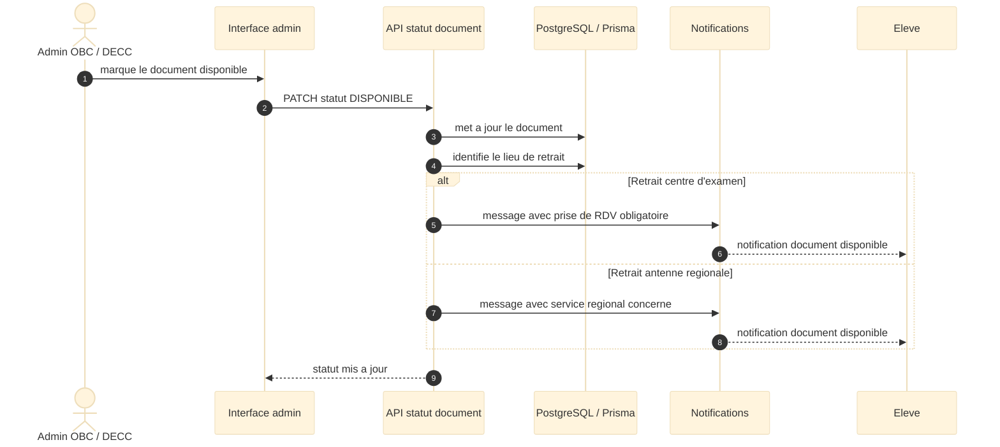

**Étapes clés :**

| Étape | Action | Résultat |
|-------|--------|----------|
| 1 | L’administrateur change le statut. | Le document passe à `DISPONIBLE`. |
| 2 | Le système contrôle le périmètre admin. | Un agent ne modifie que ses documents autorisés. |
| 3 | Une notification applicative est créée. | L’élève voit l’information dans son dashboard. |
| 4 | Un email est envoyé. | L’élève reçoit la disponibilité du document. |
| 5 | L’email est journalisé. | Le succès ou l’erreur est conservé dans `mail_logs`. |

### SEQ-05 — Demande de duplicata et paiement

Ce diagramme décrit la demande de duplicata et le paiement associé. Le MVP gère un paiement applicatif simplifié avec reçu, tandis que l’intégration Mobile Money réelle reste à finaliser.

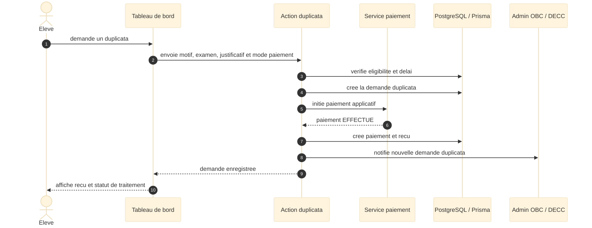

**Étapes clés :**

| Étape | Action | Résultat |
|-------|--------|----------|
| 1 | L’élève saisit sa demande. | Le système reçoit le diplôme, le document cible, la session, le centre et le motif. |
| 2 | Le système vérifie l’éligibilité. | Le Probatoire ne permet pas de duplicata de diplôme original. |
| 3 | Le duplicata est enregistré. | `DocumentAcademique` et `Duplicata` sont créés ou mis à jour. |
| 4 | Le paiement est confirmé. | Le MVP crée un paiement `EFFECTUE`. |
| 5 | Un reçu est généré. | L’élève dispose d’une trace de paiement. |
| 6 | L’administration traite la demande. | Le document pourra passer à `DISPONIBLE`. |

### SEQ-06 — Réservation et annulation de rendez-vous

Ce diagramme décrit la réservation puis l’annulation d’un rendez-vous. Le système vérifie la disponibilité du document, le besoin réel de rendez-vous, les jours bloqués, les quotas et l’absence de rendez-vous actif déjà existant.

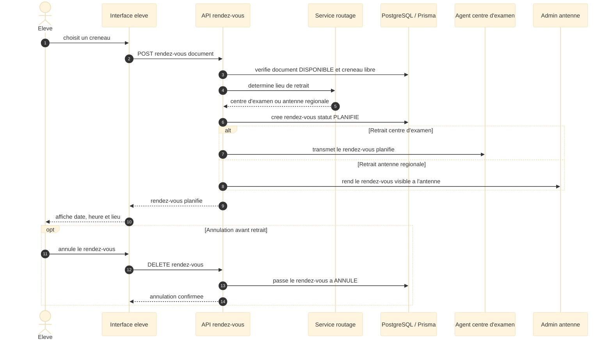

**Étapes clés :**

| Étape | Action | Résultat |
|-------|--------|----------|
| 1 | L’élève demande un rendez-vous. | Le système vérifie si le document nécessite réellement un RDV. |
| 2 | Le calendrier est calculé. | Week-ends, jours fériés, quotas et créneaux actifs sont pris en compte. |
| 3 | L’élève choisit date et heure. | Le système valide le créneau. |
| 4 | Le rendez-vous est créé. | Le statut devient `PLANIFIE` et il est transmis au service concerné. |
| 5 | L’élève annule plus tard. | Le statut devient `ANNULE`. |

### SEQ-07 — Mise à jour du statut d’un document

Ce diagramme complète le scénario de notification en montrant les contrôles administratifs et les effets métier. Lorsqu’un document est marqué `RETIRE`, les rendez-vous actifs liés sont passés à `HONORE`.

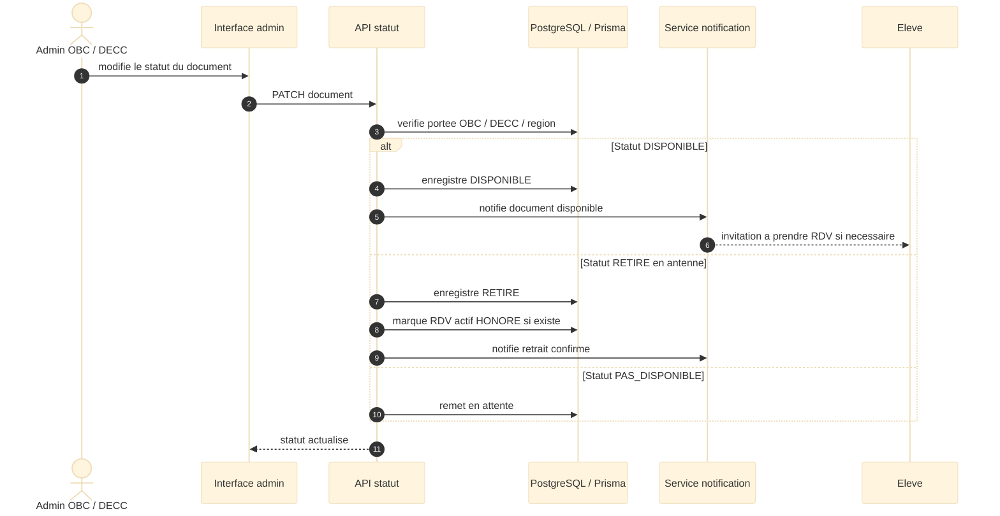

**Étapes clés :**

| Étape | Action | Résultat |
|-------|--------|----------|
| 1 | L’administrateur choisit un statut. | Le système reçoit la demande de mise à jour. |
| 2 | Le périmètre est contrôlé. | L’accès hors organisme ou antenne est refusé. |
| 3 | Les règles métier sont appliquées. | Le Probatoire ne donne pas lieu à diplôme original. |
| 4 | Le statut est modifié. | Le document devient disponible ou retiré. |
| 5 | Les notifications sont envoyées. | L’élève est informé et l’email est journalisé. |

### SEQ-08 — Retrait physique d’un document

Ce diagramme décrit l’enregistrement d’un retrait physique par l’administration. Le retrait est tracé par le statut `RETIRE` sur le document et par un rendez-vous `HONORE`, existant ou créé à cet effet.

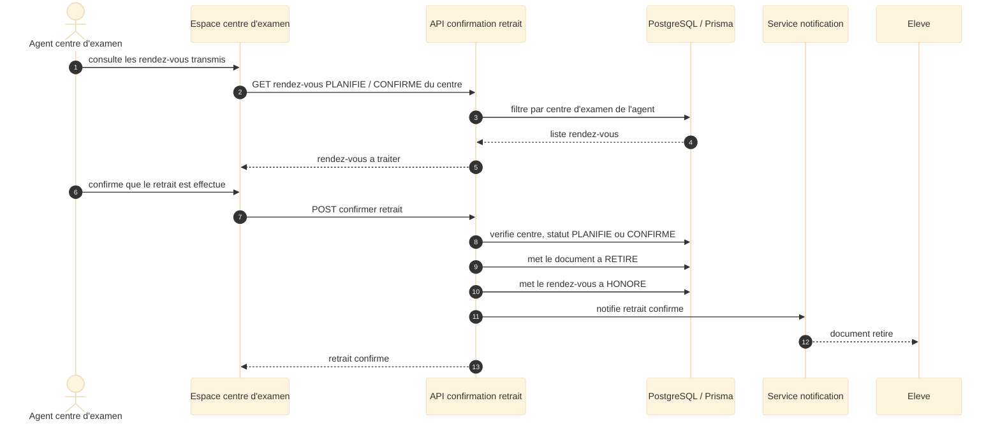

**Étapes clés :**

| Étape | Action | Résultat |
|-------|--------|----------|
| 1 | L’administrateur confirme le retrait. | Le système initie l’enregistrement. |
| 2 | Le document est vérifié. | Le périmètre admin est respecté. |
| 3 | Le document passe à `RETIRE`. | Le retrait est validé. |
| 4 | Le rendez-vous est honoré ou créé. | La traçabilité du retrait est conservée. |
| 5 | L’élève est notifié. | Un email et une notification sont créés. |

---

## 4. Diagramme MCD / MLD

Ce diagramme logique présente les principales tables issues du schéma Prisma actuel. Il complète le diagramme de classes en précisant les clés primaires, clés étrangères et relations relationnelles entre les entités.

Versions finales conformes:

- MCD detaille: `docs/diagrammes-images/diagramme-mcd-v2.png`
- MLD detaille: `docs/diagrammes-images/diagramme-mld-v2.png`
- Planche MCD/MLD synthetique: `docs/diagrammes-images/diagramme-mcd-mld-v2.png`

Ces images listent les attributs des tables du schema Prisma actuel et corrigent les liaisons afin qu'elles soient rattachees aux tables concernees.

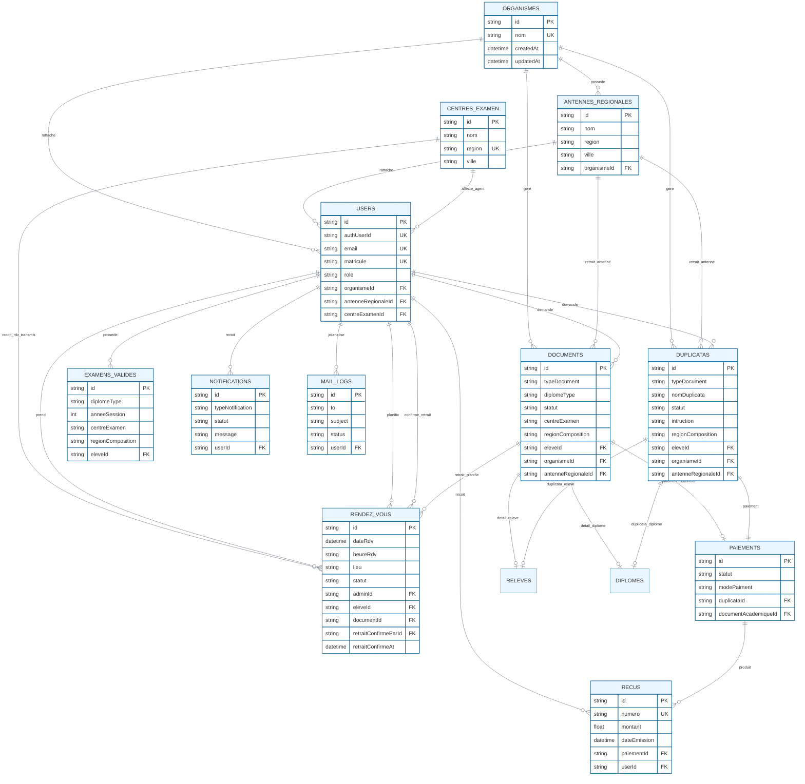

**Tables principales :**

| Table | Rôle |
|-------|------|
| `users` | Profils applicatifs des élèves et administrateurs. |
| `organismes` | Organismes responsables, OBC ou DECC. |
| `antennes_regionales` | Antennes régionales OBC. |
| `examens_valides` | Examens validés permettant de générer les documents. |
| `documents` | Documents scolaires suivis par l’application. |
| `rendez_vous` | Rendez-vous et retraits honorés. |
| `notifications` | Notifications applicatives. |
| `mail_logs` | Journalisation des emails. |
| `duplicatas` | Demandes de duplicata. |
| `paiements` | Paiements liés aux duplicatas et documents. |
| `recus` | Reçus de paiement. |

---

## 5. Notes de Cohérence avec le Code Actuel

| Point | Décision de cohérence |
|-------|-----------------------|
| Utilisateur / User | Les diagrammes utilisent `Utilisateur` pour la lisibilité UML, mais le modèle Prisma réel est `User`. |
| Étudiant / Élève | Les anciens diagrammes parlaient d’`Étudiant`; la documentation actuelle privilégie `Élève`, cohérent avec le rôle `ELEVE`. |
| Mot de passe | L’attribut `password` n’est pas stocké dans Prisma ; il est géré par Supabase Auth. |
| Administrateur | Il n’existe pas de table séparée `Administrateur`; il s’agit d’un `User` avec rôle `ADMINISTRATEUR`. |
| Service délivrance | Le rôle séparé `SERVICE_DELIVRANCE` reste une évolution possible ; il est actuellement inclus dans `ADMINISTRATEUR`. |
| Notifications push | Les anciens diagrammes mentionnaient le push ; le MVP actuel réalise notification en base + email. |
| Paiement Mobile Money | Le vrai flux Orange Money / MTN Money reste à finaliser ; le MVP gère un paiement applicatif simplifié avec reçu. |
| Probatoire | Le Probatoire ne donne pas lieu à un diplôme original. |
| BEPC | Les documents du BEPC sont rattachés à la DECC. |
| Baccalauréat original | Le diplôme original du Baccalauréat est routé vers une antenne régionale OBC et nécessite un rendez-vous. |
| Retrait physique | Un retrait est représenté par un document `RETIRE` et un rendez-vous `HONORE`. |

---

*Document mis a jour le 02/06/2026 — Version 2.1*
