# DIAGRAMMES UML — Application de Gestion des Documents Académiques
## OBC / DECC — Cameroun | Version 2.0

---

## TABLE DES MATIÈRES

1. Diagramme de Cas d'Utilisation
2. Diagramme de Classes
3. Diagrammes de Séquence
4. Diagramme MCD / MLD
5. Notes de Cohérence avec le Code Actuel

---

## 1. Diagramme de Cas d'Utilisation

Ce diagramme représente les interactions entre les acteurs principaux et le système de gestion des documents académiques. Les acteurs humains restent à l’extérieur du système, tandis que les cas d’utilisation sont regroupés dans le rectangle système intitulé "Gestion de retrait de documents académiques".

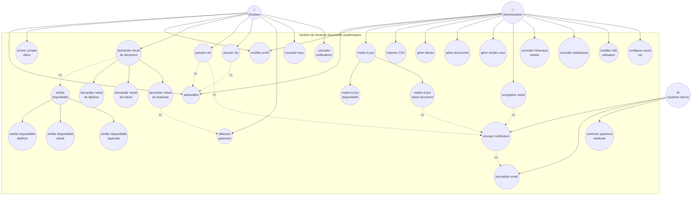

**Acteurs :**

| Acteur | Rôle |
|--------|------|
| Étudiant | Élève ou diplômé souhaitant consulter, demander ou retirer un document académique. |
| Administration | Service OBC / DECC chargé de gérer les élèves, documents, statuts, rendez-vous, retraits et statistiques. |
| Système interne | Composant technique chargé des notifications, emails, webhooks de paiement et traitements internes protégés. |

**Relations :**

| Relation | Type | Signification |
|----------|------|---------------|
| prendre rdv → authentifier | <<include>> | Toute réservation de rendez-vous nécessite une authentification préalable. |
| annuler rdv → authentifier | <<include>> | Toute annulation côté élève nécessite une session active. |
| demander retrait → vérifier disponibilité | <<include>> | Le système doit vérifier la disponibilité avant d’autoriser un retrait ou une réservation. |
| demander retrait de duplicata → effectuer paiement | <<include>> | Le paiement est obligatoire pour une demande de duplicata. |
| envoyer notification → journaliser email | <<include>> | Chaque email envoyé ou échoué est journalisé dans `mail_logs`. |
| mettre à jour statut document → envoyer notification | <<extend>> | Une notification est déclenchée lorsque le statut devient `DISPONIBLE` ou `RETIRE`. |
| enregistrer retrait → envoyer notification | <<extend>> | Un accusé de retrait est envoyé lorsque le retrait physique est enregistré. |
| prendre rdv → envoyer notification | <<extend>> | Une confirmation est envoyée après la réservation d’un rendez-vous. |

---

## 2. Diagramme de Classes

Ce diagramme présente la structure statique du système, les entités métier, leurs attributs, leurs méthodes principales et les relations entre elles. Les classes reprennent les concepts historiques des diagrammes initiaux tout en les alignant avec le code actuel : Supabase Auth, Prisma, OBC / DECC, antennes régionales, paiements, reçus et journaux d’emails.

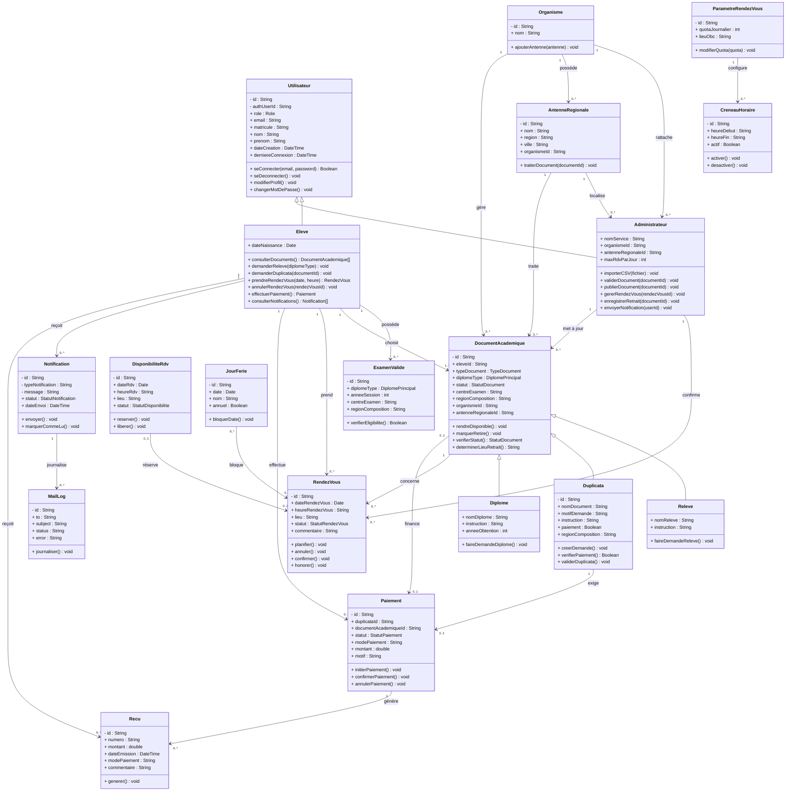

**Description des classes :**

| Classe | Rôle |
|--------|------|
| Utilisateur | Classe mère logique de tous les utilisateurs du système ; dans le code, elle correspond au modèle Prisma `User`. |
| Eleve | Élève ou diplômé utilisant l’application pour consulter, demander, payer et réserver. |
| Administrateur | Agent OBC / DECC gérant les documents, imports, rendez-vous, retraits et statistiques. |
| Organisme | Structure responsable des documents, actuellement OBC ou DECC. |
| AntenneRegionale | Antenne régionale OBC utilisée pour certains retraits, notamment le Baccalauréat original. |
| ExamenValide | Examen obtenu par l’élève, utilisé pour déterminer les documents demandables. |
| DocumentAcademique | Entité centrale représentant un document académique : diplôme, relevé ou duplicata. |
| RendezVous | Planification d’un retrait physique ou trace d’un retrait honoré. |
| DisponibiliteRdv | Modèle de disponibilité dédié encore présent dans le schéma. |
| ParametreRendezVous | Paramètres globaux de rendez-vous, notamment quota journalier et lieu OBC. |
| CreneauHoraire | Plage horaire configurable pour les rendez-vous. |
| JourFerie | Date bloquée dans le calendrier de rendez-vous. |
| Paiement | Gestion du paiement lié à une demande, principalement le duplicata dans le MVP. |
| Recu | Trace de paiement générée pour l’élève. |
| Notification | Message applicatif envoyé à un élève. |
| MailLog | Journalisation des emails envoyés ou échoués. |
| Diplome, Releve, Duplicata | Spécialisations fonctionnelles de `DocumentAcademique`. |

---

## 3. Diagrammes de Séquence

### SEQ-01 — Inscription et activation du compte

Ce diagramme décrit le processus d’inscription d’un élève dans le MVP actuel. L’élève ne crée pas un compte totalement libre : son matricule et son email doivent déjà exister dans la base métier, puis le système active ou crée le compte Supabase Auth correspondant.

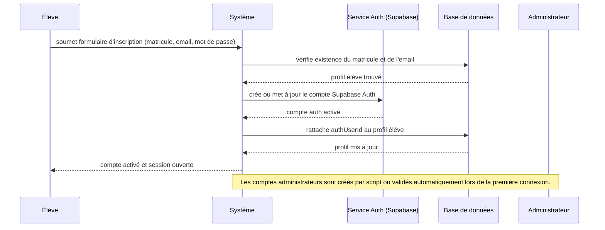

**Étapes clés :**

| Étape | Action | Résultat |
|-------|--------|----------|
| 1 | L’élève soumet matricule, email et mot de passe. | Le système reçoit la demande d’activation. |
| 2 | Le système vérifie le profil Prisma. | Le compte n’est activé que si le matricule et l’email correspondent. |
| 3 | Supabase Auth crée ou met à jour le compte. | Le mot de passe est géré hors Prisma. |
| 4 | Prisma reçoit `authUserId`. | Le profil métier est relié au compte Auth. |
| 5 | L’élève est connecté. | L’utilisateur est redirigé vers le tableau de bord. |

### SEQ-02 — Connexion et déconnexion

Ce diagramme décrit la connexion d’un utilisateur avec matricule, email et mot de passe. Le système vérifie d’abord la cohérence du matricule dans Prisma, puis délègue l’authentification du mot de passe à Supabase Auth.

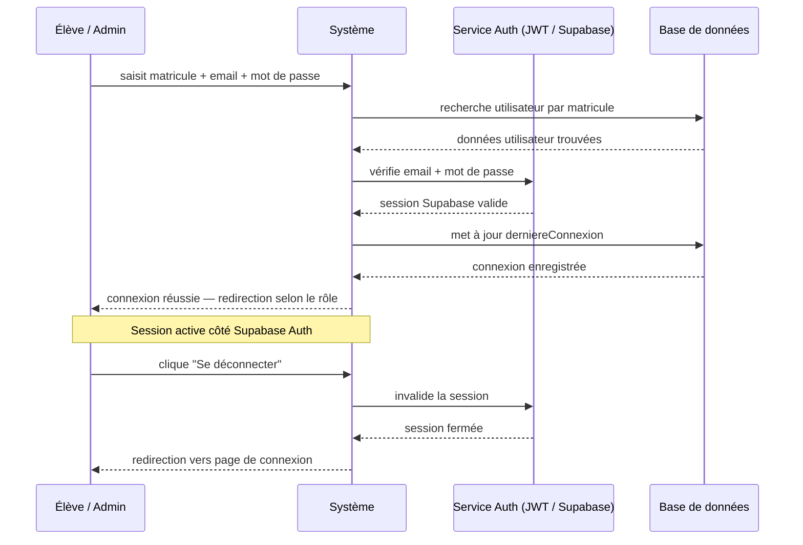

**Étapes clés :**

| Étape | Action | Résultat |
|-------|--------|----------|
| 1 | L’utilisateur saisit ses identifiants. | Le système reçoit matricule, email et mot de passe. |
| 2 | Prisma vérifie le matricule et l’email. | Les erreurs de couple matricule/email sont bloquées. |
| 3 | Supabase Auth vérifie le mot de passe. | Une session sécurisée est ouverte. |
| 4 | Prisma met à jour la dernière connexion. | La traçabilité de connexion est conservée. |
| 5 | L’utilisateur se déconnecte. | La session Supabase est fermée. |

### SEQ-03 — Consultation des documents académiques

Ce diagramme décrit la consultation des documents par un élève connecté. Le système garantit que seuls les documents de l’élève courant sont chargés, puis affiche le statut, le lieu de retrait et l’éventuel rendez-vous actif.

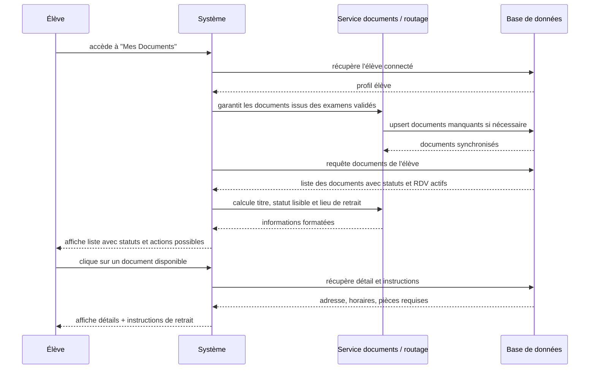

**Étapes clés :**

| Étape | Action | Résultat |
|-------|--------|----------|
| 1 | L’élève ouvre la page des documents. | Le système identifie l’utilisateur connecté. |
| 2 | Les documents sont synchronisés depuis les examens validés. | Les documents demandables sont disponibles en base. |
| 3 | Le système charge la liste. | Les statuts et rendez-vous actifs sont récupérés. |
| 4 | Le routage calcule le lieu de retrait. | Le système distingue centre d’examen et antenne régionale. |
| 5 | L’élève consulte un détail. | Les instructions de retrait sont affichées. |

### SEQ-04 — Envoi de notification de disponibilité

Ce diagramme décrit le processus déclenché lorsqu’un administrateur marque un document comme disponible. Dans le MVP actuel, la notification est enregistrée en base et un email est envoyé via Nodemailer ; la notification push native reste une évolution future.

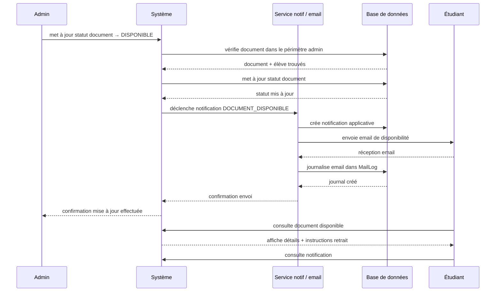

**Étapes clés :**

| Étape | Action | Résultat |
|-------|--------|----------|
| 1 | L’administrateur change le statut. | Le document passe à `DISPONIBLE`. |
| 2 | Le système contrôle le périmètre admin. | Un agent ne modifie que ses documents autorisés. |
| 3 | Une notification applicative est créée. | L’élève voit l’information dans son dashboard. |
| 4 | Un email est envoyé. | L’élève reçoit la disponibilité du document. |
| 5 | L’email est journalisé. | Le succès ou l’erreur est conservé dans `mail_logs`. |

### SEQ-05 — Demande de duplicata et paiement

Ce diagramme décrit la demande de duplicata et le paiement associé. Le MVP gère un paiement applicatif simplifié avec reçu, tandis que l’intégration Mobile Money réelle reste à finaliser.

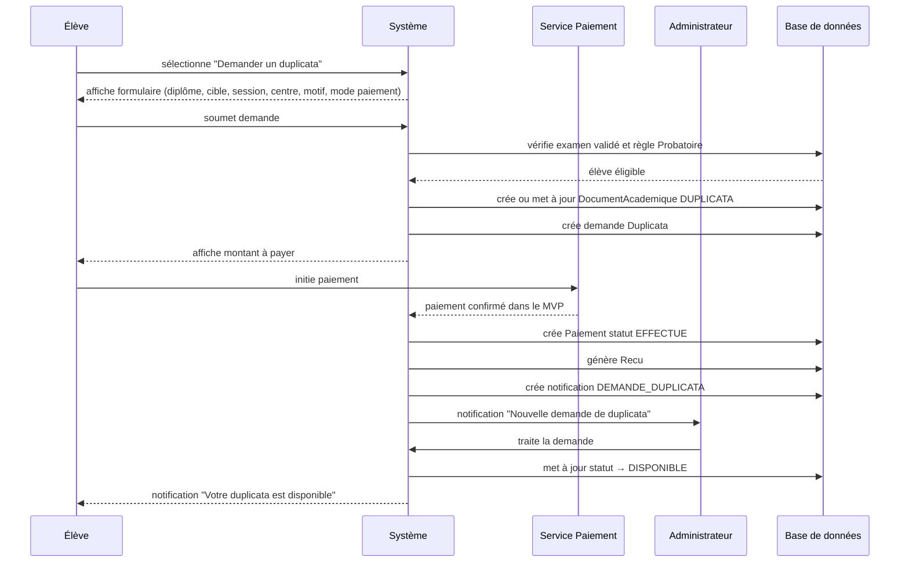

**Étapes clés :**

| Étape | Action | Résultat |
|-------|--------|----------|
| 1 | L’élève saisit sa demande. | Le système reçoit le diplôme, le document cible, la session, le centre et le motif. |
| 2 | Le système vérifie l’éligibilité. | Le Probatoire ne permet pas de duplicata de diplôme original. |
| 3 | Le duplicata est enregistré. | `DocumentAcademique` et `Duplicata` sont créés ou mis à jour. |
| 4 | Le paiement est confirmé. | Le MVP crée un paiement `EFFECTUE`. |
| 5 | Un reçu est généré. | L’élève dispose d’une trace de paiement. |
| 6 | L’administration traite la demande. | Le document pourra passer à `DISPONIBLE`. |

### SEQ-06 — Réservation et annulation de rendez-vous

Ce diagramme décrit la réservation puis l’annulation d’un rendez-vous. Le système vérifie la disponibilité du document, le besoin réel de rendez-vous, les jours bloqués, les quotas et l’absence de rendez-vous actif déjà existant.

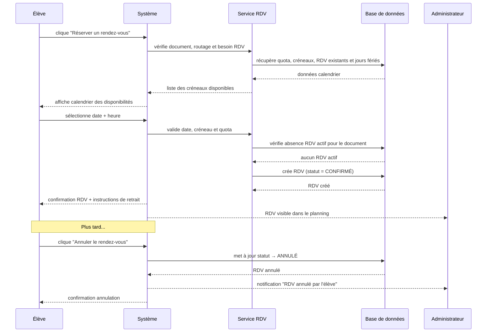

**Étapes clés :**

| Étape | Action | Résultat |
|-------|--------|----------|
| 1 | L’élève demande un rendez-vous. | Le système vérifie si le document nécessite réellement un RDV. |
| 2 | Le calendrier est calculé. | Week-ends, jours fériés, quotas et créneaux actifs sont pris en compte. |
| 3 | L’élève choisit date et heure. | Le système valide le créneau. |
| 4 | Le rendez-vous est créé. | Le statut devient `CONFIRME`. |
| 5 | L’élève annule plus tard. | Le statut devient `ANNULE`. |

### SEQ-07 — Mise à jour du statut d’un document

Ce diagramme complète le scénario de notification en montrant les contrôles administratifs et les effets métier. Lorsqu’un document est marqué `RETIRE`, les rendez-vous actifs liés sont passés à `HONORE`.

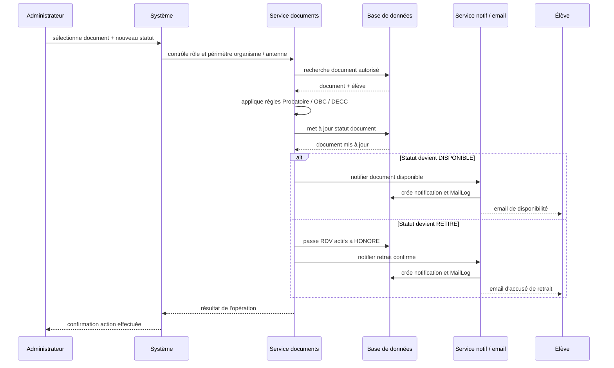

**Étapes clés :**

| Étape | Action | Résultat |
|-------|--------|----------|
| 1 | L’administrateur choisit un statut. | Le système reçoit la demande de mise à jour. |
| 2 | Le périmètre est contrôlé. | L’accès hors organisme ou antenne est refusé. |
| 3 | Les règles métier sont appliquées. | Le Probatoire ne donne pas lieu à diplôme original. |
| 4 | Le statut est modifié. | Le document devient disponible ou retiré. |
| 5 | Les notifications sont envoyées. | L’élève est informé et l’email est journalisé. |

### SEQ-08 — Retrait physique d’un document

Ce diagramme décrit l’enregistrement d’un retrait physique par l’administration. Le retrait est tracé par le statut `RETIRE` sur le document et par un rendez-vous `HONORE`, existant ou créé à cet effet.

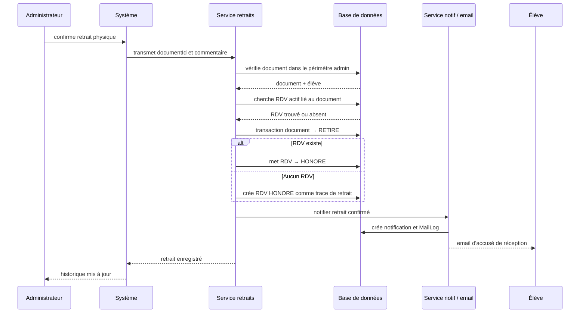

**Étapes clés :**

| Étape | Action | Résultat |
|-------|--------|----------|
| 1 | L’administrateur confirme le retrait. | Le système initie l’enregistrement. |
| 2 | Le document est vérifié. | Le périmètre admin est respecté. |
| 3 | Le document passe à `RETIRE`. | Le retrait est validé. |
| 4 | Le rendez-vous est honoré ou créé. | La traçabilité du retrait est conservée. |
| 5 | L’élève est notifié. | Un email et une notification sont créés. |

---

## 4. Diagramme MCD / MLD

Ce diagramme logique présente les principales tables issues du schéma Prisma actuel. Il complète le diagramme de classes en précisant les clés primaires, clés étrangères et relations relationnelles entre les entités.

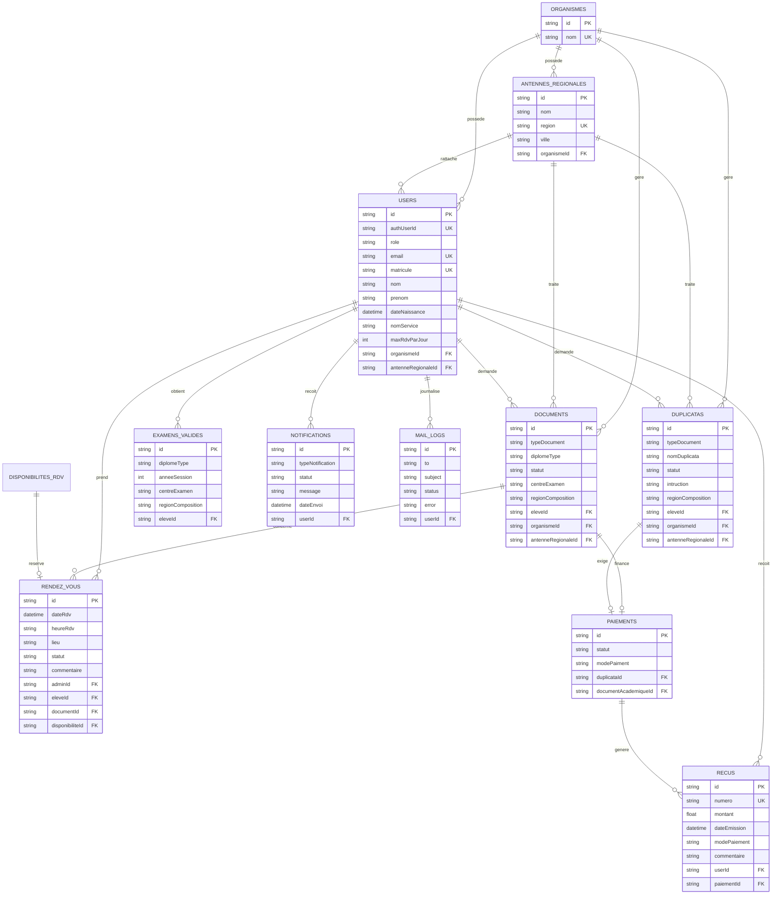

**Tables principales :**

| Table | Rôle |
|-------|------|
| `users` | Profils applicatifs des élèves et administrateurs. |
| `organismes` | Organismes responsables, OBC ou DECC. |
| `antennes_regionales` | Antennes régionales OBC. |
| `examens_valides` | Examens validés permettant de générer les documents. |
| `documents` | Documents académiques suivis par l’application. |
| `rendez_vous` | Rendez-vous et retraits honorés. |
| `notifications` | Notifications applicatives. |
| `mail_logs` | Journalisation des emails. |
| `duplicatas` | Demandes de duplicata. |
| `paiements` | Paiements liés aux duplicatas et documents. |
| `recus` | Reçus de paiement. |

---

## 5. Notes de Cohérence avec le Code Actuel

| Point | Décision de cohérence |
|-------|-----------------------|
| Utilisateur / User | Les diagrammes utilisent `Utilisateur` pour la lisibilité UML, mais le modèle Prisma réel est `User`. |
| Étudiant / Élève | Les anciens diagrammes parlaient d’`Étudiant`; la documentation actuelle privilégie `Élève`, cohérent avec le rôle `ELEVE`. |
| Mot de passe | L’attribut `password` n’est pas stocké dans Prisma ; il est géré par Supabase Auth. |
| Administrateur | Il n’existe pas de table séparée `Administrateur`; il s’agit d’un `User` avec rôle `ADMINISTRATEUR`. |
| Service délivrance | Le rôle séparé `SERVICE_DELIVRANCE` reste une évolution possible ; il est actuellement inclus dans `ADMINISTRATEUR`. |
| Notifications push | Les anciens diagrammes mentionnaient le push ; le MVP actuel réalise notification en base + email. |
| Paiement Mobile Money | Le vrai flux Orange Money / MTN Money reste à finaliser ; le MVP gère un paiement applicatif simplifié avec reçu. |
| Probatoire | Le Probatoire ne donne pas lieu à un diplôme original. |
| BEPC | Les documents du BEPC sont rattachés à la DECC. |
| Baccalauréat original | Le diplôme original du Baccalauréat est routé vers une antenne régionale OBC et nécessite un rendez-vous. |
| Retrait physique | Un retrait est représenté par un document `RETIRE` et un rendez-vous `HONORE`. |

---

*Document généré le 27/05/2026 — Version 2.0*
